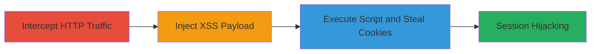

---
tags:
  - xss
  - http-interception
  - session-hijacking
  - mitm
type: attack_chain
tools:
  - '[[tools/Burp-Suite]]'
tactics:
  - '[[Execution]]'
  - '[[Credential Access]]'
commands: []
platforms:
  - Web
complexity: medium
procedures:
  - '[[procedures/Intercept-and-Inject-XSS-Payload-in-HTTP-Requests]]'
step_count: 1
techniques:
  - '[[JavaScript]]'
  - '[[Steal Web Session Cookie]]'
description: >-
  Attacker intercepts unencrypted HTTP traffic to apps.owncloud.com, modifies
  requests to inject XSS payloads, executes malicious JavaScript in victims'
  browsers, and steals session cookies for hijacking.
skill_level: intermediate
impact_level: high
id: 5b5294f4-978c-4567-a6e7-e477607012f4
created_at: '2025-12-14T03:15:41.592Z'
updated_at: '2025-12-14T03:15:41.592Z'
verified: false
validated: true
submitted: true
mitre_tactics:
  - '[[Execution]]'
  - '[[Credential Access]]'
mitre_techniques:
  - '[[JavaScript]]'
  - '[[Steal Web Session Cookie]]'
---
# XSS via Unencrypted HTTP Request Interception on apps.owncloud.com

Multi-stage attack chain demonstrating a complete attack workflow targeting unencrypted HTTP endpoints on apps.owncloud.com to inject XSS payloads and hijack user sessions.

## Chain Metrics Dashboard

| Metric | Value |
|--------|-------|
| Chain Status | Unverified |
| Total Steps | 1 |
| Execution Time | ~5 minutes |
| Skill Level | Intermediate |
| Complexity | Medium |
| Impact Level | High |

## Attack Flow Visualization

## Prerequisites & Requirements

### Required Tools

- [[tools/Burp-Suite]]

### Target Environment

- Web platform
- Unencrypted HTTP service on apps.owncloud.com (port 80 implied)
- No HTTPS enforcement

### Initial Access Requirements

- Man-in-the-Middle (MITM) position, such as same network as victim or configured proxy
- No credentials needed, but network access to intercept traffic
- Victim must visit the site via intercepted connection

## Detailed Attack Procedures

### Step 1: Intercept and Inject XSS
procedure: [[procedures/Intercept-and-Inject-XSS-Payload-in-HTTP-Requests]]

**Objective**: Intercept unencrypted HTTP requests to apps.owncloud.com, modify them to include a malicious XSS payload, and forward to trigger script execution in the victim's browser.

**Instructions**: Configure a proxy tool like Burp Suite to intercept traffic. Position yourself to MITM the connection (e.g., via ARP spoofing on the network or DNS poisoning). When a victim accesses apps.owncloud.com, capture the request, inject an XSS script such as `` into a parameter or header without sanitization, and forward the modified request.

**Expected Output**: The victim's browser executes the injected script, sending session cookies to the attacker's server.

**Success Indicators**:
- Request intercepted and modified successfully
- Script execution confirmed via callback to attacker-controlled server
- Session cookies received

## Attack Chain Summary

### Key Achievements

1. Successful interception of unencrypted HTTP traffic
2. Injection and execution of XSS payload in victim's browser
3. Theft of session cookies enabling account takeover

## Technique & Tactic Coverage

### MITRE ATT&CK Techniques

- [[JavaScript]]
- [[Steal Web Session Cookie]]

### MITRE ATT&CK Tactics

- [[Execution]]
- [[Credential Access]]

---

*Last updated: 2023-10-01*
