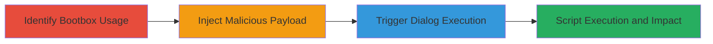

# XSS via Unsanitized Bootbox Dialog Messages

Multi-stage attack chain demonstrating exploitation of the Cross-Site Scripting (XSS) vulnerability in the Bootbox JavaScript library, where dialog methods insert user-provided messages using jQuery.html() without sanitization, enabling arbitrary HTML and script execution. This was discovered via GitHub issue #661 and reported on HackerOne (Report #508446). The attack targets web applications using Bootbox to display unsanitized user input, such as error messages or dynamic content, potentially leading to session hijacking, data theft, or further compromise.

## Chain Metrics Dashboard

| Metric | Value |
|--------|-------|
| Chain Status | Unverified |
| Total Steps | 3 |
| Execution Time | ~5 minutes |
| Skill Level | Intermediate |
| Complexity | Medium |
| Impact Level | High |

## Attack Flow Visualization



## Prerequisites & Requirements

### Required Tools

- Browser Developer Tools
- JavaScript Console (e.g., Chrome DevTools)

### Target Environment

- Web application using Bootbox library (version vulnerable to CVE-2018-14040 or similar)
- jQuery dependency
- Access to user input fields or APIs that feed into Bootbox dialogs

### Initial Access Requirements

- Valid user session or public access to the application
- Ability to submit user-controlled input (e.g., forms, error messages)
- No special credentials needed beyond typical user access

## Detailed Attack Procedures

### Step 1: Identify Bootbox Library Usage
procedure: [[procedures/Identify-Bootbox-Library-Usage]]

**Objective**: Locate and confirm the use of the vulnerable Bootbox library in the target web application to assess XSS potential.

**Instructions**: Inspect the application's source code, network requests, or documentation for Bootbox integration. Look for script tags loading bootbox.js and usage of methods like bootbox.alert(). Use browser dev tools to search for 'bootbox' in the page source.

**Expected Output**: Confirmation of Bootbox version and dialog method calls, such as bootbox.alert(message).

**Success Indicators**:
- Bootbox library detected in scripts
- Dialog methods identified that accept string messages

### Step 2: Inject Malicious Payload into Bootbox Message
procedure: [[procedures/Inject-Malicious-Payload-into-Bootbox-Message]]

**Objective**: Craft and submit a payload containing arbitrary HTML/script to a parameter that gets passed to Bootbox dialogs without sanitization.

**Instructions**: Identify input points like forms or APIs that populate error messages or dynamic content. Submit a payload such as `<script>alert(1);</script>` via a form field or URL parameter. For example, if an error message is displayed via Bootbox, trigger an error with the payload in the input.

Use [[commands/bootbox-alert-script-injection]] to test in console if direct access is available:

```javascript
bootbox.alert("<script>alert(1);</script>");
```

**Expected Output**: The payload is accepted and stored for later display in a Bootbox dialog.

**Success Indicators**:
- Payload reflected in application responses
- No immediate sanitization errors

### Step 3: Trigger Bootbox Dialog to Execute Script
procedure: [[procedures/Trigger-Bootbox-Dialog-to-Execute-Script]]

**Objective**: Invoke the Bootbox dialog to render the injected payload, causing jQuery.html() to execute the embedded script in the victim's browser context.

**Instructions**: Perform an action that triggers the dialog, such as submitting invalid input to show an error message. The unsanitized message will be inserted via jQuery.html(), executing the script. Monitor for popups or network requests indicating execution.

If testing dynamically, use [[commands/bootbox-alert-dynamic-user-input]]:

```javascript
bootbox.alert(`${username} is unavailable`);
```

Where `username` contains the payload.

**Expected Output**: JavaScript execution, e.g., alert(1) popup or console logs from the script.

**Success Indicators**:
- Script executes (e.g., alert fires)
- DOM manipulation or data exfiltration observed

## Attack Chain Summary

### Key Achievements

1. Confirmed vulnerable Bootbox integration in the target application
2. Successfully injected and rendered malicious script via dialog messages
3. Achieved arbitrary JavaScript execution, enabling further attacks like session theft

## Technique & Tactic Coverage

### MITRE ATT&CK Techniques

- [[JavaScript]]

### MITRE ATT&CK Tactics

- [[Execution]]

---
*Last updated: 2023-10-01T00:00:00Z*
