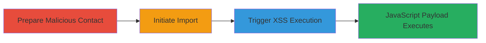

# XSS via Unsanitized Gmail Contact Import in Respondly

Multi-stage attack chain demonstrating a complete client-side XSS workflow in Respondly's Gmail integration.

## Chain Metrics Dashboard

| Metric | Value |
|--------|-------|
| Chain Status | Unverified |
| Total Steps | 3 |
| Execution Time | ~5 minutes |
| Skill Level | Intermediate |
| Complexity | Medium |
| Impact Level | High |

## Attack Flow Visualization

## Prerequisites & Requirements

### Required Tools

- Web browser (e.g., Chrome with developer tools for payload testing)
- Access to a Gmail account
- Respondly account with Gmail integration enabled

### Target Environment

- Respondly web application
- Gmail API/integration for contact import
- No specific ports required; operates over HTTPS

### Initial Access Requirements

- Valid Respondly user account
- Gmail account with modifiable contacts
- Ability to trick victim into importing contacts (social engineering)

## Detailed Attack Procedures

### Step 1: Prepare Malicious Contact
procedure: [[procedures/Prepare-Malicious-Gmail-Contact]]

**Objective**: Create a Gmail contact with an embedded JavaScript payload in the name field to exploit the lack of sanitization during import.

**Instructions**: Log into the attacker's Gmail account. Navigate to Google Contacts (contacts.google.com). Create a new contact or edit an existing one, setting the name field to include JavaScript, such as `` or a more malicious payload like ``. Save the contact. Optionally, send this contact to the victim's Gmail to ensure it appears in their address book.

**Expected Output**: Contact saved in Gmail with the malicious name; verify by viewing the contact details in the browser.

**Success Indicators**:
- Malicious JavaScript visible in the contact name without escaping
- Contact appears in the Gmail address book

### Step 2: Initiate Contact Import in Respondly
procedure: [[procedures/Initiate-Respondly-Gmail-Import]]

**Objective**: Trigger the import process in Respondly to fetch unsanitized contacts from Gmail.

**Instructions**: Log into the victim's Respondly account using their credentials (or phish for them). Navigate to the settings or dashboard where Gmail integration is available. Select the option to import contacts from Gmail. Authenticate with the victim's Gmail account if prompted, granting Respondly access to read contacts via the Gmail API.

**Expected Output**: Respondly begins fetching contacts; a list or preview of contacts may appear on the page without sanitization.

**Success Indicators**:
- Gmail authentication successful
- Import process starts, displaying contact names in the UI

### Step 3: Trigger XSS Execution
procedure: [[procedures/Trigger-XSS-Execution-on-Import]]

**Objective**: Cause the malicious contact name to be rendered in the browser, executing the embedded JavaScript in the context of the Respondly domain.

**Instructions**: Complete the import process by confirming or selecting the contacts. As Respondly renders the contact list or details page, the unsanitized name from the malicious contact will be output directly into the HTML, triggering the JavaScript payload. Monitor the browser console or network tab for execution (e.g., alert popup or data exfiltration request).

**Expected Output**: JavaScript executes, such as an alert dialog or HTTP request to attacker-controlled server with stolen data like session cookies.

**Success Indicators**:
- JavaScript payload runs in the browser
- Potential session hijacking or data theft observed (e.g., cookies sent to attacker)

## Attack Chain Summary

### Key Achievements

1. Successful preparation of a malicious Gmail contact with XSS payload
2. Initiation of unsanitized import leading to payload delivery
3. Arbitrary JavaScript execution in the victim's browser context, enabling session theft or further attacks

## Technique & Tactic Coverage

### MITRE ATT&CK Techniques

- [[JavaScript]]
- [[Exploit Public-Facing Application]]

### MITRE ATT&CK Tactics

- [[Execution]]
- [[Collection]]

---
*Last updated: 2023-10-01T00:00:00Z*
