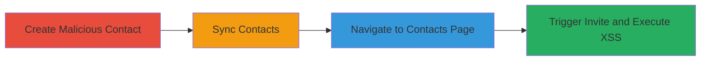

---
tags:
  - xss
  - web
  - google-contacts
  - injection
type: attack_chain
tools: []
tactics:
  - '[[Execution]]'
  - '[[Collection]]'
verified: false
platforms:
  - Web
submitted: true
complexity: medium
created_at: '2023-10-01T00:00:00Z'
procedures:
  - '[[procedures/Create-Malicious-Contact-in-Google-Contacts]]'
  - '[[procedures/Sync-Contacts-to-Openfolio]]'
  - '[[procedures/Navigate-to-Contacts-Page-in-Openfolio]]'
  - '[[procedures/Trigger-XSS-via-Invite-Button]]'
step_count: 4
techniques:
  - '[[JavaScript]]'
updated_at: '2025-12-14T03:15:36.325Z'
description: >-
  A multi-stage attack exploiting insufficient sanitization of contact names
  from Google Contacts to inject and execute arbitrary JavaScript in the
  victim's browser via Openfolio's invite feature.
skill_level: intermediate
impact_level: high
id: b1498200-708a-434e-932d-0881bedcd22b
validated: true
mitre_tactics:
  - '[[Execution]]'
  - '[[Collection]]'
mitre_techniques:
  - '[[JavaScript]]'
---
# XSS via Unsanitized Google Contacts Import in Openfolio

Multi-stage attack chain demonstrating a complete XSS exploitation workflow in Openfolio by leveraging unsanitized imports from Google Contacts.

## Chain Metrics Dashboard

| Metric | Value |
|--------|-------|
| Chain Status | Unverified |
| Total Steps | 4 |
| Execution Time | ~5 minutes |
| Skill Level | Intermediate |
| Complexity | Medium |
| Impact Level | High |

## Attack Flow Visualization

## Prerequisites & Requirements

### Required Tools

- Web browser (e.g., Chrome)
- Access to Google account with Contacts

### Target Environment

- Openfolio web application
- Google Contacts service
- Network access to https://openfolio.com

### Initial Access Requirements

- Valid Google account
- Ability to register or access Openfolio (attacker needs to sync contacts, victim needs to be logged in to Openfolio)
- No prior access needed beyond public web access

## Detailed Attack Procedures

### Step 1: Create Malicious Contact
procedure: [[procedures/Create-Malicious-Contact-in-Google-Contacts]]

**Objective**: Inject a JavaScript payload into a contact name to prepare for XSS exploitation during import.

**Instructions**: Use the Google Contacts web interface to add a new contact with a malicious name containing an XSS payload, such as an onerror event in an img tag.

**Expected Output**: Contact created and visible in Google Contacts list.

**Success Indicators**:
- Malicious contact appears in Google Contacts
- Payload is embedded in the name field without errors

### Step 2: Sync Contacts to Openfolio
procedure: [[procedures/Sync-Contacts-to-Openfolio]]

**Objective**: Import the malicious contact into Openfolio, carrying over the unsanitized payload.

**Instructions**: In Openfolio, initiate the sync feature to pull contacts from the linked Google account.

**Expected Output**: Synced contacts list in Openfolio includes the malicious entry.

**Success Indicators**:
- Sync completes without errors
- Malicious contact name displays in Openfolio contacts

### Step 3: Navigate to Contacts Page
procedure: [[procedures/Navigate-to-Contacts-Page-in-Openfolio]]

**Objective**: Access the vulnerable browsing page where synced contacts are displayed.

**Instructions**: Log in to Openfolio and visit the contacts browsing URL to load the list.

**Expected Output**: Page loads showing the list of synced contacts, including the malicious one.

**Success Indicators**:
- URL https://openfolio.com/browse/contacts/ loads successfully
- Malicious contact is visible in the list

### Step 4: Trigger XSS via Invite Button
procedure: [[procedures/Trigger-XSS-via-Invite-Button]]

**Objective**: Execute the injected JavaScript by interacting with the invite functionality, leading to arbitrary code execution in the browser.

**Instructions**: Select and click the invite button for the malicious contact, which renders the unsanitized name and triggers the payload.

**Expected Output**: JavaScript executes, e.g., a prompt dialog appears.

**Success Indicators**:
- Alert or prompt pops up (e.g., prompt(1))
- Browser console shows execution of the payload

## Attack Chain Summary

### Key Achievements

1. Successful injection of XSS payload via Google Contacts
2. Import and display of unsanitized data in Openfolio
3. Execution of arbitrary JavaScript, enabling potential session theft or further client-side attacks

## Technique & Tactic Coverage

### MITRE ATT&CK Techniques

- [[JavaScript]]

### MITRE ATT&CK Tactics

- [[Execution]]
- [[Collection]]

---
*Last updated: 2023-10-01T00:00:00Z*
