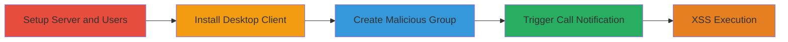

---
tags:
  - xss
  - nextcloud
  - desktop-client
  - html-injection
type: attack_chain
tools: []
tactics:
  - '[[Execution]]'
verified: false
platforms:
  - Web
  - Desktop
  - Windows 10
submitted: true
complexity: medium
created_at: '2023-10-01T00:00:00Z'
procedures:
  - '[[procedures/Setup-Nextcloud-Server-and-Users]]'
  - '[[procedures/Install-Nextcloud-Desktop-Client]]'
  - '[[procedures/Create-Malicious-Group-Conversation]]'
  - '[[procedures/Trigger-XSS-in-Call-Notification]]'
step_count: 12
techniques:
  - '[[JavaScript]]'
updated_at: '2025-12-14T03:15:53.558Z'
description: >-
  Demonstrates a cross-site scripting vulnerability in the Nextcloud Desktop
  Client where malicious HTML in a group conversation name is executed in call
  notifications, allowing arbitrary HTML injection and potential client-side
  attacks.
skill_level: intermediate
impact_level: high
id: 8287d361-f806-4c9c-8d99-35578d9ea1c7
validated: true
mitre_tactics:
  - '[[Execution]]'
mitre_techniques:
  - '[[JavaScript]]'
---
# XSS via Unsanitized Group Conversation Name in Nextcloud Talk Desktop Client

Multi-stage attack chain demonstrating a complete attack workflow for exploiting an XSS vulnerability in the Nextcloud Desktop Client through unsanitized group names in Nextcloud Talk.

## Chain Metrics Dashboard

| Metric | Value |
|--------|-------|
| Chain Status | Unverified |
| Total Steps | 12 |
| Execution Time | ~30 minutes |
| Skill Level | Intermediate |
| Complexity | Medium |
| Impact Level | High |

## Attack Flow Visualization

## Prerequisites & Requirements

### Required Tools

- None (manual setup and web interface usage)

### Target Environment

- Nextcloud Server (self-hosted)
- Nextcloud Desktop Client on Windows 10
- Nextcloud Talk app enabled
- Administrative access to Nextcloud server

### Initial Access Requirements

- Ability to install and configure Nextcloud server
- User credentials for admin and regular user accounts
- Local network access to server and desktop client

## Detailed Attack Procedures

### Step 1: Setup Nextcloud Server
procedure: [[procedures/Setup-Nextcloud-Server-and-Users]]

**Objective**: Establish the Nextcloud server environment, create admin and user accounts, and install the Talk app.

**Instructions**: Follow the procedure to install the server, register accounts, and enable Talk. This prepares the backend for creating conversations.

**Expected Output**: Fully functional Nextcloud server with Talk app and two user accounts (admin and regular).

**Success Indicators**:
- Server accessible via web interface
- Admin and user accounts created and login successful
- Talk app installed and visible in the app menu

### Step 2: Install Desktop Client
procedure: [[procedures/Install-Nextcloud-Desktop-Client]]

**Objective**: Deploy the Nextcloud Desktop Client on the target machine and authenticate the regular user.

**Instructions**: Download and install the client, then log in with the regular user credentials to sync files and enable Talk integration.

**Expected Output**: Desktop client running and connected to the server, with Talk notifications enabled by default.

**Success Indicators**:
- Client installation complete without errors
- Successful login and file sync
- Talk app accessible within the client

### Step 3: Create Malicious Group Conversation
procedure: [[procedures/Create-Malicious-Group-Conversation]]

**Objective**: Use admin access to create a group conversation with an HTML payload in the name to prepare for injection.

**Instructions**: Log in as admin, open Talk, create a new group, and set the name to a payload like ``. Add the regular user to the group.

**Expected Output**: Group created with the malicious name, and regular user invited successfully.

**Success Indicators**:
- Group appears in Talk interface with the injected name
- Regular user receives invitation and can join

### Step 4: Trigger XSS in Call Notification
procedure: [[procedures/Trigger-XSS-in-Call-Notification]]

**Objective**: Initiate a call in the malicious group to render the unsanitized name in the desktop client's popup, executing the payload.

**Instructions**: As admin, start a call in the group. Observe the notification on the regular user's desktop client.

**Expected Output**: Call notification popup on desktop client displays and executes the HTML payload, such as loading the external image.

**Success Indicators**:
- Payload executes (e.g., image loads or script runs if escalated)
- No sanitization errors; arbitrary HTML rendered

## Attack Chain Summary

### Key Achievements

1. Successful setup of vulnerable Nextcloud environment
2. Injection of HTML payload via group name without detection
3. Execution of XSS in desktop client context, enabling phishing or further client-side exploitation

## Technique & Tactic Coverage

### MITRE ATT&CK Techniques

- [[JavaScript]]

### MITRE ATT&CK Tactics

- [[Execution]]

---

*Last updated: 2023-10-01T00:00:00Z*
