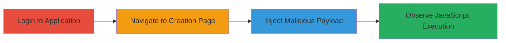

---
tags:
  - xss
  - web
  - javascript-injection
type: attack_chain
tools: []
tactics:
  - '[[Execution]]'
verified: false
platforms:
  - Web
submitted: true
complexity: low
created_at: '2023-10-01T00:00:00Z'
procedures:
  - '[[procedures/Login-to-Localize-io-Application]]'
  - '[[procedures/Navigate-to-Project-Creation-Page]]'
  - '[[procedures/Inject-XSS-Payload-in-Group-Name]]'
  - '[[procedures/Trigger-and-Verify-XSS-Execution]]'
step_count: 4
techniques:
  - '[[JavaScript]]'
updated_at: '2025-12-14T03:16:37.473Z'
description: >-
  A multi-step attack exploiting a reflected XSS vulnerability in the group
  creation feature of Localize.io, allowing arbitrary JavaScript execution in
  the victim's browser.
skill_level: beginner
impact_level: high
id: 8ef8e714-423f-40de-9c3c-2fb9eca9c94d
validated: true
mitre_tactics:
  - '[[Execution]]'
mitre_techniques:
  - '[[JavaScript]]'
---
# XSS via Unsanitized Group Names in Localize.io Project Creation

Multi-stage attack chain demonstrating a complete XSS exploitation workflow in Localize.io's group creation feature.

## Chain Metrics Dashboard

| Metric | Value |
|--------|-------|
| Chain Status | Unverified |
| Total Steps | 4 |
| Execution Time | ~2 minutes |
| Skill Level | Beginner |
| Complexity | Low |
| Impact Level | High |

## Attack Flow Visualization

## Prerequisites & Requirements

### Required Tools

- Web browser (e.g., Chrome, Firefox)

### Target Environment

- Localize.io web application
- Access to an authenticated user account
- No specific services or ports required beyond standard HTTPS (443)

### Initial Access Requirements

- Valid credentials for Localize.io account
- Direct network access to https://www.localize.io
- No prior access needed beyond login

## Detailed Attack Procedures

### Step 1: Login to Application
procedure: [[procedures/Login-to-Localize-io-Application]]

**Objective**: Authenticate to the Localize.io application to gain access to protected features like project and group creation.

**Instructions**: Open a web browser and navigate to the Localize.io login page. Enter valid credentials to authenticate.

**Expected Output**: Successful login redirect to the dashboard, with session cookies established.

**Success Indicators**:
- Dashboard loads without errors
- User profile or projects visible

### Step 2: Navigate to Project Creation Page
procedure: [[procedures/Navigate-to-Project-Creation-Page]]

**Objective**: Access the project creation interface where the vulnerable group name input is available.

**Instructions**: From the dashboard, click on the project creation option or directly visit the URL for creating a project.

**Expected Output**: Project creation form loads, including fields for group names.

**Success Indicators**:
- Form fields for project and group details appear
- URL matches /pages/create_project/ pattern

### Step 3: Inject Malicious Payload
procedure: [[procedures/Inject-XSS-Payload-in-Group-Name]]

**Objective**: Submit a crafted XSS payload in the group name field to inject executable JavaScript.

**Instructions**: In the group name input field, enter the payload `<object data="data:text/html;base64,PHN2Zy9vbmxvYWQ9YWxlcnQoNCk+></object>`. Complete any other required fields and submit the form.

**Expected Output**: Form submission succeeds, and the group is created with the injected payload stored.

**Success Indicators**:
- No validation errors on submission
- Group appears in the list with the payload as name

### Step 4: Trigger and Verify Execution
procedure: [[procedures/Trigger-and-Verify-XSS-Execution]]

**Objective**: Render the vulnerable page to execute the injected JavaScript and confirm the XSS.

**Instructions**: Navigate back to the project or group list page where the group name is rendered. The payload should execute automatically upon rendering.

**Expected Output**: JavaScript alert popup displays "4".

**Success Indicators**:
- Alert box pops up in the browser
- Browser console shows no errors, confirming execution

## Attack Chain Summary

### Key Achievements

1. Successful authentication and navigation to the vulnerable feature
2. Injection of a base64-encoded SVG-based XSS payload
3. Arbitrary JavaScript execution demonstrated via alert
4. Potential for session hijacking or data theft if viewed by admins

## Technique & Tactic Coverage

### MITRE ATT&CK Techniques

- [[JavaScript]]

### MITRE ATT&CK Tactics

- [[Execution]]

---
*Last updated: 2023-10-01T00:00:00Z*
