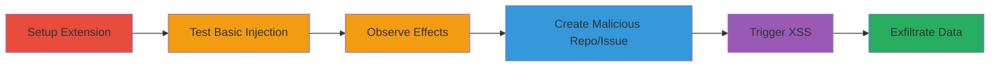

# XSS via Unsanitized HTML in Awesome Autocomplete GitHub Extension

Multi-stage attack chain demonstrating a complete attack workflow for exploiting XSS in the Awesome Autocomplete extension on GitHub.com.

## Chain Metrics Dashboard

| Metric | Value |
|--------|-------|
| Chain Status | Unverified |
| Total Steps | 6 |
| Execution Time | ~15 minutes |
| Skill Level | Intermediate |
| Complexity | Medium |
| Impact Level | High |

## Attack Flow Visualization

## Prerequisites & Requirements

### Required Tools

- [[tools/Awesome-Autocomplete-Extension]]
- [[tools/Browser-Developer-Tools]]
- [[tools/GitHub]]

### Target Environment

- Supported browsers: Chrome 57.0.2987.133 or Safari 10.1
- OS: macOS Sierra 10.12.4 or Windows 7 x64
- GitHub.com with search functionality
- Algolia indexing enabled (default for GitHub)

### Initial Access Requirements

- Authenticated GitHub account for creating repositories and issues
- Browser with extension support
- No special network access beyond internet connectivity

## Detailed Attack Procedures

### Step 1: Setup Extension
procedure: [[procedures/Setup-Awesome-Autocomplete-Extension]]

**Objective**: Install and enable the Awesome Autocomplete extension to prepare for injecting unsanitized content into GitHub search results.

**Instructions**: Download and install the latest version of the extension from the Chrome Web Store or equivalent, then navigate to GitHub.com and enable it for search autocomplete.

**Expected Output**: Extension icon appears in browser toolbar, and GitHub search bar shows enhanced autocomplete suggestions.

**Success Indicators**:
- Extension installed without errors
- GitHub search loads with autocomplete active

### Step 2: Test Basic Injection
procedure: [[procedures/Test-Unsanitized-HTML-Injection]]

**Objective**: Inject a basic HTML-breaking payload to demonstrate lack of sanitization in rendered search results.

**Instructions**: In the GitHub search bar, enter the payload `'>` and observe the autocomplete dropdown.

**Expected Output**: Broken HTML elements appear in the DOM, with failed image loads to 'x' endpoint.

**Success Indicators**:
- Autocomplete renders malformed HTML
- Network requests to invalid 'x' src visible

### Step 3: Observe Effects
procedure: [[procedures/Observe-Injection-Effects-in-Developer-Tools]]

**Objective**: Use developer tools to inspect the injected HTML and confirm DOM manipulation in GitHub.com context.

**Instructions**: Open browser developer tools (F12), inspect the autocomplete dropdown elements, and check the Network tab for erroneous requests.

**Expected Output**: Injected `` element visible in DOM; failed requests logged.

**Success Indicators**:
- DOM shows unsanitized payload
- Console or network confirms injection effects

### Step 4: Create Malicious Payload
procedure: [[procedures/Create-Malicious-Repository-and-Issue-on-GitHub]]

**Objective**: Craft a controlled repository and issue with XSS payload to enable full JavaScript execution.

**Instructions**: Log in to GitHub, create a new repository, then add an issue with title and description containing `"><h1>A</h1>`. Wait for Algolia to index the content (typically a few minutes).

**Expected Output**: Repository and issue created successfully; payload indexed and searchable.

**Success Indicators**:
- Issue visible on GitHub
- Searchable via autocomplete after indexing

### Step 5: Trigger XSS
procedure: [[procedures/Trigger-Full-XSS-with-Controlled-Payload]]

**Objective**: Execute the XSS payload by searching for a trigger query, leading to JavaScript alert with domain and cookies.

**Instructions**: In GitHub search, enter a single apostrophe `'` within the context of the malicious repository to load and render the issue details unsanitized.

**Expected Output**: JavaScript alert pops up displaying "XSS on github.com. Cookies: [session cookies]".

**Success Indicators**:
- Alert dialog executes
- Cookies and domain accessible via payload

### Step 6: Assess Impact

**Objective**: Evaluate the potential for session hijacking or data theft based on executed JavaScript.

**Instructions**: Review the alert output for sensitive data like session tokens, then test further payloads for exfiltration (e.g., sending cookies to an attacker-controlled server).

**Expected Output**: Confirmation of arbitrary JS execution, including access to document.cookie.

**Success Indicators**:
- Sensitive data (e.g., cookies) revealed
- Potential for follow-on attacks like session theft

## Attack Chain Summary

### Key Achievements

1. Successful installation and setup of vulnerable extension
2. Demonstration of unsanitized HTML rendering from GitHub content
3. Full XSS execution stealing cookies in authenticated sessions
4. Highlighted impact on GitHub.com users via browser extension

## Technique & Tactic Coverage

### MITRE ATT&CK Techniques

- [[JavaScript]]

### MITRE ATT&CK Tactics

- [[Execution]]

---

*Last updated: 2023-10-01T00:00:00Z*
