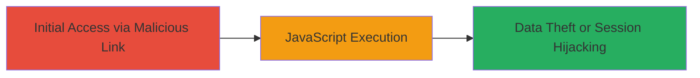

---
tags:
  - xss
  - web
  - javascript
  - injection
type: attack_chain
tools: []
tactics:
  - '[[Execution]]'
  - '[[Collection]]'
verified: false
platforms:
  - Web
submitted: true
complexity: low
created_at: '2023-10-01T00:00:00Z'
procedures:
  - '[[procedures/Exploit-XSS-via-Input-Injection]]'
step_count: 1
techniques:
  - '[[JavaScript]]'
updated_at: '2025-12-14T03:15:41.460Z'
description: >-
  A cross-site scripting attack exploiting an unsanitized input parameter on a
  specific page of gmchat.gm.com, allowing arbitrary JavaScript execution in
  users' browsers.
skill_level: beginner
impact_level: high
id: 1f6ca4c8-c8e9-4ff9-84d9-1f669db8c0d9
validated: true
mitre_tactics:
  - '[[Execution]]'
  - '[[Collection]]'
mitre_techniques:
  - '[[JavaScript]]'
---
# XSS via Unsanitized Input Parameter on gmchat.gm.com

Multi-stage attack chain demonstrating a complete attack workflow targeting a cross-site scripting vulnerability on gmchat.gm.com.

## Chain Metrics Dashboard

| Metric | Value |
|--------|-------|
| Chain Status | Unverified |
| Total Steps | 1 |
| Execution Time | ~1 minutes |
| Skill Level | Beginner |
| Complexity | Low |
| Impact Level | High |

## Attack Flow Visualization

## Prerequisites & Requirements

### Required Tools

- Web browser with developer tools

### Target Environment

- Web platform
- Access to gmchat.gm.com
- No specific ports or services required beyond standard HTTP/HTTPS

### Initial Access Requirements

- Ability to send a malicious link or input to a victim user
- No prior credentials needed; social engineering may be used to lure the victim

## Detailed Attack Procedures

### Step 1: Inject Malicious Payload
procedure: [[procedures/Exploit-XSS-via-Input-Injection]]

**Objective**: Deliver and execute arbitrary JavaScript in the victim's browser by exploiting the unsanitized input parameter on the vulnerable page.

**Instructions**: Craft a payload such as `` or more advanced like ``. Append it to the vulnerable URL parameter (e.g., ?param=<payload>). Send the link to the victim via email or chat. When the victim visits the page and the parameter is reflected without sanitization, the script executes.

**Expected Output**: Alert box pops up or data is exfiltrated to attacker's server.

**Success Indicators**:
- JavaScript alert triggers in the browser
- Network request to attacker's domain with stolen data (e.g., cookies)

## Attack Chain Summary

### Key Achievements

1. Successful injection of arbitrary JavaScript
2. Potential theft of session cookies or sensitive data
3. Demonstration of session hijacking risk

## Technique & Tactic Coverage

### MITRE ATT&CK Techniques

- [[JavaScript]]

### MITRE ATT&CK Tactics

- [[Execution]]
- [[Collection]]

---
*Last updated: 2023-10-01T00:00:00Z*
