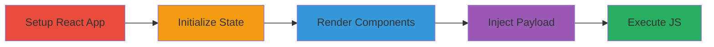

# XSS via Unsanitized Input in react-autolinker-wrapper Library

Multi-stage attack chain demonstrating exploitation of an XSS vulnerability in the react-autolinker-wrapper library (version 1.1.0), which fails to sanitize user input before injecting it via innerHTML, allowing arbitrary JavaScript execution in client-side applications.

## Chain Metrics Dashboard

| Metric | Value |
|--------|-------|
| Chain Status | Unverified |
| Total Steps | 4 |
| Execution Time | ~5 minutes |
| Skill Level | Intermediate |
| Complexity | Medium |
| Impact Level | High |

## Attack Flow Visualization



## Prerequisites & Requirements

### Required Tools

- [[tools/React]]
- [[tools/react-autolinker-wrapper]]
- [[tools/Autolinker.js]]

### Target Environment

- Web browser (e.g., Chrome, Firefox)
- Node.js for package management via NPM
- React development environment

### Initial Access Requirements

- Access to a development environment or vulnerable application incorporating react-autolinker-wrapper v1.1.0
- No special credentials needed for client-side exploitation
- Network access to NPM for installing dependencies

## Detailed Attack Procedures

### Step 1: Set Up Vulnerable React Application
procedure: [[procedures/Set-Up-Vulnerable-React-Application]]

**Objective**: Create a basic React application that imports and uses the vulnerable react-autolinker-wrapper component to prepare for input injection.

**Instructions**: Start by importing the necessary modules using [[commands/import-react-and-autolinkerwrapper]]:

```javascript
import React from 'react';
import AutolinkerWrapper from 'react-autolinker-wrapper';
```

Then define a class component App extending React.Component using [[commands/define-react-app-component]]:

```javascript
class App extends React.Component {
  // Constructor and methods to be added in next steps
}

export default App;
```

**Expected Output**: Basic React component structure ready for state management and rendering.

**Success Indicators**:
- No import errors in the development console
- Component compiles without syntax issues

### Step 2: Initialize State and Event Handler
procedure: [[procedures/Initialize-State-and-Event-Handler]]

**Objective**: Set up component state to hold user input and bind a handler for real-time updates to the text prop.

**Instructions**: In the constructor, initialize state and bind the change handler using [[commands/initialize-app-state]]:

```javascript
constructor(){
  super()
  this.state = {text: "fudge"}
  this.changeState = this.changeState.bind(this)
}

changeState(event){
  this.setState({text: event.target.value})
}
```

**Expected Output**: State initialized with default text; event handler bound to update state on input changes.

**Success Indicators**:
- State updates correctly when input is modified
- No binding errors in console

### Step 3: Render Input and Autolinker Component
procedure: [[procedures/Render-Input-and-Autolinker-Component]]

**Objective**: Render an input field connected to the state and the AutolinkerWrapper component to display processed text.

**Instructions**: Implement the render method using [[commands/render-app-components]]:

```javascript
render(){
  return (
    <div className="App">
      <input placeholder="Place your link here" type="text" onChange={this.changeState}/>
      <AutolinkerWrapper text={this.state.text}/>
    </div>
  )
}
```

**Expected Output**: UI displays an input field and the AutolinkerWrapper; text updates on input.

**Success Indicators**:
- Input field accepts text
- AutolinkerWrapper renders without errors for benign input

### Step 4: Trigger XSS with Malicious Input
procedure: [[procedures/Trigger-XSS-with-Malicious-Input]]

**Objective**: Inject a malicious payload into the input to exploit the unsanitized innerHTML setting in AutolinkerWrapper.

**Instructions**: Enter the payload using [[commands/inject-malicious-xss-payload]]:

```javascript
// Enter into input: ''
```

Monitor the invokeLink method via [[commands/observe-invokelink-execution]] to confirm innerHTML injection:

```javascript
invokeLink = () => {
  this.element.innerHTML = this.props.options == defaultOptions
    ? Autolinker.link(this.props.text)
    : Autolinker.link(this.props.text, this.props.options)
}
```

**Expected Output**: Alert dialog pops up executing the onerror handler, confirming XSS.

**Success Indicators**:
- JavaScript alert executes
- Arbitrary code runs in the browser context

## Attack Chain Summary

### Key Achievements

1. Successful setup of a vulnerable React application using react-autolinker-wrapper.
2. Real-time input processing without sanitization.
3. Execution of injected JavaScript payload leading to client-side code execution.
4. Potential for data theft or session hijacking in affected applications.

## Technique & Tactic Coverage

### MITRE ATT&CK Techniques

- [[JavaScript]]

### MITRE ATT&CK Tactics

- [[Execution]]

---
*Last updated: 2023-10-01T00:00:00Z*
