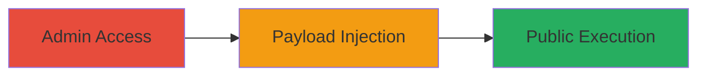

# XSS via Unsanitized Post Title in Tagregator Flickr Integration

Multi-stage attack chain demonstrating a complete XSS workflow in the Tagregator WordPress plugin, exploiting unfiltered HTML input in the admin interface to execute JavaScript on public pages.

## Chain Metrics Dashboard

| Metric | Value |
|--------|-------|
| Chain Status | Unverified |
| Total Steps | 3 |
| Execution Time | ~5 minutes |
| Skill Level | Intermediate |
| Complexity | Medium |
| Impact Level | High |

## Attack Flow Visualization

## Prerequisites & Requirements

### Required Tools

- Web browser (e.g., Firefox or Chrome with developer tools)

### Target Environment

- WordPress instance with Tagregator plugin installed and active
- Administrative access to WordPress dashboard
- tggr-flickr custom post type enabled

### Initial Access Requirements

- Valid WordPress admin credentials
- Direct network access to the WordPress site (e.g., http://example.com/wp-admin)
- No prior access needed beyond admin login

## Detailed Attack Procedures

### Step 1: Admin Access for New Post
procedure: [[procedures/Access-WordPress-Admin-for-Tggr-Flickr-Post]]

**Objective**: Gain access to the WordPress admin interface to create a new tggr-flickr post, setting the stage for payload injection.

**Instructions**: Log in to the WordPress admin dashboard and navigate to the post creation page for the tggr-flickr custom post type. Use the browser to visit the specific URL for new post creation.

**Expected Output**: The post editor interface loads, displaying fields including post_title.

**Success Indicators**:
- Admin dashboard accessible without errors
- tggr-flickr post type selection available

### Step 2: Payload Injection
procedure: [[procedures/Inject-XSS-Payload-into-Post-Title]]

**Objective**: Inject a malicious JavaScript payload into the post_title field, which is not properly sanitized for public rendering.

**Instructions**: In the post editor, locate the post_title input field and enter the XSS payload. Save or publish the post to generate the permalink.

**Expected Output**: Post saved successfully, with permalink generated containing the injected title.

**Success Indicators**:
- Payload entered without validation errors
- Post publishes and permalink is created

### Step 3: Public Execution
procedure: [[procedures/Access-Public-Permalink-to-Execute-Payload]]

**Objective**: Access the public permalink to trigger the XSS payload execution, demonstrating arbitrary JavaScript on unauthenticated users.

**Instructions**: Copy the generated permalink from the post editor and visit it in a browser as a public user. Observe the execution of the injected script.

**Expected Output**: JavaScript alert or other payload effects trigger upon page load.

**Success Indicators**:
- Alert box or script execution visible
- No server-side errors; payload renders in public view

## Attack Chain Summary

### Key Achievements

1. Successful admin access to custom post type
2. Injection of unescaped HTML/JavaScript into post_title
3. Public execution confirming XSS vulnerability

## Technique & Tactic Coverage

### MITRE ATT&CK Techniques

- [[JavaScript]]

### MITRE ATT&CK Tactics

- [[Execution]]

---
*Last updated: 2023-10-01T00:00:00Z*
