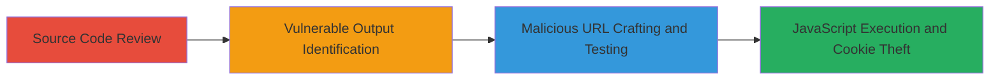

---
tags:
  - xss
  - concrete-cms
  - php
  - web
  - injection
type: attack_chain
tools: []
tactics:
  - '[[Execution]]'
  - '[[Collection]]'
verified: false
platforms:
  - Web
  - PHP
submitted: true
complexity: medium
created_at: '2023-10-01T00:00:00Z'
procedures:
  - '[[procedures/Review-Source-Code-for-Unsanitized-Variables]]'
  - '[[procedures/Identify-Vulnerable-Output-in-Connect-Endpoint]]'
  - '[[procedures/Craft-and-Test-Malicious-URL-for-XSS-Exploitation]]'
step_count: 3
techniques:
  - '[[JavaScript]]'
updated_at: '2025-12-14T03:15:35.991Z'
description: >-
  A multi-stage attack exploiting a Cross-Site Scripting vulnerability in
  Concrete CMS by injecting malicious JavaScript through an unsanitized variable
  in the marketplace integration, leading to arbitrary code execution and
  session cookie theft.
skill_level: intermediate
impact_level: high
id: 8fa7bcb7-5f25-4856-bc29-b7dd44be31fd
validated: true
mitre_tactics:
  - '[[Execution]]'
  - '[[Collection]]'
mitre_techniques:
  - '[[JavaScript]]'
---
# XSS via Unsanitized Product Block ID in Concrete CMS Marketplace

Multi-stage attack chain demonstrating a complete XSS exploitation workflow in Concrete CMS, targeting the marketplace integration to inject and execute JavaScript for stealing session cookies.

## Chain Metrics Dashboard

| Metric | Value |
|--------|-------|
| Chain Status | Unverified |
| Total Steps | 3 |
| Execution Time | ~15 minutes |
| Skill Level | Intermediate |
| Complexity | Medium |
| Impact Level | High |

## Attack Flow Visualization

## Prerequisites & Requirements

### Required Tools

- Browser developer tools for testing
- Access to Concrete CMS source code (e.g., GitHub repository)

### Target Environment

- Concrete CMS installation (version vulnerable to this issue)
- Web platform with PHP backend
- Marketplace integration enabled

### Initial Access Requirements

- Read access to source code
- Ability to craft and send URLs to victims (e.g., via phishing)
- No prior credentials needed for discovery, but victim must visit the malicious URL while authenticated

## Detailed Attack Procedures

### Step 1: Source Code Review
procedure: [[procedures/Review-Source-Code-for-Unsanitized-Variables]]

**Objective**: Identify unsanitized variables in the codebase that could allow HTML or JavaScript injection.

**Instructions**: Examine the `getMarketplacePurchaseFrame` function in `marketplace.php`. Look for outputs of variables like `$mp->getProductBlockID()` without sanitization.

**Expected Output**: Identification of line 176 in `marketplace.php` where the variable is used without filtering.

**Success Indicators**:
- Unsanitized variable confirmed
- Potential injection point noted

### Step 2: Vulnerable Output Identification
procedure: [[procedures/Identify-Vulnerable-Output-in-Connect-Endpoint]]

**Objective**: Locate where the unsanitized variable is outputted in the application, confirming the injection vector.

**Instructions**: Review `connect.php` to find usage of the variable in URL construction, specifically at line 14, where it's inserted into the path without escaping.

**Expected Output**: Confirmation of injection in `/dashboard/extend/connect/` endpoint.

**Success Indicators**:
- Output location pinpointed
- Injection feasibility assessed

### Step 3: Malicious URL Crafting and Testing
procedure: [[procedures/Craft-and-Test-Malicious-URL-for-XSS-Exploitation]]

**Objective**: Construct a payload to inject JavaScript and test for execution, leading to cookie theft.

**Instructions**: Build a URL like `/dashboard/extend/connect/"%20onmouseover="alert(document.cookie)">` and visit it in a browser. Hover over the injected element to trigger the alert.

**Expected Output**: Alert box displaying document cookies upon hover.

**Success Indicators**:
- JavaScript executes
- Cookies are accessible for theft

## Attack Chain Summary

### Key Achievements

1. Discovered unsanitized output in Concrete CMS marketplace code
2. Identified precise injection point in connect endpoint
3. Successfully exploited XSS to execute JavaScript and steal session data

## Technique & Tactic Coverage

### MITRE ATT&CK Techniques

- [[JavaScript]]

### MITRE ATT&CK Tactics

- [[Execution]]
- [[Collection]]

---
*Last updated: 2023-10-01T00:00:00Z*
