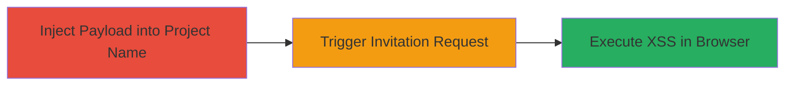

---
tags:
  - xss
  - web
  - javascript
  - session-hijacking
type: attack_chain
tools: []
tactics:
  - '[[Execution]]'
  - '[[Collection]]'
commands: []
platforms:
  - Web
complexity: medium
procedures:
  - '[[procedures/Inject-Malicious-XSS-Payload-into-Project-Name]]'
  - '[[procedures/Trigger-Translator-Invitation-Request]]'
  - '[[procedures/Execute-XSS-in-Invitation-Requests-View]]'
step_count: 3
techniques:
  - '[[JavaScript]]'
description: >-
  A cross-site scripting attack exploiting unsanitized project names to execute
  arbitrary JavaScript in translators' browsers when viewing invitation
  requests, enabling session hijacking.
skill_level: intermediate
impact_level: high
id: 63d9742d-7868-40f0-8ffd-baa247317414
created_at: '2025-12-14T03:16:25.432Z'
updated_at: '2025-12-14T03:16:25.432Z'
verified: false
validated: true
submitted: true
mitre_tactics:
  - '[[Execution]]'
  - '[[Collection]]'
mitre_techniques:
  - '[[JavaScript]]'
---
# XSS via Unsanitized Project Names in Invitation Requests

## Overview

This attack chain exploits a reflected cross-site scripting (XSS) vulnerability in the Localize platform's project management feature. An attacker creates a project with a malicious JavaScript payload in the name, which is stored without sanitization. When a translator visits the project to request an invitation, the unsanitized name is rendered on the main page's invitation requests section, executing the payload in the translator's browser. This can lead to session hijacking, cookie theft, or other client-side attacks, compromising the translator's account.

## Attack Flow Visualization

## Prerequisites & Requirements

### Required Tools

- Web browser (e.g., Chrome with developer tools for payload testing)

### Target Environment

- Web application (Localize platform)
- Authenticated access to create projects
- No specific ports or services beyond standard HTTPS

### Initial Access Requirements

- Valid user account with permission to create projects
- Ability to influence or target translators (e.g., via social engineering)
- Network access to the target web application

## Detailed Attack Procedures

### Step 1: Inject Malicious Payload into Project Name
procedure: [[procedures/Inject-Malicious-XSS-Payload-into-Project-Name]]

**Objective**: Store a malicious JavaScript payload in a project name without sanitization, setting up the reflected XSS.

**Instructions**: Log in to the Localize platform, navigate to the project creation or editing page, and enter a payload like `"><svg onload="prompt(/xss/);"><!--` in the project name field. Save the project to persist the unsanitized input.

**Expected Output**: Project created or updated successfully, with the payload stored in the backend.

**Success Indicators**:
- Project name appears altered in the UI but payload is not escaped
- No errors during save, confirming storage without sanitization

### Step 2: Trigger Translator Invitation Request
procedure: [[procedures/Trigger-Translator-Invitation-Request]]

**Objective**: Lure or direct a translator to interact with the malicious project, causing the unsanitized name to be displayed.

**Instructions**: Share the project URL with a targeted translator or wait for them to discover it. Instruct or entice them to visit the project page and submit an invitation request through the UI.

**Expected Output**: Translator submits the request, and the invitation appears in the requests section on the main page.

**Success Indicators**:
- Invitation request logged in the system
- Translator confirms visiting the project page

### Step 3: Execute XSS in Invitation Requests View
procedure: [[procedures/Execute-XSS-in-Invitation-Requests-View]]

**Objective**: Cause the payload to execute when the project owner or admin views the invitation requests, compromising the viewer's browser.

**Instructions**: As the project owner, navigate to the main page and open the invitation requests section. The unsanitized project name will render, triggering the JavaScript payload in your (or the viewer's) browser.

**Expected Output**: Alert box or other payload effect (e.g., prompt(/xss/)) appears, confirming execution.

**Success Indicators**:
- JavaScript executes, displaying the alert or performing actions like cookie access
- Browser console shows no errors, but payload runs successfully

## Attack Chain Summary

### Key Achievements

1. Successful injection and storage of XSS payload in project metadata
2. Triggering of the vulnerable reflection path via invitation workflow
3. Arbitrary JavaScript execution in victim browsers, enabling data theft or account compromise

## Technique & Tactic Coverage

### MITRE ATT&CK Techniques

- [[JavaScript]]

### MITRE ATT&CK Tactics

- [[Execution]]
- [[Collection]]

*Last updated: 2023-10-01*
