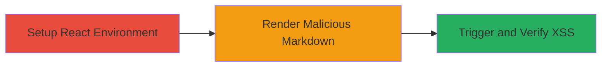

---

# XSS via Unsanitized javascript: URLs in react-marked-markdown Links

Multi-stage attack chain demonstrating exploitation of a cross-site scripting vulnerability in the react-marked-markdown module (v1.4.6), where the sanitize option fails to escape href attributes in Markdown links, allowing injection of javascript: URLs that execute arbitrary code when rendered in a React application.

## Chain Metrics Dashboard

| Metric | Value |
|--------|-------|
| Chain Status | Unverified |
| Total Steps | 3 |
| Execution Time | ~5 minutes |
| Skill Level | Intermediate |
| Complexity | Low |
| Impact Level | High |

## Attack Flow Visualization



## Prerequisites & Requirements

### Required Tools

- [[tools/Node.js]]
- [[tools/npm]]
- [[tools/React]]
- [[tools/ReactDOM]]
- [[tools/marked]]

### Target Environment

- Node.js runtime (v8.11.1 or compatible)
- React development environment
- Browser for rendering (e.g., Chrome)
- No specific ports or services required; local development setup

### Initial Access Requirements

- Local machine with Node.js installed
- No network access or credentials needed; runs in isolated dev environment
- Prior access: Ability to install and run npm packages

## Detailed Attack Procedures

### Step 1: Setup React App
procedure: [[procedures/Setup-React-App-for-Vulnerability-Testing]]

**Objective**: Prepare a basic React application to import and use the vulnerable react-marked-markdown module.

**Instructions**: Install dependencies and set up the basic structure using [[commands/npm-install-react-marked-markdown]] and manual imports.

**Expected Output**: A running React app with the module imported, ready for rendering components.

**Success Indicators**:
- No import errors in console
- Basic app renders without issues

### Step 2: Render Malicious Input
procedure: [[procedures/Render-Malicious-Markdown-in-MarkdownPreview]]

**Objective**: Inject and process user-controlled Markdown containing a javascript: URL in a link, bypassing the sanitize option.

**Instructions**: Use the [[commands/render-markdownpreview-xss]] to display the component with tainted input.

```javascript
import React from 'react';
import ReactDOM from 'react-dom';
import { MarkdownPreview } from 'react-marked-markdown';

ReactDOM.render(
  <MarkdownPreview
    markedOptions={{ sanitize: true }}
    value={'[XSS](javascript: alert`1`)'}
  />,
  document.getElementById('root')
);
```

**Expected Output**: Rendered anchor tag with unescaped href="javascript: alert`1`".

**Success Indicators**:
- Markdown renders as a clickable link
- href attribute contains javascript: protocol

### Step 3: Trigger XSS
procedure: [[procedures/Verify-XSS-Execution-via-Alert]]

**Objective**: Confirm arbitrary JavaScript execution by interacting with the rendered link.

**Instructions**: Click the link or allow parsing to execute the payload using [[commands/observe-xss-trigger]].

**Expected Output**: Browser alert dialog displaying "1".

**Success Indicators**:
- JavaScript alert fires
- No sanitization blocks the execution

## Attack Chain Summary

### Key Achievements

1. Bypassed marked library's sanitize option in react-marked-markdown
2. Injected and executed arbitrary JavaScript via Markdown links
3. Demonstrated potential for session hijacking or data theft in client-side rendering

## Technique & Tactic Coverage

### MITRE ATT&CK Techniques

- [[JavaScript]]

### MITRE ATT&CK Tactics

- [[Execution]]

---

*Last updated: 2023-10-01T00:00:00Z*
