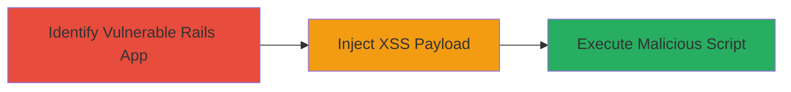

---
tags:
  - xss
  - rails
  - html-sanitizer
  - csrf-bypass
type: attack_chain
tools: []
tactics:
  - '[[Execution]]'
commands: []
platforms:
  - Web
  - Ruby on Rails
complexity: medium
procedures:
  - '[[procedures/Exploit-XSS-in-Rails-HTML-Sanitizer]]'
step_count: 2
techniques:
  - '[[JavaScript]]'
description: >-
  Attack chain exploiting a vulnerability in the rails-html-sanitizer gem that
  fails to remove certain data-* attributes, enabling XSS to subvert CSRF
  protections and execute malicious scripts in Ruby on Rails applications.
skill_level: intermediate
impact_level: high
id: 614fcc25-3904-4bd5-8dab-186f0a900624
created_at: '2025-12-14T17:27:23.596Z'
updated_at: '2025-12-14T17:27:23.596Z'
verified: false
validated: true
submitted: true
mitre_tactics:
  - '[[Execution]]'
mitre_techniques:
  - '[[JavaScript]]'
---
# XSS via Unstripped data-* Attributes in Rails HTML Sanitizer

Multi-stage attack chain demonstrating a complete attack workflow exploiting the rails-html-sanitizer vulnerability to inject and execute XSS payloads in Ruby on Rails applications using affected versions prior to 1.0.3.

## Chain Metrics Dashboard

| Metric | Value |
|--------|-------|
| Chain Status | Unverified |
| Total Steps | 2 |
| Execution Time | ~5 minutes |
| Skill Level | Intermediate |
| Complexity | Medium |
| Impact Level | High |

## Attack Flow Visualization

## Prerequisites & Requirements

### Required Tools

- Browser developer tools for payload testing

### Target Environment

- Ruby on Rails application using rails-html-sanitizer < 1.0.3
- Web platform with HTML input fields or user-generated content rendering

### Initial Access Requirements

- Access to a user input form or endpoint that processes HTML through the sanitizer
- No special credentials needed beyond legitimate user access

## Detailed Attack Procedures

### Step 1: Identify Vulnerable Rails App

**Objective**: Confirm the target Rails application uses a vulnerable version of rails-html-sanitizer and identify input points for HTML injection.

**Instructions**: Review the application's dependencies or test for the vulnerability by submitting benign HTML with data-* attributes and inspecting the output for retention.

**Expected Output**: Confirmation that data-* attributes persist in sanitized HTML output.

**Success Indicators**:
- Vulnerable version detected (e.g., via gem list or error logs)
- Input form accepts HTML without full stripping

### Step 2: Inject and Execute XSS Payload
procedure: [[procedures/Exploit-XSS-in-Rails-HTML-Sanitizer]]

**Objective**: Craft and submit an XSS payload using unstripped data-* attributes to execute JavaScript, potentially bypassing CSRF and hijacking sessions.

**Instructions**: Use the procedure to inject a payload like `
Test
` into a vulnerable input field and observe script execution on render.

**Expected Output**: Alert or malicious script execution in the victim's browser.

**Success Indicators**:
- JavaScript executes client-side
- CSRF token subverted or session accessed

## Attack Chain Summary

### Key Achievements

1. Identified vulnerable sanitization in Rails app
2. Injected persistent XSS via data-* attributes
3. Executed client-side attacks like session hijacking

## Technique & Tactic Coverage

### MITRE ATT&CK Techniques

- [[JavaScript]]

### MITRE ATT&CK Tactics

- [[Execution]]

---
*Last updated: 2023-10-01*
