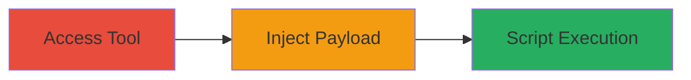

---
tags:
  - xss
  - web
  - injection
type: attack_chain
tools: []
tactics:
  - '[[Execution]]'
verified: false
platforms:
  - Web
submitted: true
created_at: '2023-10-01T00:00:00Z'
procedures:
  - '[[procedures/Exploit-XSS-in-API-Request-Calculator-Secret-Keys]]'
step_count: 1
techniques:
  - '[[JavaScript]]'
updated_at: '2025-12-14T03:15:41.533Z'
description: >-
  A cross-site scripting attack exploiting lack of input validation in the API
  request calculator tool on ok.ru's developer wiki, allowing injection of
  malicious scripts into application_secret_key and session_secret_key
  parameters.
id: 4d0d7197-f923-44d3-ab0b-9f583cf2284c
validated: true
mitre_tactics:
  - '[[Execution]]'
mitre_techniques:
  - '[[JavaScript]]'
---
# XSS via Unvalidated Secret Key Parameters in ok.ru API Request Calculator

Multi-stage attack chain demonstrating a complete attack workflow targeting the API request calculator on ok.ru's developer wiki.

## Chain Metrics Dashboard

| Metric | Value |
|--------|-------|
| Chain Status | Unverified |
| Total Steps | 1 |
| Execution Time | ~2 minutes |
| Skill Level | Beginner |
| Complexity | Low |
| Impact Level | Medium |

## Attack Flow Visualization

## Prerequisites & Requirements

### Required Tools

- Browser with developer tools

### Target Environment

- Web platform
- Access to https://apiok.ru/wiki/pages/viewpage.action?pageId=75989046

### Initial Access Requirements

- Public access to the developer wiki (no authentication required)
- Network access to the internet

## Detailed Attack Procedures

### Step 1: Inject XSS Payload into Secret Key Parameters
procedure: [[procedures/Exploit-XSS-in-API-Request-Calculator-Secret-Keys]]

**Objective**: Inject a malicious JavaScript payload into the application_secret_key or session_secret_key input fields of the API request calculator to execute arbitrary scripts in the victim's browser.

**Instructions**: Navigate to the vulnerable tool at https://apiok.ru/wiki/pages/viewpage.action?pageId=75989046. Locate the input fields for application_secret_key and session_secret_key. Enter a payload such as `` into one of the fields and submit the form to generate the API request.

**Expected Output**: The calculator processes the input and reflects the payload in the output, executing the script (e.g., an alert box pops up in the browser).

**Success Indicators**:
- Malicious script executes, such as an alert dialog appearing
- Source code inspection shows the payload reflected without sanitization

## Attack Chain Summary

### Key Achievements

1. Successful injection and execution of JavaScript in the browser context
2. Demonstration of client-side script execution leading to potential session hijacking or data theft
3. Identification of input validation flaw in web-based developer tool

## Technique & Tactic Coverage

### MITRE ATT&CK Techniques

- [[JavaScript]]

### MITRE ATT&CK Tactics

- [[Execution]]

---
*Last updated: 2023-10-01T00:00:00Z*
