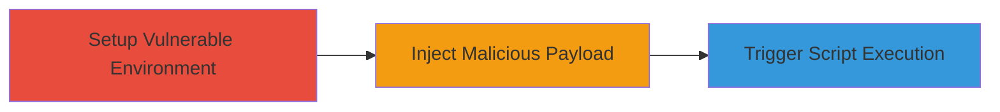

# XSS via Vulnerable jQuery DOM Manipulation in fabric-sdk-py Documentation Generation

Multi-stage attack chain demonstrating a complete attack workflow targeting the Cross-Site Scripting vulnerability in the fabric-sdk-py package.

## Chain Metrics Dashboard

| Metric | Value |
|--------|-------|
| Chain Status | Unverified |
| Total Steps | 1 |
| Execution Time | ~15 minutes |
| Skill Level | Intermediate |
| Complexity | Medium |
| Impact Level | High |

## Attack Flow Visualization



## Prerequisites & Requirements

### Required Tools

- Python environment (pip for package installation)
- Web browser for viewing generated documentation

### Target Environment

- Python platform with fabric-sdk-py package (older vulnerable versions, e.g., pre-jQuery 3.5 update)
- Documentation generation setup (e.g., Sphinx or similar using jQuery)
- Local access to source code or runtime environment for doc building

### Initial Access Requirements

- Access to a development or documentation build environment using the affected package
- No network credentials required; local execution
- Prior knowledge of the package's doc generation process

## Detailed Attack Procedures

### Step 1: Demonstrate XSS in Documentation Generation
procedure: [[procedures/Demonstrate-XSS-in-fabric-sdk-py-Doc-Generation]]

**Objective**: Set up the vulnerable environment, inject a malicious script payload into documentation content, and trigger execution via jQuery's unsafe DOM methods to demonstrate XSS.

**Instructions**: Install the vulnerable version of fabric-sdk-py, modify or create a documentation file with a payload like `<script>alert('XSS')</script>`, build the docs, and load the output in a browser to observe script execution despite sanitization attempts.

First, install the vulnerable package using pip:

```bash
pip install fabric-sdk-py==1.5.3  # Example vulnerable version; check report for exact
```

Then, locate or create a reStructuredText (.rst) file in the docs source and insert the payload:

```rst
This is a test paragraph with malicious HTML: <script>alert('XSS via jQuery')</script>
```

Build the documentation (assuming Sphinx setup in the package):

```bash
cd docs
make html
```

Open the generated HTML file in a browser:

```bash
open _build/html/index.html  # On macOS; use equivalent on other OS
```

**Expected Output**: The generated HTML page loads, and the injected script executes, popping an alert dialog due to jQuery's .html() or .append() methods processing unsanitized content.

**Success Indicators**:
- Package installs without errors
- Documentation builds successfully
- Alert or console log from the script appears in the browser
- No blocking by modern sanitization if using outdated jQuery

## Attack Chain Summary

### Key Achievements

1. Identified and exploited outdated jQuery dependency in fabric-sdk-py
2. Demonstrated script execution in doc generation output
3. Highlighted risks in environments relying on the package for automated documentation

## Technique & Tactic Coverage

### MITRE ATT&CK Techniques

- [[JavaScript]]

### MITRE ATT&CK Tactics

- [[Execution]]

---
*Last updated: 2023-10-01T12:00:00Z*
