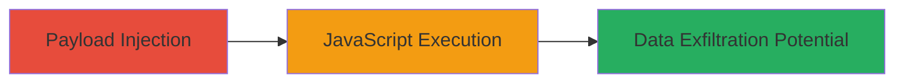

# XSS via javascript: URI Injection in WPML Reminder Popup

Multi-stage attack chain demonstrating a complete attack workflow targeting a reflected XSS vulnerability in the WPML plugin on love.uber.com.

## Chain Metrics Dashboard

| Metric | Value |
|--------|-------|
| Chain Status | Unverified |
| Total Steps | 1 |
| Execution Time | ~1 minute |
| Skill Level | Beginner |
| Complexity | Low |
| Impact Level | High |

## Attack Flow Visualization



## Prerequisites & Requirements

### Required Tools

- Web browser (e.g., Chrome, Firefox)

### Target Environment

- WordPress site with outdated WPML plugin
- Accessible URL: https://love.uber.com/australia/
- No authentication required for public-facing endpoint

### Initial Access Requirements

- Internet access to the target site
- No prior credentials or network position needed; attack is remote and unauthenticated

## Detailed Attack Procedures

### Step 1: Payload Injection and Execution
procedure: [[procedures/Inject-javascript-URI-into-WPML-Target-Parameter]]

**Objective**: Inject a malicious javascript: URI into the 'target' parameter to execute arbitrary JavaScript in the victim's browser upon page load.

**Instructions**: Construct the exploit URL by URL-encoding the javascript: payload and append it to the reminder_popup action. Open the URL in a browser to trigger the execution. For testing, use a simple alert payload:

```url
https://love.uber.com/australia/?icl_action=reminder_popup&target=javascript%3aalert%28%2ftest%2f%29%3b%2f%2f
```

This decodes to `javascript:alert(/test/);//` and executes the alert on page load due to improper sanitization in the WPML plugin.

**Expected Output**: An alert box displaying "test" pops up in the browser, confirming JavaScript execution.

**Success Indicators**:
- Alert box appears without errors
- Browser console shows no blocking (e.g., CSP violations, though none present here)
- Potential for further payloads to steal session cookies via `document.cookie`

## Attack Chain Summary

### Key Achievements

1. Successful injection of javascript: URI scheme bypassing input validation
2. Arbitrary JavaScript execution in the context of the victim's session
3. Demonstrated potential for session hijacking or client-side data theft

## Technique & Tactic Coverage

### MITRE ATT&CK Techniques

- [[JavaScript]]

### MITRE ATT&CK Tactics

- [[Execution]]
- [[Collection]]

---
*Last updated: 2023-10-01T00:00:00Z*
