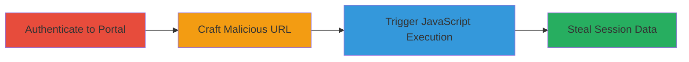

# XSS via javascript: URI Scheme in redirect_url Parameter on Acronis Portal

Multi-stage attack chain demonstrating exploitation of an XSS vulnerability in the Acronis learning portal's licensing-check endpoint, enabling arbitrary JavaScript execution in an authenticated user's browser context.

## Chain Metrics Dashboard

| Metric | Value |
|--------|-------|
| Chain Status | Unverified |
| Total Steps | 3 |
| Execution Time | ~2 minutes |
| Skill Level | Beginner |
| Complexity | Low |
| Impact Level | High |

## Attack Flow Visualization

## Prerequisites & Requirements

### Required Tools

- Web browser (e.g., Chrome, Firefox)

### Target Environment

- Web platform
- Access to https://learn.acronis.com/
- Valid user credentials for the portal

### Initial Access Requirements

- Network access to the internet
- Authenticated session required for impact

## Detailed Attack Procedures

### Step 1: Authenticate to Acronis Portal
procedure: [[procedures/Authenticate-to-Acornis-Portal]]

**Objective**: Establish an authenticated session to the target portal, enabling the vulnerability to execute in a privileged context.

**Instructions**: Open a web browser and navigate to the login page at https://learn.acronis.com/. Enter valid credentials to authenticate.

**Expected Output**: Successful login redirect to the portal dashboard, with session cookies set.

**Success Indicators**:
- Dashboard loads without errors
- Session token visible in browser developer tools (e.g., via Network tab)

### Step 2: Craft Malicious Redirect URL for XSS
procedure: [[procedures/Craft-Malicious-Redirect-URL-for-XSS]]

**Objective**: Manipulate the redirect_url parameter to inject a javascript: URI scheme that executes arbitrary code.

**Instructions**: Construct the vulnerable URL by appending the malicious payload to the licensing-check endpoint: https://learn.acronis.com/portal/licensing-check?redirect_url=javascript:alert(document.domain). Ensure the session is active before proceeding.

**Expected Output**: The crafted URL ready for navigation, with the javascript: payload embedded.

**Success Indicators**:
- URL formed correctly without syntax errors
- Payload includes valid JavaScript (e.g., alert for testing)

### Step 3: Trigger and Verify XSS Execution
procedure: [[procedures/Trigger-and-Verify-XSS-Execution]]

**Objective**: Navigate to the crafted URL to execute the injected JavaScript, confirming the vulnerability and demonstrating potential data theft.

**Instructions**: With the authenticated session active, visit the crafted URL in the browser. Observe the JavaScript execution, such as an alert box popping up.

**Expected Output**: Alert box displays "learn.acronis.com", confirming execution in the domain context.

**Success Indicators**:
- JavaScript alert or console output appears
- No redirection or sanitization blocks the payload

## Attack Chain Summary

### Key Achievements

1. Successful authentication to the target portal
2. Injection and execution of arbitrary JavaScript via redirect_url
3. Potential for session token theft and unauthorized actions

## Technique & Tactic Coverage

### MITRE ATT&CK Techniques

- [[JavaScript]]
- [[Exploit Public-Facing Application]]

### MITRE ATT&CK Tactics

- [[Execution]]
- [[Collection]]

---
*Last updated: 2023-10-01T00:00:00Z*
