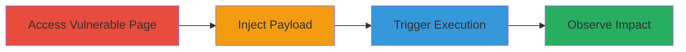

# XSS via javascript: URI in citySource Parameter on Uber Movement Community Page

Multi-stage attack chain demonstrating a complete XSS workflow on the Uber Movement community page.

## Chain Metrics Dashboard

| Metric | Value |
|--------|-------|
| Chain Status | Unverified |
| Total Steps | 3 |
| Execution Time | ~1 minute |
| Skill Level | Beginner |
| Complexity | Low |
| Impact Level | Medium |

## Attack Flow Visualization

## Prerequisites & Requirements

### Required Tools

- Web browser (e.g., Chrome, Firefox)

### Target Environment

- Web platform
- Access to http://ubermovement.com/community/daniel
- No special services or ports required

### Initial Access Requirements

- Public internet access
- No credentials needed
- Direct navigation to the target URL

## Detailed Attack Procedures

### Step 1: Access Vulnerable Page with Payload
procedure: [[procedures/Exploit-XSS-in-citySource-Parameter]]

**Objective**: Inject the malicious javascript: URI into the citySource parameter to set up the payload.

**Instructions**: Navigate to the target URL with the appended payload in your web browser.

**Expected Output**: The page loads with the injected parameter, but no immediate execution.

**Success Indicators**:
- Page loads without errors
- URL reflects the citySource parameter with javascript: payload

### Step 2: Trigger Payload Execution
procedure: [[procedures/Exploit-XSS-in-citySource-Parameter]]

**Objective**: Interact with the page element to execute the injected JavaScript.

**Instructions**: On the loaded page, locate and click the 'Back to community' link.

**Expected Output**: The JavaScript payload executes upon click.

**Success Indicators**:
- No page navigation errors
- Payload ready for execution

### Step 3: Validate XSS Execution
procedure: [[procedures/Exploit-XSS-in-citySource-Parameter]]

**Objective**: Confirm arbitrary JavaScript execution by observing the alert popup.

**Instructions**: After clicking the link, watch for the alert dialog to appear.

**Expected Output**: An alert box displays 'XSSED'.

**Success Indicators**:
- Alert popup appears
- Confirms XSS vulnerability

## Attack Chain Summary

### Key Achievements

1. Successful injection of javascript: URI via citySource parameter
2. Triggered execution through user interaction on the community page
3. Demonstrated potential for phishing or CSRF via arbitrary JS

## Technique & Tactic Coverage

### MITRE ATT&CK Techniques

- [[JavaScript]]

### MITRE ATT&CK Tactics

- [[Execution]]

---
*Last updated: 2023-10-01T12:00:00Z*
