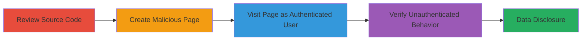

---
tags:
  - xssi
  - jsonp
  - information-disclosure
  - privacy-bypass
  - web-vulnerability
type: attack_chain
tools:
  - '[[tools/curl]]'
tactics:
  - '[[Initial Access]]'
  - '[[Collection]]'
verified: false
platforms:
  - Web
submitted: true
complexity: medium
created_at: '2023-10-01T00:00:00Z'
procedures:
  - '[[procedures/Review-Source-Code-for-JSONP-Vulnerability]]'
  - '[[procedures/Create-Malicious-HTML-for-JSONP-Exploitation]]'
  - '[[procedures/Execute-Authenticated-Cross-Origin-Script-Inclusion]]'
  - '[[procedures/Verify-Unauthenticated-Endpoint-Behavior]]'
step_count: 4
techniques:
  - '[[Exploit Public-Facing Application]]'
  - '[[JavaScript]]'
  - '[[Drive-by Compromise]]'
updated_at: '2025-12-14T17:25:13.269Z'
description: >-
  Multi-stage attack exploiting XSSI in Liberapay's charts.json endpoint to
  disclose private donation data via cross-origin JSONP inclusion when an
  authenticated user visits a malicious page.
skill_level: intermediate
impact_level: high
id: 0f725056-4cdd-4ee1-9cc5-3130dfd25fa5
validated: true
mitre_tactics:
  - '[[Initial Access]]'
  - '[[Collection]]'
mitre_techniques:
  - '[[Exploit Public-Facing Application]]'
  - '[[JavaScript]]'
  - '[[Drive-by Compromise]]'
---
# XSSI via JSONP Callback to Bypass Donation Privacy on Liberapay

Multi-stage attack chain demonstrating exploitation of an XSSI vulnerability in Liberapay.com's /username/charts.json endpoint, where JSONP support allows cross-origin requests to bypass privacy settings and disclose private donation data for authenticated users.

## Chain Metrics Dashboard

| Metric | Value |
|--------|-------|
| Chain Status | Unverified |
| Total Steps | 4 |
| Execution Time | ~5 minutes |
| Skill Level | Intermediate |
| Complexity | Medium |
| Impact Level | High |

## Attack Flow Visualization



## Prerequisites & Requirements

### Required Tools

- [[tools/curl]]

### Target Environment

- Web platform
- Liberapay.com service
- Access to source code (e.g., via public repo)

### Initial Access Requirements

- No prior credentials needed for reconnaissance
- Authenticated session to Liberapay for exploitation
- Ability to host a malicious HTML page (e.g., local server or public host)

## Detailed Attack Procedures

### Step 1: Review Source Code
procedure: [[procedures/Review-Source-Code-for-JSONP-Vulnerability]]

**Objective**: Identify the XSSI vulnerability in the charts.json endpoint by analyzing the source code for privacy checks and JSONP support.

**Instructions**: Examine the charts.json.spt file, focusing on privacy logic and JSONP handling.

**Expected Output**: Confirmation of incomplete privacy checks for authenticated requests and presence of jsonp_dump function.

**Success Indicators**:
- Privacy check (hide_receiving) only triggers 403 for unauthenticated users
- jsonp_dump enables callback support at line 85

### Step 2: Create Malicious HTML Page
procedure: [[procedures/Create-Malicious-HTML-for-JSONP-Exploitation]]

**Objective**: Develop a proof-of-concept page that loads the vulnerable endpoint via JSONP to extract data.

**Instructions**: Create an HTML file with a script defining a callback function and loading the JSONP URL.

**Expected Output**: Malicious page ready for hosting.

**Success Indicators**:
- Callback function defined (e.g., 'rip')
- Script src points to /~username/charts.json?callback=rip

### Step 3: Execute Cross-Origin Inclusion
procedure: [[procedures/Execute-Authenticated-Cross-Origin-Script-Inclusion]]

**Objective**: Trigger the vulnerability by having an authenticated user visit the malicious page, executing the JSONP callback to disclose private data.

**Instructions**: Host the page and load it in a browser while logged into Liberapay.

**Expected Output**: Alert or console output showing the first row of private donation JSON data.

**Success Indicators**:
- Cross-origin request succeeds with authentication cookies
- Private donation array disclosed via callback

### Step 4: Verify Unauthenticated Behavior
procedure: [[procedures/Verify-Unauthenticated-Endpoint-Behavior]]

**Objective**: Confirm that privacy protections work for unauthenticated requests, highlighting the authenticated bypass.

**Instructions**: Use [[commands/curl-check-private-profile-status]] and [[commands/curl-check-public-profile-status]] to test endpoints without auth.

```bash
curl -Is https://liberapay.com/EdOverflow/charts.json?callback=rip | head -1
```

```bash
curl -Is https://liberapay.com/Liberapay/charts.json?callback=rip | head -1
```

**Expected Output**: 403 for private profiles, 200 for public.

**Success Indicators**:
- HTTP/2 403 for private unauthenticated
- HTTP/2 200 for public unauthenticated

## Attack Chain Summary

### Key Achievements

1. Identified JSONP-enabled endpoint vulnerable to XSSI
2. Bypassed privacy settings for authenticated cross-origin requests
3. Disclosed private donation data via malicious page
4. Verified differential behavior for unauthenticated access

## Technique & Tactic Coverage

### MITRE ATT&CK Techniques

- [[Exploit Public-Facing Application]]
- [[JavaScript]]
- [[Drive-by Compromise]]

### MITRE ATT&CK Tactics

- [[Initial Access]]
- [[Collection]]

---

*Last updated: 2023-10-01T00:00:00Z*
