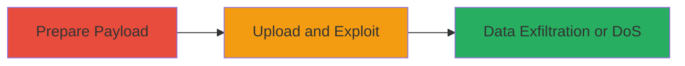

---
tags:
  - xxe
  - file-upload
  - web-vulnerability
type: attack_chain
tools: []
tactics:
  - '[[Initial Access]]'
  - '[[Execution]]'
commands:
  - '[[commands/craft-xxe-xml-payload]]'
  - '[[commands/curl-upload-xxe-file]]'
platforms:
  - Web
complexity: medium
procedures:
  - '[[procedures/Prepare-XXE-Payload]]'
  - '[[procedures/Upload-and-Exploit-XXE]]'
step_count: 2
techniques:
  - '[[Exploit Public-Facing Application]]'
description: >-
  Exploitation of XML External Entity (XXE) vulnerability in a web application's
  file upload feature to execute attacks like file disclosure or SSRF
skill_level: intermediate
impact_level: high
id: 8e002e60-5e13-4730-b188-ab3d15a1f520
created_at: '2025-12-13T09:00:27.845Z'
updated_at: '2025-12-13T09:00:27.845Z'
verified: false
validated: true
submitted: true
mitre_tactics:
  - '[[Initial Access]]'
  - '[[Execution]]'
mitre_techniques:
  - '[[Exploit Public-Facing Application]]'
---
# XXE Exploitation via File Upload in Web Application

## Overview

This attack chain demonstrates the exploitation of an XML External Entity (XXE) vulnerability in Informatica's file upload feature, as reported in a HackerOne disclosure. The vulnerability allows attackers to upload malicious XML files that reference external entities, potentially leading to file disclosure, server-side request forgery (SSRF), or denial of service. The chain covers payload preparation and upload execution, based on the reported vulnerability details.

## Attack Flow Visualization



## Prerequisites & Requirements

### Required Tools

- None specifically required beyond standard HTTP clients like curl

### Target Environment

- Web application with file upload functionality processing XML
- Target platform: Web
- Required services/ports: HTTP/HTTPS (typically port 80/443)
- Network access requirements: Direct access to the file upload endpoint

### Initial Access Requirements

- No credentials required if the upload feature is publicly accessible
- Network position: External attacker with internet access
- Prior access needed: None

## Detailed Attack Procedures

### Step 1: Prepare XXE Payload
procedure: [[procedures/Prepare-XXE-Payload]]

**Objective**: Craft a malicious XML file that includes an external entity reference to exploit the XXE vulnerability.

**Instructions**: Create an XML payload file using [[commands/craft-xxe-xml-payload]] to define an external entity that points to sensitive data, such as /etc/passwd:

```bash
echo '<?xml version="1.0" encoding="UTF-8"?><!DOCTYPE foo [<!ENTITY xxe SYSTEM "file:///etc/passwd">]><foo>&xxe;</foo>' > malicious.xml
```

**Expected Output**: A file named malicious.xml containing the XXE payload.

**Success Indicators**:
- Payload file created successfully
- XML structure validates locally

### Step 2: Upload and Exploit XXE
procedure: [[procedures/Upload-and-Exploit-XXE]]

**Objective**: Upload the crafted XML file to the vulnerable file upload endpoint and trigger the XXE processing.

**Instructions**: Use [[commands/curl-upload-xxe-file]] to send the malicious XML file to the target endpoint:

```bash
curl -X POST -F "file=@malicious.xml" https://target.com/upload
```

Monitor the response for exfiltrated data or signs of successful exploitation, such as disclosed file contents.

**Expected Output**: Server response containing exfiltrated data (e.g., contents of /etc/passwd) or error indicating DoS.

**Success Indicators**:
- Upload successful
- Evidence of entity expansion (e.g., disclosed files or SSRF response)

## Attack Chain Summary

### Key Achievements

1. Successful crafting of XXE payload for entity injection
2. Exploitation via file upload leading to potential data disclosure or SSRF
3. Demonstration of high-impact web vulnerability in production systems

## Technique & Tactic Coverage

### MITRE ATT&CK Techniques

- [[Exploit Public-Facing Application]]

### MITRE ATT&CK Tactics

- [[Initial Access]]
- [[Execution]]

*Last updated: 2023-10-01*
