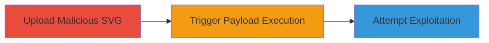

---
tags:
  - xxe
  - file-upload
  - svg
  - xml
  - dos
type: attack_chain
tools:
  - '[[tools/Python-HTTP-Server]]'
tactics:
  - '[[Initial Access]]'
  - '[[Execution]]'
commands:
  - '[[commands/start-python-http-server]]'
platforms:
  - Web
complexity: medium
procedures:
  - '[[procedures/Upload-Malicious-SVG-for-XXE]]'
  - '[[procedures/Trigger-XXE-Payload-Execution]]'
  - '[[procedures/Attempt-XXE-Exploitation-for-File-Access-and-DoS]]'
step_count: 3
techniques:
  - '[[Exploit Public-Facing Application]]'
description: >-
  Exploitation of XXE vulnerability in Coinbase's OAuth2 Applications gallery
  profile by uploading a malicious SVG file to force external connections and
  potential DoS
skill_level: intermediate
impact_level: high
id: 80458213-3149-48c3-ae95-459137b60980
created_at: '2025-12-13T09:00:27.255Z'
updated_at: '2025-12-13T09:00:27.255Z'
verified: false
validated: true
submitted: true
mitre_tactics:
  - '[[Initial Access]]'
  - '[[Execution]]'
mitre_techniques:
  - '[[Exploit Public-Facing Application]]'
---
# XXE Exploitation via Malicious SVG Upload in Coinbase OAuth2 App Logo

Multi-stage attack chain demonstrating exploitation of an XXE vulnerability in Coinbase's OAuth2 Applications gallery profile by uploading a malicious SVG file renamed to .jpg as an app logo, forcing the server to resolve external entities and connect to an attacker's server, with potential for DoS attacks.

## Chain Metrics Dashboard

| Metric | Value |
|--------|-------|
| Chain Status | Unverified |
| Total Steps | 3 |
| Execution Time | ~5 minutes |
| Skill Level | Intermediate |
| Complexity | Medium |
| Impact Level | High |

## Attack Flow Visualization



## Prerequisites & Requirements

### Required Tools

- [[tools/Python-HTTP-Server]]

### Target Environment

- Platform: Web
- Services: Cloudinary
- Network access: Ability to upload files to Coinbase OAuth2 Applications gallery profile

### Initial Access Requirements

- Access to Coinbase OAuth2 Applications gallery profile for app logo upload
- No specific credentials beyond standard access
- Network position: External attacker

## Detailed Attack Procedures

### Step 1: Upload Malicious SVG for XXE
procedure: [[procedures/Upload-Malicious-SVG-for-XXE]]

**Objective**: Upload a crafted SVG file containing an XXE payload to the app logo feature to initiate the vulnerability.

**Instructions**: Create an XML-based SVG file with an XXE payload that references an external entity pointing to your server. Rename the file to .jpg. Upload it via the Coinbase OAuth2 Applications gallery profile app logo upload feature.

**Expected Output**: Successful upload confirmation from the server.

**Success Indicators**:
- File uploaded without rejection
- No immediate errors on upload

### Step 2: Trigger XXE Payload Execution
procedure: [[procedures/Trigger-XXE-Payload-Execution]]

**Objective**: Force the server to parse the uploaded file and resolve the external entities, connecting to the attacker's server.

**Instructions**: Start your Python HTTP server using [[commands/start-python-http-server]]:

```bash
python -m http.server 8000
```

Wait for the server to process the uploaded file, which will trigger the XXE payload and cause a connection to your server.

**Expected Output**: Incoming connection logged on the Python HTTP server.

**Success Indicators**:
- Connection request received from the vulnerable server
- External entity resolution confirmed

### Step 3: Attempt XXE Exploitation for File Access and DoS
procedure: [[procedures/Attempt-XXE-Exploitation-for-File-Access-and-DoS]]

**Objective**: Attempt to leverage the XXE to read system files or force connections for DoS on other systems.

**Instructions**: Modify the XXE payload to attempt reading system files (e.g., /etc/passwd) or to force repeated connections to target systems for DoS. Monitor the Python HTTP server for responses. Note that file access may fail due to privileges or protections.

**Expected Output**: Potential DoS effects on targeted systems or error responses indicating failed file access.

**Success Indicators**:
- Successful forced connections for DoS
- Confirmation of limited or failed file access attempts

## Attack Chain Summary

### Key Achievements

1. Successful upload and parsing of malicious SVG triggering XXE
2. Forced external connections demonstrating vulnerability
3. Potential for DoS attacks on other systems

## Technique & Tactic Coverage

### MITRE ATT&CK Techniques

- [[Exploit Public-Facing Application]]

### MITRE ATT&CK Tactics

- [[Initial Access]]
- [[Execution]]

*Last updated: [TIMESTAMP]*
