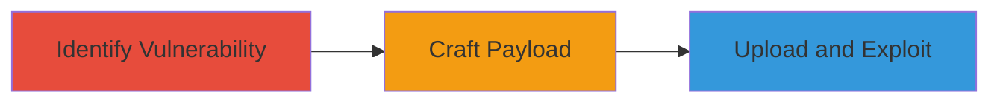

---
tags:
  - xxe
  - svg-upload
  - xml-injection
type: attack_chain
tools: []
tactics:
  - '[[Initial Access]]'
  - '[[Execution]]'
commands:
  - '[[commands/craft-xxe-svg]]'
  - '[[commands/curl-upload-svg]]'
platforms:
  - Web
complexity: medium
procedures:
  - '[[procedures/Identify-Vulnerable-Upload-Feature]]'
  - '[[procedures/Craft-Malicious-SVG-with-XXE-Payload]]'
  - '[[procedures/Upload-and-Exploit-XXE-Vulnerability]]'
step_count: 3
techniques:
  - '[[Exploit Public-Facing Application]]'
description: >-
  Multi-stage attack chain exploiting an XXE vulnerability in Moneybird's SVG
  file upload feature to gain unauthorized access to internal resources.
skill_level: intermediate
impact_level: high
id: 5a47b244-8e96-430f-b087-1c773ed83e16
created_at: '2025-12-13T09:00:27.584Z'
updated_at: '2025-12-13T09:00:27.584Z'
verified: false
validated: true
submitted: true
mitre_tactics:
  - '[[Initial Access]]'
  - '[[Execution]]'
mitre_techniques:
  - '[[Exploit Public-Facing Application]]'
---
# XXE Exploitation via SVG Upload in Moneybird

Multi-stage attack chain demonstrating a complete attack workflow exploiting an XXE vulnerability in Moneybird's software through uploaded SVG files, allowing unauthorized access to internal resources.

## Chain Metrics Dashboard

| Metric | Value |
|--------|-------|
| Chain Status | Unverified |
| Total Steps | 3 |
| Execution Time | ~5 minutes |
| Skill Level | Intermediate |
| Complexity | Medium |
| Impact Level | High |

## Attack Flow Visualization



## Prerequisites & Requirements

### Required Tools

- None specific (uses standard utilities like echo and curl)

### Target Environment

- Web-based application with SVG upload feature
- Required services/ports: HTTP/HTTPS (e.g., port 443)
- Network access requirements: Ability to upload files to the target server

### Initial Access Requirements

- Credential requirements: Valid user account for upload functionality
- Network position: External access to the web application
- Prior access needed: None beyond user authentication

## Detailed Attack Procedures

### Step 1: Identify Vulnerable Upload Feature
procedure: [[procedures/Identify-Vulnerable-Upload-Feature]]

**Objective**: Locate the SVG file upload endpoint in the Moneybird application that parses XML insecurely.

**Instructions**: Access the Moneybird web interface and navigate to the file upload section. Test with a benign SVG file to confirm upload and processing. Use browser developer tools to inspect the upload request.

**Expected Output**: Confirmation that SVG files are accepted and parsed by the server.

**Success Indicators**:
- Successful upload of test SVG
- Server processes file without errors

### Step 2: Craft Malicious SVG with XXE Payload
procedure: [[procedures/Craft-Malicious-SVG-with-XXE-Payload]]

**Objective**: Create an SVG file containing an XXE payload to reference external entities.

**Instructions**: Use [[commands/craft-xxe-svg]] to generate the malicious SVG file:

```bash
echo '<?xml version="1.0" encoding="UTF-8"?><!DOCTYPE svg [<!ENTITY xxe SYSTEM "file:///etc/passwd">]><svg>&xxe;</svg>' > malicious.svg
```

**Expected Output**: A file named malicious.svg containing the XXE payload.

**Success Indicators**:
- File created successfully
- Payload includes external entity reference

### Step 3: Upload and Exploit XXE Vulnerability
procedure: [[procedures/Upload-and-Exploit-XXE-Vulnerability]]

**Objective**: Upload the crafted SVG to trigger the XXE and access internal resources.

**Instructions**: Use [[commands/curl-upload-svg]] to upload the file to the Moneybird upload endpoint (replace with actual URL):

```bash
curl -X POST -F "file=@malicious.svg" https://moneybird.example.com/upload
```
Monitor the response or server logs for exfiltrated data, such as contents of internal files.

**Expected Output**: Server response containing data from internal resources, like file contents.

**Success Indicators**:
- Successful upload and parsing
- Exfiltration of internal data (e.g., /etc/passwd contents)

## Attack Chain Summary

### Key Achievements

1. Identification of vulnerable SVG parsing
2. Successful injection of XXE payload
3. Unauthorized access to internal files

## Technique & Tactic Coverage

### MITRE ATT&CK Techniques

- [[Exploit Public-Facing Application]]

### MITRE ATT&CK Tactics

- [[Initial Access]]
- [[Execution]]

*Last updated: [TIMESTAMP]*
