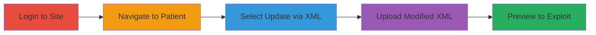

---
tags:
  - xxe
  - xml
  - file-disclosure
  - rce
  - web-vulnerability
type: attack_chain
tools: []
tactics:
  - '[[Initial Access]]'
  - '[[Execution]]'
commands: []
platforms:
  - Web
  - Linux
complexity: medium
procedures:
  - '[[procedures/Exploit-XXE-in-C-CDA-XML-Upload]]'
step_count: 5
techniques:
  - '[[Exploit Public-Facing Application]]'
description: >-
  Exploitation of XXE vulnerability in drchrono's C-CDA XML upload feature to
  read arbitrary server files and potentially achieve RCE
skill_level: intermediate
impact_level: high
id: ed33d8be-5328-4104-9797-b9e7bd4895e3
created_at: '2025-12-13T09:00:27.952Z'
updated_at: '2025-12-13T09:00:27.952Z'
verified: false
validated: true
submitted: true
mitre_tactics:
  - '[[Initial Access]]'
  - '[[Execution]]'
mitre_techniques:
  - '[[Exploit Public-Facing Application]]'
---
# XXE Injection in drchrono XML Parser for Arbitrary File Read and Potential RCE

Multi-stage attack chain demonstrating exploitation of an XML External Entity (XXE) vulnerability in the drchrono website's patient update feature using C-CDA XML files. The attack involves modifying a legitimate XML file to include malicious external entities, uploading it, and previewing to disclose server files like /etc/passwd, with potential for remote code execution.

## Chain Metrics Dashboard

| Metric | Value |
|--------|-------|
| Chain Status | Unverified |
| Total Steps | 5 |
| Execution Time | ~5 minutes |
| Skill Level | Intermediate |
| Complexity | Medium |
| Impact Level | High |

## Attack Flow Visualization



## Prerequisites & Requirements

### Required Tools

- None (web browser and text editor sufficient)

### Target Environment

- Web platform (drchrono website)
- Linux server backend with XML parser
- No specific ports required; standard HTTPS access

### Initial Access Requirements

- Valid user credentials for drchrono site
- Network access to the website
- Ability to download and modify C-CDA XML files

## Detailed Attack Procedures

### Step 1: Login to drchrono Site
procedure: [[procedures/Exploit-XXE-in-C-CDA-XML-Upload]]

**Objective**: Authenticate as a user to access protected features.

**Instructions**: Access the drchrono website and log in with valid credentials.

**Expected Output**: Successful authentication and access to the dashboard.

**Success Indicators**:
- Logged in session established
- Access to patient management section

### Step 2: Navigate to Patient Management
procedure: [[procedures/Exploit-XXE-in-C-CDA-XML-Upload]]

**Objective**: Reach the patient update section.

**Instructions**: From the dashboard, navigate to patients -> patient.

**Expected Output**: Patient management interface loaded.

**Success Indicators**:
- Patient list or details visible

### Step 3: Select Update via C-CDA XML
procedure: [[procedures/Exploit-XXE-in-C-CDA-XML-Upload]]

**Objective**: Access the XML upload feature for patient updates.

**Instructions**: Click on 'Update patient (via C-CDA XML)'.

**Expected Output**: Upload interface presented.

**Success Indicators**:
- Upload form ready for file selection

### Step 4: Upload Modified XML File
procedure: [[procedures/Exploit-XXE-in-C-CDA-XML-Upload]]

**Objective**: Submit a malicious XML file containing XXE payload.

**Instructions**: First, download a legitimate C-CDA XML file from the site. Modify it to include an XXE payload, such as:

```xml
<!DOCTYPE foo [ <!ENTITY xxe SYSTEM "file:///etc/passwd"> ]>
<root>&xxe;</root>
```
Save as AXAX000001.xml. Select and upload this modified file.

**Expected Output**: File uploaded successfully without immediate errors.

**Success Indicators**:
- Upload confirmation
- No validation errors on malicious content

### Step 5: Preview to Trigger Exploitation
procedure: [[procedures/Exploit-XXE-in-C-CDA-XML-Upload]]

**Objective**: Trigger the XML parsing to resolve external entities and disclose file contents.

**Instructions**: Click on 'Preview' to process the uploaded XML.

**Expected Output**: Contents of /etc/passwd or targeted file displayed in the preview.

**Success Indicators**:
- Arbitrary file contents revealed
- Potential for RCE if commands can be injected via entities

## Attack Chain Summary

### Key Achievements

1. Gained access to arbitrary server files via XXE
2. Demonstrated potential for remote code execution
3. Highlighted insecure XML parsing in web applications

## Technique & Tactic Coverage

### MITRE ATT&CK Techniques

- [[Exploit Public-Facing Application]]

### MITRE ATT&CK Tactics

- [[Initial Access]]
- [[Execution]]

*Last updated: 2023-10-01*
