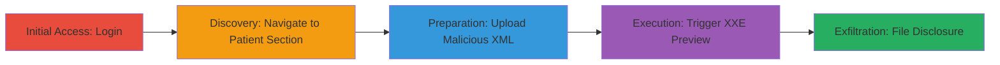

---
tags:
  - xxe
  - file-disclosure
  - rce
  - xml-injection
  - web-app
type: attack_chain
tools: []
tactics:
  - '[[Initial Access]]'
  - '[[Execution]]'
  - '[[Collection]]'
verified: false
platforms:
  - Web
submitted: true
complexity: medium
created_at: '2024-10-01T00:00:00Z'
procedures:
  - '[[procedures/Exploit-XXE-in-drchrono-Patient-Update]]'
step_count: 5
techniques:
  - '[[Exploit Public-Facing Application]]'
  - '[[File and Directory Discovery]]'
  - '[[Exploitation of Remote Services]]'
updated_at: '2025-12-14T17:23:41.953Z'
description: >-
  A multi-step attack exploiting an XXE vulnerability in the drchrono web
  application's patient update feature to disclose server files like /etc/passwd
  and potentially achieve RCE.
skill_level: intermediate
impact_level: high
id: 8981e69b-679b-48d3-b6fc-9162ba60c29c
validated: true
mitre_tactics:
  - '[[Initial Access]]'
  - '[[Execution]]'
  - '[[Collection]]'
mitre_techniques:
  - '[[Exploit Public-Facing Application]]'
  - '[[File and Directory Discovery]]'
  - '[[Exploitation of Remote Services]]'
---
# XXE Injection via C-CDA XML Upload for Arbitrary File Disclosure in drchrono

Multi-stage attack chain demonstrating exploitation of an XML External Entity (XXE) vulnerability in the drchrono web application's patient update feature using C-CDA XML files. The attack allows arbitrary file disclosure on the server, such as reading /etc/passwd, and can be extended to remote code execution (RCE) by targeting sensitive configuration files or command execution payloads.

## Chain Metrics Dashboard

| Metric | Value |
|--------|-------|
| Chain Status | Unverified |
| Total Steps | 5 |
| Execution Time | ~10 minutes |
| Skill Level | Intermediate |
| Complexity | Medium |
| Impact Level | High |

## Attack Flow Visualization



## Prerequisites & Requirements

### Required Tools

- Web browser (e.g., Chrome or Firefox with developer tools for XML editing)
- Text editor for modifying XML files

### Target Environment

- drchrono web application
- Authenticated user access to patient management section
- No specific ports or services beyond standard HTTPS (443)

### Initial Access Requirements

- Valid credentials for a drchrono account with patient update permissions
- Direct network access to the drchrono site (https://www.drchrono.com or equivalent)
- No prior access needed beyond login

## Detailed Attack Procedures

### Step 1: Authenticate to drchrono Application

**Objective**: Gain authenticated access to the web application to reach protected features.

**Instructions**: Open a web browser and navigate to the drchrono login page. Enter valid credentials to log in.

**Expected Output**: Successful login redirect to the dashboard.

**Success Indicators**:
- User session established
- Access to patient management menu available

### Step 2: Navigate to Patient Management

**Objective**: Locate the vulnerable patient update feature.

**Instructions**: After login, click on the "Patients" menu and select a specific patient profile.

**Expected Output**: Patient details page loads.

**Success Indicators**:
- Patient section accessible
- Update options visible

### Step 3: Initiate C-CDA XML Update

**Objective**: Access the file upload interface for patient data updates.

**Instructions**: On the patient details page, click the "Update patient (via C-CDA XML)" button to open the upload form.

**Expected Output**: Upload dialog or form appears for selecting XML files.

**Success Indicators**:
- Upload feature activated
- File selection prompt displayed

### Step 4: Prepare and Upload Malicious XML
procedure: [[procedures/Exploit-XXE-in-drchrono-Patient-Update]]

**Objective**: Download a legitimate XML template, inject XXE payload, and upload it to trigger entity expansion.

**Instructions**: First, download a sample C-CDA XML file from the drchrono site (e.g., AXAX000001.xml). Open it in a text editor and modify the DOCTYPE to include an external entity pointing to /etc/passwd:

```xml
<!DOCTYPE cda [
  <!ENTITY xxe SYSTEM "file:///etc/passwd">
]>
<cda:ClinicalDocument ...>
  <patient> &xxe; </patient>
</cda:ClinicalDocument>
```

Save the modified file and select it in the upload form. Submit the file.

**Expected Output**: File uploaded successfully without errors.

**Success Indicators**:
- Upload confirmation
- No parsing errors on submission

### Step 5: Trigger XXE and Exfiltrate Data
procedure: [[procedures/Exploit-XXE-in-drchrono-Patient-Update]]

**Objective**: Process the uploaded XML to expand the malicious entity and disclose server files.

**Instructions**: After upload, click the "Preview" button to parse and render the XML content.

**Expected Output**: Preview page displays the contents of /etc/passwd embedded in the patient data section.

**Success Indicators**:
- Sensitive file contents visible in preview
- Confirmation of XXE success (e.g., user list from /etc/passwd)

## Attack Chain Summary

### Key Achievements

1. Successful authentication and navigation to vulnerable endpoint
2. Injection of XXE payload via modified C-CDA XML upload
3. Arbitrary file disclosure demonstrating server compromise
4. Potential escalation to RCE by targeting executable files or configs

## Technique & Tactic Coverage

### MITRE ATT&CK Techniques

- [[Exploit Public-Facing Application]]
- [[File and Directory Discovery]]
- [[Exploitation of Remote Services]]

### MITRE ATT&CK Tactics

- [[Initial Access]]
- [[Execution]]
- [[Collection]]

---
*Last updated: 2024-10-01T00:00:00Z*
