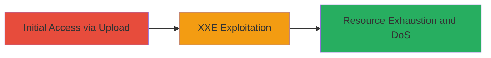

# XXE Injection via File Upload Leading to Denial of Service

Multi-stage attack chain demonstrating a complete attack workflow exploiting XXE in Informatica's application to induce denial of service through resource exhaustion.

## Chain Metrics Dashboard

| Metric | Value |
|--------|-------|
| Chain Status | Unverified |
| Total Steps | 1 |
| Execution Time | ~5 minutes |
| Skill Level | Intermediate |
| Complexity | Medium |
| Impact Level | High |

## Attack Flow Visualization



## Prerequisites & Requirements

### Required Tools

- None specific; standard web testing tools like curl or Burp Suite recommended.

### Target Environment

- Web application (Informatica platform)
- File upload feature exposed
- No specific ports required beyond standard HTTP/HTTPS (80/443)
- Network access to the upload endpoint

### Initial Access Requirements

- Valid user session or authentication if required for upload
- Direct network access to the application
- No prior access needed beyond reaching the public-facing upload feature

## Detailed Attack Procedures

### Step 1: Exploit XXE Vulnerability
procedure: [[procedures/Exploit-XXE-in-File-Upload]]

**Objective**: Upload a malicious XML file to trigger external entity expansion, causing uncontrolled resource consumption and potential denial of service.

**Instructions**: Identify the file upload endpoint in the Informatica application. Craft a malicious XML payload that defines external entities leading to recursive expansion (e.g., Billion Laughs attack). Use [[commands/curl-upload-xxe]] to submit the file:

```bash
curl -X POST -F "file=@malicious.xml" http://target.com/upload
```

Monitor server response and resource usage for signs of exhaustion. If the upload succeeds without validation, the XXE will process the entities during parsing.

**Expected Output**: Server processes the XML, leading to high CPU/memory usage; potential timeout or error indicating DoS.

**Success Indicators**:
- Server response delayed or fails due to resource limits
- Logs show entity expansion attempts
- Application becomes unresponsive to subsequent requests

## Attack Chain Summary

### Key Achievements

1. Successful injection of XXE payload via file upload
2. Triggered uncontrolled resource consumption
3. Achieved denial of service on the target application

## Technique & Tactic Coverage

### MITRE ATT&CK Techniques

- [[Exploit Public-Facing Application]] Exploit Public-Facing Application
- [[Network Denial of Service]] Network Denial of Service

### MITRE ATT&CK Tactics

- [[Initial Access]] Initial Access
- [[Execution]] Execution

---
*Last updated: 2023-10-01T00:00:00Z*
