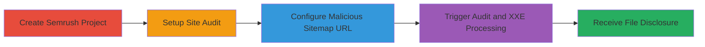

---
tags:
  - xxe
  - file-disclosure
  - xml
  - java
  - semrush
type: attack_chain
tools: []
tactics:
  - '[[Initial Access]]'
  - '[[Discovery]]'
verified: false
platforms:
  - Web
submitted: true
complexity: medium
created_at: '2023-10-01T00:00:00Z'
procedures:
  - '[[procedures/Exploit-XXE-in-Semrush-Site-Audit-via-Malicious-Sitemap]]'
step_count: 4
techniques:
  - '[[Exploit Public-Facing Application]]'
  - '[[File and Directory Discovery]]'
updated_at: '2025-12-14T17:28:36.428Z'
description: >-
  Exploits XML External Entity processing in Semrush Site Audit to read
  arbitrary files from the server filesystem by submitting a malicious
  sitemap.xml URL.
skill_level: intermediate
impact_level: high
id: 29024966-42d2-4e0a-9913-0a2da0342f39
validated: true
mitre_tactics:
  - '[[Initial Access]]'
  - '[[Discovery]]'
mitre_techniques:
  - '[[Exploit Public-Facing Application]]'
  - '[[File and Directory Discovery]]'
---
# XXE Injection via Malicious Sitemap in Semrush Site Audit for Arbitrary File Read

Multi-stage attack chain demonstrating exploitation of an XXE vulnerability in Semrush's Site Audit feature to disclose sensitive server files like /etc/hostname and /home directory contents.

## Chain Metrics Dashboard

| Metric | Value |
|--------|-------|
| Chain Status | Unverified |
| Total Steps | 4 |
| Execution Time | ~5 minutes |
| Skill Level | Intermediate |
| Complexity | Medium |
| Impact Level | High |

## Attack Flow Visualization

## Prerequisites & Requirements

### Required Tools

- Web browser for Semrush interface
- Web server to host malicious sitemap.xml (e.g., Apache or Python SimpleHTTPServer)

### Target Environment

- Semrush account with access to Site Audit feature
- Publicly accessible domain to host the malicious sitemap

### Initial Access Requirements

- Valid Semrush user credentials
- No special privileges required beyond standard Site Audit access
- Network access to Semrush web application

## Detailed Attack Procedures

### Step 1: Create Semrush Project
procedure: [[procedures/Exploit-XXE-in-Semrush-Site-Audit-via-Malicious-Sitemap]]

**Objective**: Establish a project in Semrush to serve as the entry point for the Site Audit feature.

**Instructions**: Log in to your Semrush account and navigate to the Projects dashboard. Click 'Create Project' and enter a domain name that matches or relates to the hosting domain for your malicious sitemap, such as semrush.webhooks.pw. This ensures the sitemap URL appears legitimate during configuration.

**Expected Output**: A new project is created and visible in the dashboard.

**Success Indicators**:
- Project dashboard shows the new project
- No errors during creation

### Step 2: Setup Site Audit
procedure: [[procedures/Exploit-XXE-in-Semrush-Site-Audit-via-Malicious-Sitemap]]

**Objective**: Initiate the Site Audit feature within the created project to prepare for sitemap configuration.

**Instructions**: Within the new project, select the 'Site Audit' tool from the left sidebar. Click 'Set up a new Site Audit' to begin the setup process. Configure basic settings like crawl depth if prompted, but focus on advancing to the crawl source selection.

**Expected Output**: Site Audit setup interface loads, ready for crawl source configuration.

**Success Indicators**:
- Site Audit setup page appears
- Basic configuration options are available

### Step 3: Configure Malicious Sitemap URL
procedure: [[procedures/Exploit-XXE-in-Semrush-Site-Audit-via-Malicious-Sitemap]]

**Objective**: Direct the Site Audit to fetch and process a malicious sitemap.xml containing XXE payload.

**Instructions**: In the Site Audit Settings, locate the 'Crawl Source' option and change it from default crawling to 'Enter sitemap URL'. Input the full URL to your hosted malicious sitemap, such as http://static.webhooks.pw/files/semrush_sitemap.xml. This file should contain an XXE payload with an external DTD referencing file:// and http:// entities to exfiltrate data like <!ENTITY xxe SYSTEM "file:///etc/hostname"> and directory listings for /home/.

**Expected Output**: Sitemap URL is accepted and saved in settings.

**Success Indicators**:
- URL field validates without errors
- Settings page confirms the custom sitemap source

### Step 4: Trigger Audit and XXE Processing
procedure: [[procedures/Exploit-XXE-in-Semrush-Site-Audit-via-Malicious-Sitemap]]

**Objective**: Start the audit process to trigger the Java XML processor and fetch external entities for file disclosure.

**Instructions**: Click 'Start Site Audit' to launch the background crawling process. The Semrush server will download the sitemap.xml from your URL, parse it using a vulnerable Java XML processor (Java/1.8.0_144), and process the external DTD. Monitor your hosting server logs for incoming requests from Semrush IPs, which will include the exfiltrated file contents via HTTP responses or error logs.

**Expected Output**: Audit begins, and your server receives requests embedding sensitive data like hostname or directory listings.

**Success Indicators**:
- Audit status shows 'In Progress'
- Server logs capture exfiltrated data (e.g., contents of /etc/hostname)
- No parsing errors on Semrush side that block entity resolution

## Attack Chain Summary

### Key Achievements

1. Successful project and audit setup without triggering defenses
2. Injection of malicious XXE payload via sitemap URL
3. Arbitrary file read from Semrush server filesystem
4. Exposure of sensitive information like hostnames and user directories

## Technique & Tactic Coverage

### MITRE ATT&CK Techniques

- [[Exploit Public-Facing Application]]
- [[File and Directory Discovery]]

### MITRE ATT&CK Tactics

- [[Initial Access]]
- [[Discovery]]

---
*Last updated: 2023-10-01T00:00:00Z*
