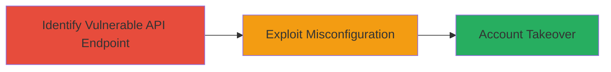

---
tags:
  - account-takeover
  - api-misconfiguration
  - zero-click
  - web
type: attack_chain
tools: []
tactics:
  - '[[Initial Access]]'
verified: false
platforms:
  - Web
submitted: true
complexity: low
created_at: '2023-10-01T00:00:00Z'
procedures:
  - '[[procedures/Exploit-UPchieve-API-Misconfiguration-for-Account-Takeover]]'
step_count: 1
techniques:
  - '[[Exploit Public-Facing Application]]'
updated_at: '2025-12-14T17:33:12.439Z'
description: >-
  An attack chain exploiting an API misconfiguration in UPchieve's forms to
  achieve full account takeover without user interaction.
skill_level: intermediate
impact_level: high
id: acc38028-68a5-4506-bcdf-7eca7c15a3f4
validated: true
mitre_tactics:
  - '[[Initial Access]]'
mitre_techniques:
  - '[[Exploit Public-Facing Application]]'
---
# Zero-Click Account Takeover via UPchieve API Misconfiguration

Multi-stage attack chain demonstrating a complete attack workflow.

## Chain Metrics Dashboard

| Metric | Value |
|--------|-------|
| Chain Status | Unverified |
| Total Steps | 1 |
| Execution Time | ~5 minutes |
| Skill Level | Intermediate |
| Complexity | Low |
| Impact Level | High |

## Attack Flow Visualization



## Prerequisites & Requirements

### Required Tools

- None (uses standard HTTP client like curl)

### Target Environment

- Web platform
- Accessible API forms endpoint
- No specific ports required beyond standard HTTPS (443)

### Initial Access Requirements

- Public internet access to UPchieve's web application
- No prior credentials needed due to zero-click nature
- Knowledge of target user account identifiers (e.g., email or ID)

## Detailed Attack Procedures

### Step 1: Exploit API Misconfiguration
procedure: [[procedures/Exploit-UPchieve-API-Misconfiguration-for-Account-Takeover]]

**Objective**: Leverage the API misconfiguration in UPchieve's forms to takeover any user account without authentication or user interaction.

**Instructions**: Identify the vulnerable API endpoint (e.g., a form submission API at `/api/forms/submit`) that lacks proper authorization checks, allowing arbitrary account modifications. Use [[commands/curl-api-takeover]] to send a crafted POST request specifying the target account and new credentials:

```bash
curl -X POST https://upchieve.com/api/forms/submit \
  -H "Content-Type: application/json" \
  -d '{"user_id": "target@example.com", "action": "change_password", "new_password": "hacked123"}'
```

Verify the takeover by logging in with the new credentials using a browser or additional curl request to the login endpoint.

**Expected Output**: HTTP 200 response indicating successful form submission, with no error for unauthorized access.

**Success Indicators**:
- API accepts the request without authentication
- Ability to login to the target account with the set credentials
- Full control over the victim's account (e.g., access to sessions, data, or actions)

## Attack Chain Summary

### Key Achievements

1. Unauthorized access to any UPchieve user account via API
2. Complete account control without victim interaction
3. Demonstration of severe impact from API misconfiguration

## Technique & Tactic Coverage

### MITRE ATT&CK Techniques

- [[Exploit Public-Facing Application]]

### MITRE ATT&CK Tactics

- [[Initial Access]]

---
*Last updated: 2023-10-01T00:00:00Z*
