# Zomato Reconnaissance via IP Ping, Nmap Scanning, Subdomain Enumeration, and GitHub Vulnerability Discovery Leading to IDOR Exploitation

Multi-stage attack chain demonstrating reconnaissance on Zomato-associated targets, including IP resolution, network scanning, subdomain discovery, GitHub repository analysis, and exploitation of vulnerabilities like IDOR for unauthorized user data access. The chain uncovers approximately 10 vulnerabilities from low to critical, with impacts including information disclosure and potential server hijacking, though the report was closed as not applicable.

## Chain Metrics Dashboard

| Metric | Value |
|--------|-------|
| Chain Status | Unverified |
| Total Steps | 9 |
| Execution Time | ~60 minutes |
| Skill Level | Intermediate |
| Complexity | Medium |
| Impact Level | High |

## Attack Flow Visualization

```mermaid
graph LR
    A[Initial IP Discovery] --> B[Network Scanning]
    B --> C[Web Testing and DNS Scan]
    C --> D[GitHub Exploration]
    D --> E[Subdomain Enumeration with Aquatone]
    E --> F[Maltego Comparison]
    F --> G[gitSploit Vulnerability Scan]
    G --> H[Subdomain and Port Discovery]
    H --> I[IDOR Exploitation]

    style A fill:#e74c3c
    style B fill:#f39c12
    style C fill:#f39c12
    style D fill:#3498db
    style E fill:#3498db
    style F fill:#3498db
    style G fill:#9b59b6
    style H fill:#9b59b6
    style I fill:#27ae60
```



## Prerequisites & Requirements

### Required Tools

- [[tools/ping]]
- [[tools/nmap]]
- [[tools/Burp-Suite]]
- [[tools/DNS-scanner]]
- [[tools/Aquatone]]
- [[tools/Maltego]]
- [[tools/gitSploit]]

### Target Environment

- Web platform with public-facing services on port 443 (HTTPS)
- Access to public GitHub repositories associated with the target
- Network access to resolve domains and scan IPs

### Initial Access Requirements

- No credentials required for reconnaissance phase
- Public internet access
- No prior access needed; starts with open-source intelligence

## Detailed Attack Procedures

### Step 1: Initial IP Discovery
procedure: [[procedures/IP-Address-Discovery-with-Ping]]

**Objective**: Resolve the target's domain to identify its IP address for further scanning.

**Instructions**: Use [[commands/ping-resolve-ip]] to ping the target domain and capture the resolved IP.

```bash
ping zomato.com
```

**Expected Output**: Response showing IP address 52.77.124.190.

**Success Indicators**:
- IP address resolved successfully
- No network blocks encountered

### Step 2: Network Scanning
procedure: [[procedures/Nmap-Scanning-for-Host-Information]]

**Objective**: Gather detailed network information about the host at the identified IP.

**Instructions**: Execute [[commands/nmap-host-scan]] to perform a comprehensive scan.

```bash
nmap -sV -O 52.77.124.190
```

**Expected Output**: List of open ports, services, and OS details.

**Success Indicators**:
- Open ports identified, including 443
- Service versions detected

### Step 3: Web Application Testing
procedure: [[procedures/Web-Application-Testing-with-Burp-Suite-and-DNS-Scanner]]

**Objective**: Intercept traffic and scan for DNS-related issues in the web application.

**Instructions**: Configure [[tools/Burp-Suite]] as a proxy and run [[commands/dns-scan]] on the target.

```bash
dnsenum zomato.com
```

**Expected Output**: DNS records and potential issues, though results may be limited.

**Success Indicators**:
- Traffic intercepted without errors
- Any DNS misconfigurations noted

### Step 4: GitHub Exploration
procedure: [[procedures/GitHub-Repository-Exploration-for-Vulnerabilities]]

**Objective**: Analyze public GitHub repositories for potential vulnerabilities.

**Instructions**: Search GitHub manually or via API for Zomato-related repos and review code.

**Expected Output**: Identification of sensitive code or configs.

**Success Indicators**:
- Repositories found and analyzed
- Potential vuln patterns spotted

### Step 5: Subdomain Enumeration
procedure: [[procedures/Subdomain-Enumeration-with-Aquatone]]

**Objective**: Discover hidden subdomains and domains associated with the target.

**Instructions**: Run [[commands/aquatone-enumerate]] to screenshot and list subdomains.

```bash
aquatone-discover --domain zomato.com
```

**Expected Output**: List of subdomains like auth.zomato.com.

**Success Indicators**:
- Multiple subdomains discovered
- Screenshots confirming existence

### Step 6: Subdomain Comparison
procedure: [[procedures/Subdomain-Comparison-with-Maltego]]

**Objective**: Cross-verify subdomain results using Maltego for additional reconnaissance.

**Instructions**: Import domains into [[tools/Maltego]] and run transforms.

**Expected Output**: Enhanced graph with links and differences from Aquatone.

**Success Indicators**:
- Discrepancies noted between tools
- Additional entities mapped

### Step 7: Vulnerability Discovery
procedure: [[procedures/Vulnerability-Discovery-with-gitSploit-on-GitHub]]

**Objective**: Scan GitHub repositories for vulnerabilities using gitSploit.

**Instructions**: Execute [[commands/gitsploit-scan]] on target repos.

```bash
gitsploit -u zomato -l 10
```

**Expected Output**: ~10 vulnerabilities listed, from low to critical.

**Success Indicators**:
- Vulnerabilities categorized and reported
- Types include XSS, CSRF, etc.

### Step 8: Subdomain and Port Discovery
procedure: [[procedures/Subdomain-and-Port-Information-Discovery]]

**Objective**: Identify specific subdomains and open ports for brute-force potential.

**Instructions**: Brute-force ports on identified subdomains using inferred nmap.

```bash
nmap -p 443 auth.zomato.com
```

**Expected Output**: Confirmation of service on port 443 TCP.

**Success Indicators**:
- auth.zomato.com confirmed on 443
- Brute-force viability assessed

### Step 9: IDOR Exploitation
procedure: [[procedures/IDOR-Exploitation-for-Unauthorized-User-Data-Access]]

**Objective**: Exploit IDOR to access unauthorized user card details and balances.

**Instructions**: Manipulate parameters in requests to view other users' data, as shown in PoC video.

```bash
curl -X GET 'https://auth.zomato.com/api/user/123/card' -H 'Authorization: Bearer token'
```

**Expected Output**: Unauthorized card index and balance displayed.

**Success Indicators**:
- Access to non-owned user data
- PoC video demonstrating exploit

## Attack Chain Summary

### Key Achievements

1. Successful IP and subdomain discovery expanding attack surface
2. Identification of 10+ vulnerabilities via GitHub scanning
3. IDOR exploitation revealing sensitive user financial data

## Technique & Tactic Coverage

### MITRE ATT&CK Techniques

- [[Active Scanning]] Active Scanning
- [[Hardware]] Gather Victim Host Information: Domains
- [[Search Open Websites-Domains]] Search Open Websites and Services
- [[Exploit Public-Facing Application]] Exploit Public-Facing Application
- [[T1087.001]] Account Discovery: Local Account

### MITRE ATT&CK Tactics

- [[Reconnaissance]] Reconnaissance

---

*Last updated: 2023-10-01T00:00:00Z*
