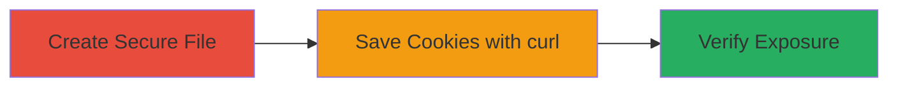

# libcurl Cookie Jar Permission Overwrite Leading to Sensitive Cookie Exposure

Multi-stage attack chain demonstrating a complete attack workflow to exploit the libcurl vulnerability that changes cookie jar file permissions, leading to potential leakage of confidential authentication cookies.

## Chain Metrics Dashboard

| Metric | Value |
|--------|-------|
| Chain Status | Unverified |
| Total Steps | 3 |
| Execution Time | ~1 minute |
| Skill Level | Basic |
| Complexity | Low |
| Impact Level | Medium |

## Attack Flow Visualization



## Prerequisites & Requirements

### Required Tools

- [[tools/install]]
- [[tools/ls]]
- [[tools/curl]]
- [[tools/libcurl]]

### Target Environment

- Linux OS with libcurl version 7.72.0 or later
- Default umask of 022
- curl command-line tool installed
- No special services or ports required (local file system access)

### Initial Access Requirements

- Local user access on a multi-user system
- No network credentials needed beyond basic internet access for curl fetch
- File creation permissions in current directory

## Detailed Attack Procedures

### Step 1: Create and Verify Secure Cookie Jar
procedure: [[procedures/Create-and-Verify-Secure-Cookie-Jar-File]]

**Objective**: Set up a cookie jar file with strict owner-only permissions to simulate secure storage of sensitive data.

**Instructions**: Use [[commands/install-create-cookie-jar]] to create the file, then [[commands/ls-check-initial-permissions]] to confirm permissions.

```bash
install -m 600 /dev/null cookie.jar
ls -l cookie.jar
```

**Expected Output**: File created with -rw------- permissions, confirmed by ls output showing 0600 mode.

**Success Indicators**:
- File exists with size 0
- Permissions are rw------- (owner read/write only)

### Step 2: Save Cookies Using curl
procedure: [[procedures/Save-Cookies-Using-curl-to-Trigger-Permission-Change]]

**Objective**: Fetch a website with curl, saving cookies to the existing jar, which triggers the permission overwrite due to libcurl's flawed handling.

**Instructions**: Execute [[commands/curl-save-cookies-to-jar]] to perform the fetch and save.

```bash
curl -s -c cookie.jar https://www.google.com -o /dev/null
```

**Expected Output**: No visible output (silent mode), but cookies written to file with permissions changed.

**Success Indicators**:
- Command completes without errors
- File now contains cookie data (check with cat if needed)

### Step 3: Verify Permission Change
procedure: [[procedures/Verify-Changed-File-Permissions]]

**Objective**: Confirm the vulnerability by checking that the file permissions have been relaxed to group and world readable.

**Instructions**: Run [[commands/ls-check-final-permissions]] to inspect the updated permissions.

```bash
ls -l cookie.jar
```

**Expected Output**: Permissions now -rw-r--r-- (0644), allowing group and world read access.

**Success Indicators**:
- Permissions changed from 0600 to 0644
- File readable by non-owner users

## Attack Chain Summary

### Key Achievements

1. Successfully created a secure file simulating sensitive cookie storage.
2. Triggered libcurl's permission overwrite via cookie save operation.
3. Verified exposure of the file to unauthorized readers on the system.

## Technique & Tactic Coverage

### MITRE ATT&CK Techniques

- [[Credentials In Files]]

### MITRE ATT&CK Tactics

- [[Credential Access]]

---
*Last updated: 2024-10-01T00:00:00Z*
