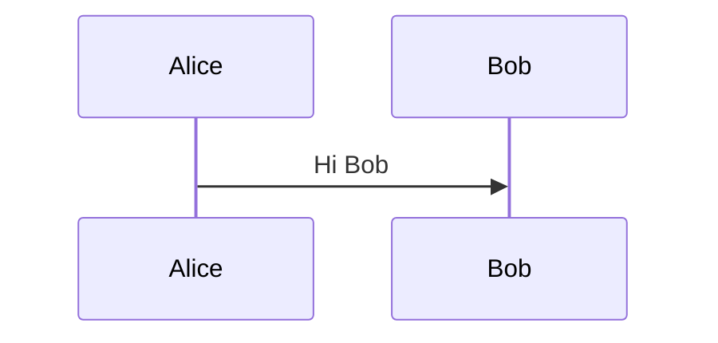

---
tags:
  - xss
  - dom-xss
  - mermaid
type: procedure
tools:
  - '[[tools/Mermaid]]'
tactics:
  - '[[Initial Access]]'
commands: []
platforms:
  - Web
techniques:
  - '[[JavaScript]]'
skill_level: intermediate
impact_level: high
detection_risk: low
sub_techniques: []
id: e3918c35-aed6-4935-99a8-ee16b5625e34
created_at: '2025-12-13T23:52:24.604Z'
updated_at: '2025-12-13T23:52:24.604Z'
verified: false
validated: true
submitted: true
mitre_tactics:
  - '[[Initial Access]]'
mitre_techniques:
  - '[[JavaScript]]'
---
# Inject-Malicious-Mermaid-Directive-for-DOM-XSS

## Summary

This procedure injects a malicious directive into a GitLab issue's Mermaid chart, exploiting unsanitized user input in the library's configuration to enable stored DOM XSS.

## Description

In GitLab, Mermaid diagrams in issues use GitLab Flavored Markdown. The vulnerability stems from Mermaid v8.6.0 merging user-supplied JSON in directives (e.g., `fontFamily`) directly into CSS rules without validation, inserting them via innerHTML into a style tag. This allows breaking out of the style context to inject HTML and JavaScript, stored persistently for any viewer.

## Requirements

1. Authenticated GitLab account with issue creation permissions
2. Access to any repository
3. Browser for UI interaction

## Defense

Defensive measures and detection strategies:

- Sanitize or disable custom directives in Mermaid configs
- Implement strict CSP with no inline styles/scripts
- Monitor for anomalous Mermaid usage in issues

## Objectives

1. Store malicious payload in issue description
2. Ensure payload renders as intended
3. Prepare for XSS trigger on view

## Instructions

### Step 1: Create New Issue

**Context**: Start a new issue to host the payload.

Use GitLab UI: Navigate to a repository > Issues > New Issue.

### Step 2: Craft and Insert Payload

**Context**: Add Mermaid block with malicious init directive to inject via fontFamily.

In the description field:

````markdown

````

The payload closes the style tag and injects an img with onerror JS.

### Step 3: Save Issue

**Context**: Persist the stored payload.

Submit the issue via UI.

## MITRE ATT&CK Mapping

### Tactics

- [[Initial Access]]

### Techniques

- [[JavaScript]]

### Sub-Techniques


## Commands Used


## Tools Used

- [[tools/Mermaid]]

## Tags

- [[xss]]
- [[dom-xss]]
- [[tools/Mermaid]]
